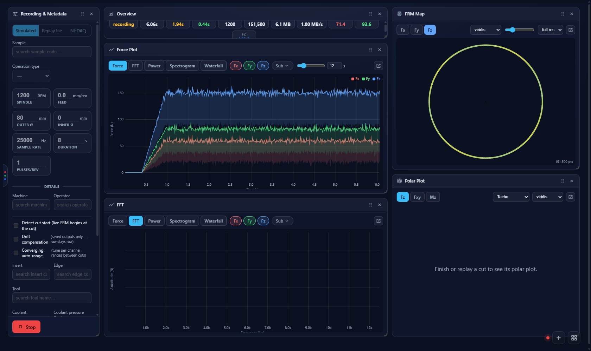
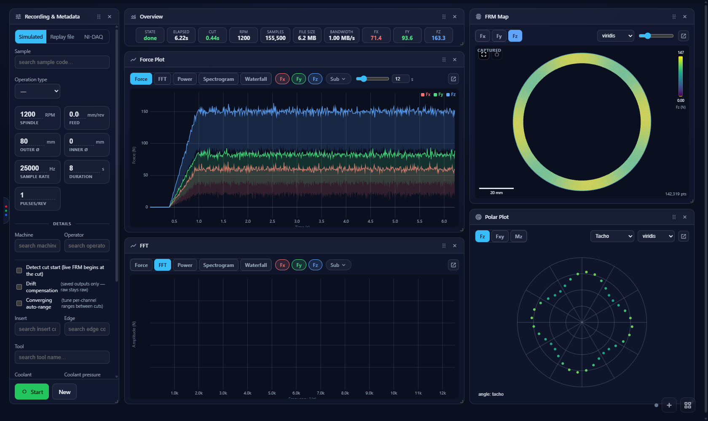
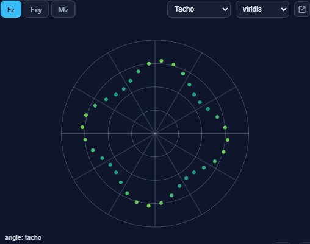
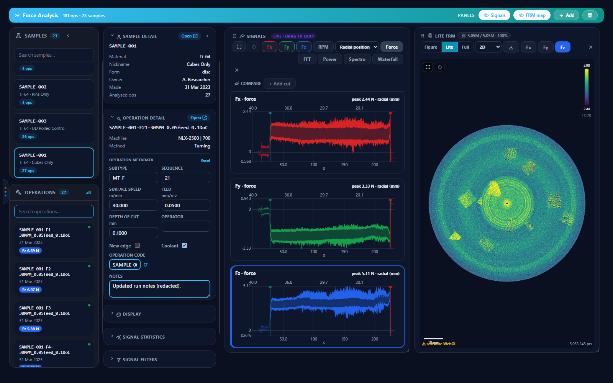
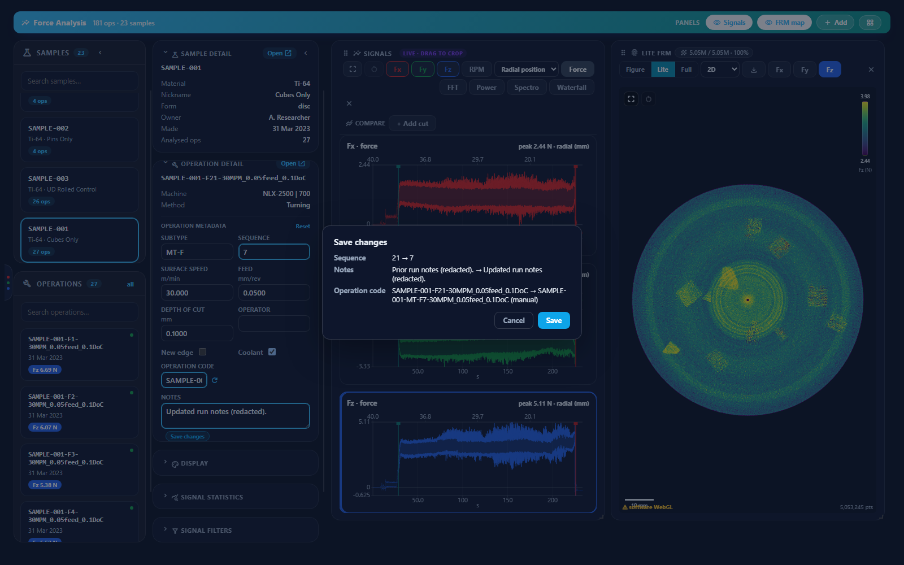

# force-app — machining force capture

A Windows desktop application for recording, visualising and analysing cutting forces from a
Kistler rotating dynamometer during turning (and, as of v0.1.19, groundwork for milling). It
replaces a fragile MATLAB-script-plus-manual-filing workflow: one operator-facing app that
acquires from the NI-DAQ, streams a crash-safe backup while recording, renders the force
fingerprint live, and uploads the finished cut straight into the D1 LIMS archive.

> **Status:** in production on the acquisition PC. Turning is fully supported end to end.
> Milling support is in progress — v0.1.19 adds the Polar Plot panel and a capture format
> that can carry torque (Mz) and machine tool-position (X/Y/Z) channels; the force-cloud
> geometry seam for real milling paths exists but has no live data source yet.

## What it looks like

**Recording a cut** — live force trace, order-tracked FRM (Force-Revolution Map) fingerprint,
FFT, RPM gauge, and the new Polar Plot, all updating in real time. Panels are drag-arranged and
each pops out to a second monitor.



**A finished cut** — the FRM map fills in as the full-resolution spiral, and the Polar Plot
shows torque or force against spindle angle (the milling counterpart to the FRM map).



**Polar Plot** (v0.1.19) — radius is Fz, |Fxy| or Mz; angle comes from the tacho or from
`atan2(Fy, Fx)`. The footer always states which, because a tacho angle and a force-vector
angle are not equally trustworthy.



**The Plot dashboard** — the finished-cut analysis view (`packages/force-plotting/`, shared
with the Directus-hosted UI). Per-axis Force/FFT/Power/Spectrogram/Waterfall charts with a
crop-shaded time axis and an optional second, top-margin axis for radial tool position; the
FRM point cloud renders its crop-drag preview entirely on the GPU (a vertex-shader rewrite of
the turning-spiral geometry) so dragging the crop handles stays responsive even at 5M+ points.



Editing an operation's metadata or dragging a new crop window batches both into one combined
"Save changes" summary — old value → new value for every changed field, computed against the
same auto-naming logic `OperationCode.vue` uses, before anything is written.



## The pieces

| Piece | Where it runs | What it is |
|---|---|---|
| **Desktop shell** | acquisition PC | Electron app (`desktop/`) — spawns the sidecar, serves the UI over `app://force/`, auto-updates from the tailnet-only feed on `d1-server` |
| **Recorder backend** | acquisition PC | FastAPI sidecar (`backend/`) — talks to the NI-DAQ hardware, writes `raw.d1raw` + finalises to `.mat` + live-cache, never containerised |
| **Web UI** | served by the shell | Vue 3 SPA (`web/`) — also served by Caddy at `/app/` for browser use |
| **Backup server** | `d1-server` | Receives streamed raw captures mid-recording (`backup-server/`) — a crash safety net, not the archive |
| **Bug-report relay** | `d1-server` | Forwards in-app bug reports (`bug-report-relay/`) |

Shared plotting components (`FrmCloud`, `PolarPlot`, the diagnostics workbench, the
`path`/`angle`/`polar` geometry modules) live in [`packages/force-plotting/`](../../packages/force-plotting/).

## Screens

- **Record** — acquire a cut (Simulated / Replay file / NI-DAQ sources), watch it live, save it
  to the archive or discard.
- **Plot** — the finished-cut dashboard; also `/plot/local/<id>` for a capture that is on disk
  but not yet uploaded.
- **Diagnostics Workbench** — a recipe-driven analysis surface (angular resampling, TSA,
  residual detrend, Getis-Ord hot-spots, HDBSCAN / GMM / seeded segmentation) over the
  full-resolution spiral, with a framed-region live recompute.
- **LabAmp / NI-DAQ** — charge-amplifier and DAQ channel configuration.
- **Settings** — capture drive, live-backup target, alarms, logs, update control, About/changelog.

## Running it

**Development** (from the repo root):

```powershell
npm install
npm run build:web:desktop
npm run build -w force-app-desktop
npm run dev -w force-app-desktop
```

The backend sidecar is spawned from `apps/force-app/backend/.venv`. To run it alone:
`.venv\Scripts\python -m uvicorn app.main:app --host 127.0.0.1 --port 8200`.

**Installed builds** — merging a version bump to `main` (or pressing *Run workflow* on
`.github/workflows/force-app-release.yml`) tests and packages the Windows installer and publishes
it as a GitHub Release ([CI and releases](../../docs/ci-cd.md)). A scheduled
task on `d1-server` republishes each release to the Caddy-served feed at `/force-app-updates/`,
which deployed rigs poll via `electron-updater` (see
[`docs/force-app-operations.md`](../../docs/force-app-operations.md#deploying-the-auto-publish-task)).

## Tests

```powershell
npm run test        -w @d1/force-plotting     # plotting / geometry unit tests
npm run test        -w force-app-web           # SPA unit tests
npm run test        -w force-app-desktop       # Electron main-process unit tests
npm run test:e2e    -w force-app-desktop       # Playwright: drives the real built app
cd apps/force-app/backend  && .venv\Scripts\pytest             # add `-m slow` to run only the slow tests
cd apps/force-app/backup-server && ..\backend\.venv\Scripts\pytest
```

## More

- [The Force App wiki](../../docs/wiki/force-app/README.md) — the illustrated user guide: recording,
  replay, the Plot dashboard, hardware setup, settings, recovery and troubleshooting
- [`docs/force-app-operations.md`](../../docs/force-app-operations.md) — running, deploying and
  troubleshooting (the live-backup server, config locations, log access)
- [`docs/force-file-standards.md`](../../docs/force-file-standards.md) — the capture `.mat` layouts
- [`docs/adr/0010-force-app-extraction-and-electron-packaging.md`](../../docs/adr/0010-force-app-extraction-and-electron-packaging.md)
  — why it is a standalone Electron app
- [`docs/superpowers/`](../../docs/superpowers/README.md) — per-feature design docs, including
  `2026-09-07-milling-path-models-and-polar-design.md`
