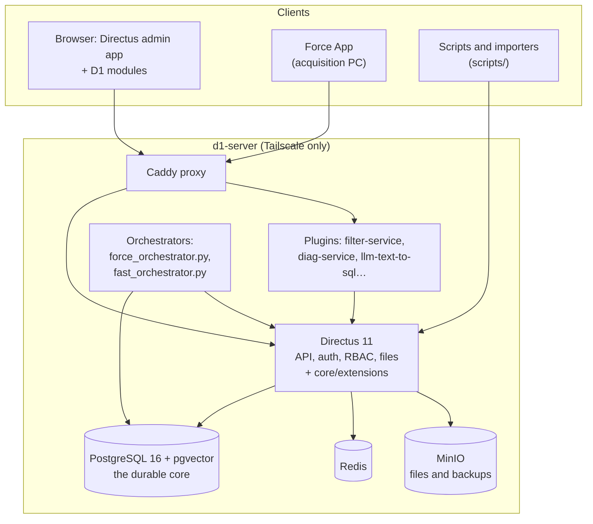

# D1 Database wiki

The **D1 Database** is the lab's record of everything physical: materials, samples, the
manufacturing operations and tests performed on them, the tooling and machines used, and the
data those produce (machining forces, FAST sintering traces, test results). It is a PostgreSQL
database with **Directus 11** as the web interface and API.

> Every screenshot here comes from a local stack filled with **demo data**: demo users
> (`Demo PI`, `Demo Researcher`, `Demo Operator`), project `DEMO-001` and samples `101`–`104`.
> None of it is real lab data. The project name in the top-left corner reads
> *D1 Database (demo)* for the same reason.

## Pages

| Page | Read it when you want to… |
|---|---|
| [Getting started](getting-started.md) | sign in and find your way around Directus |
| [Explorer pages](explorer-pages.md) | read projects, campaigns, samples, operations and tests as formatted pages, and edit them from the page |
| [The data model](data-model.md) | understand what the collections are and how they connect |
| [Samples](samples.md) | register, find, prepare and trace a sample |
| [Operations, tests, campaigns and projects](operations-and-tests.md) | log a manufacturing step or a test, and group work under campaigns and projects |
| [Tooling and equipment](tooling-and-equipment.md) | manage inserts and edges, tool holders and machines |
| [Force data](force-data.md) | see how machining-force captures get in, are processed and are viewed |
| [FAST sintering data](fast-data.md) | work with FAST/SPS runs and their traces |
| [Dashboards, Ask the Database and reports](dashboards-and-reports.md) | use the Lab Dashboard, query in plain English, print a report |
| [Roles, permissions and the audit log](roles-and-permissions.md) | understand who can do what, and who did what |
| [Administration](administration.md) | back up, migrate, configure and deploy |
| [Developer guide](developer-guide.md) | run the whole stack locally and change it |
| [Known issues](known-issues.md) | check a problem found while writing this wiki |

## Architecture

Two design rules explain most of how the system behaves:

1. **Postgres is the durable core; Directus is a swappable adapter**
   ([ADR-0001](../../adr/0001-postgres-as-durable-core.md),
   [ADR-0002](../../adr/0002-directus-as-swappable-adapter.md)). The schema changes only through
   SQL migrations in `db/migrations/`, never through the Directus data-model editor. Rules that
   must always hold (the audit log, sample codes, traceability) live in Postgres triggers and
   functions, so they apply however the data is written.
2. **Everything has two identities**: a hidden UUID primary key that never changes, and a
   human-readable code (`sample_code`, `pass_code`, `edge_code`…) that is generated from the
   record's own data and is what people see and print.

## Related reference docs

- [Data dictionary](../../data-dictionary.md): every table and view
- [API contract](../../api-contract.md): the REST surface machine clients use
- [Plugin contract](../../plugin-contract.md): how compute plugins attach
- [ADRs](../../adr/README.md): the design decisions
- [Runbooks](../../runbooks/): backup/restore, heavy-data pipeline, text-to-SQL, traceability
