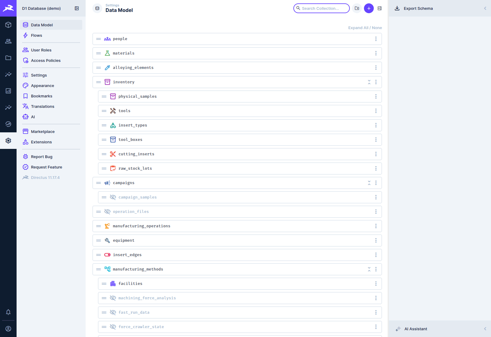

# Administration

[← D1 Database wiki](README.md)

For whoever runs the database on d1-server. The detailed procedures live in the
[runbooks](../../runbooks/). This page is the overview, and says which to read when.

## The services

`docker-compose.yml` defines the stack:

| Service | What it is |
|---|---|
| `postgres` | PostgreSQL 16 with pgvector: the durable core |
| `directus` | Directus 11 with the D1 extensions bind-mounted from `core/extensions` |
| `redis` | Directus cache and the job queue |
| `minio` | S3-compatible object store for files and dev backups |
| `proxy` | Caddy: the single entry point (Tailscale serve terminates TLS in front of it) |
| `filter-service`, `diag-service` | Force Analysis filter previews and diagnostics previews |
| `llm-text-to-sql`, `ollama` (profile `llm`) | Ask the Database and its local model |
| `heavy-data-worker`, `analysis-worker` | the heavy-data and FFT analysis pipelines |
| `backup-server`, `bug-report-relay` | Force App live backup and bug reports |

The **force** and **FAST orchestrators** are not containers. They run on the Windows host,
because only it can reach the archive share and MATLAB (see [Force data](force-data.md) and
[FAST data](fast-data.md)).

```bash
make up            # start the stack
make logs          # follow the logs
make down          # stop it
```

## Backups

| Environment | How | Read |
|---|---|---|
| **Production (d1-server)** | nightly `pg_dump` at 02:00 by the *D1 Postgres Nightly Backup* scheduled task (`scripts/backup-postgres.ps1`), kept 14 days locally and copied to the university filestore | [backup-restore runbook](../../runbooks/backup-restore.md#production-d1-server) |
| Dev and other deployments | `make backup` / `make restore BACKUP_FILE=…` to MinIO | [backup-restore runbook](../../runbooks/backup-restore.md) |

Directus **uploads** (the `directus-uploads` volume: Force App captures, live caches, FRM images)
are not in the database dumps. See the runbook for how they are protected.

## Changing the schema

The schema changes **only** through migrations in `db/migrations/`, applied with dbmate, never
through the Directus data-model screen:

```bash
make migrate          # apply pending migrations
make migrate-status   # what is applied / pending
make migrate-down     # roll back the latest
```

Every new table and column needs a `COMMENT`; it is the data dictionary. CI applies every
migration to a fresh database, runs the schema tests, then rolls everything back. See
[`db/README.md`](../../../db/README.md) and [`CONTRIBUTING.md`](../../../CONTRIBUTING.md).



**Settings → Data Model** is for browsing. Directus reads the schema; it must not change it.

## Directus configuration

Collections' display settings, field interfaces, relations and presets are version-controlled as
SQL in `scripts/configure_*.sql`. Apply them in order with:

```bash
bash scripts/configure_all.sh      # applies them, flushes Redis, restarts Directus
```

Roles, policies and user accounts come from `scripts/configure_users_and_policies.sql`, applied
separately. See [`scripts/README.md`](../../../scripts/README.md#directus-configuration).

> **Re-applying `configure_directus.sql` removes metadata that later migrations added.** The
> script deletes all field and relation metadata for the core collections, then re-inserts its
> own set. Field interfaces and relations that later migrations registered on those collections
> are removed, for example the FAST recipe → runs relation (after which the FAST recipes
> collection returns errors). On a fresh build that lost about a hundred fields. Re-apply the
> affected migrations' metadata afterwards, or compare against a migrations-only database (see
> the [developer guide](developer-guide.md#building-the-stack-from-nothing)).

## Extensions

The Vue and TypeScript extensions in `core/extensions/` are built in place, and their `dist/` is
git-ignored:

```bash
cd core/extensions/<name> && npm ci && npm run build
docker restart d1-database-directus-1     # extensions load at start-up
```

Four extensions are npm workspaces of the repo root and have no lock file of their own:
`d1-force-dashboard`, `d1-home`, `d1-lab-dashboard` and `d1-composition-bar`. Build them from the
repo root instead: `npm ci`, then `npm run build:extension` (force dashboard) and
`npm run build:extensions` (the other three).

On the Windows host, `EXTENSIONS_AUTO_RELOAD` does not see changes across the bind mount, so
always restart. [`core/README.md`](../../../core/README.md#extensions-coreextensions) lists every
extension and what it does.

## Importing data

One-off and re-runnable importers are in `scripts/` (legacy AppSheet data, archive indexing,
experiment sheets, FAST logs…). Each file's header is its manual. **Read it before running it
against production.** The index is [`scripts/README.md`](../../../scripts/README.md).

## Other runbooks

- [Heavy-data pipeline](../../runbooks/heavy-data-pipeline.md): large test-data uploads and their
  processing workers
- [Text-to-SQL](../../runbooks/text-to-sql.md): running and evaluating Ask the Database
- [Traceability](../../runbooks/traceability.md): lineage queries
- [Force App operations](../../force-app-operations.md): the live-backup server and the app's
  update feed
