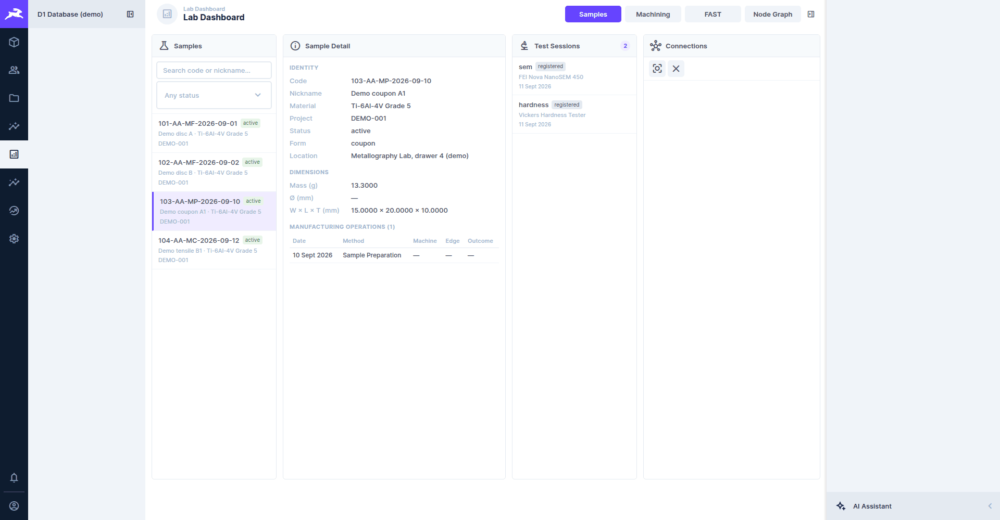
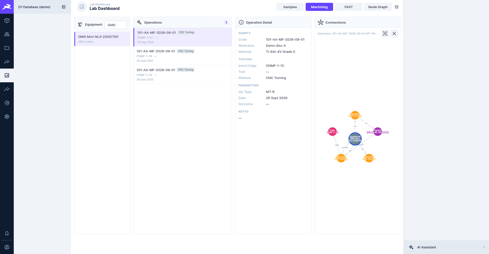
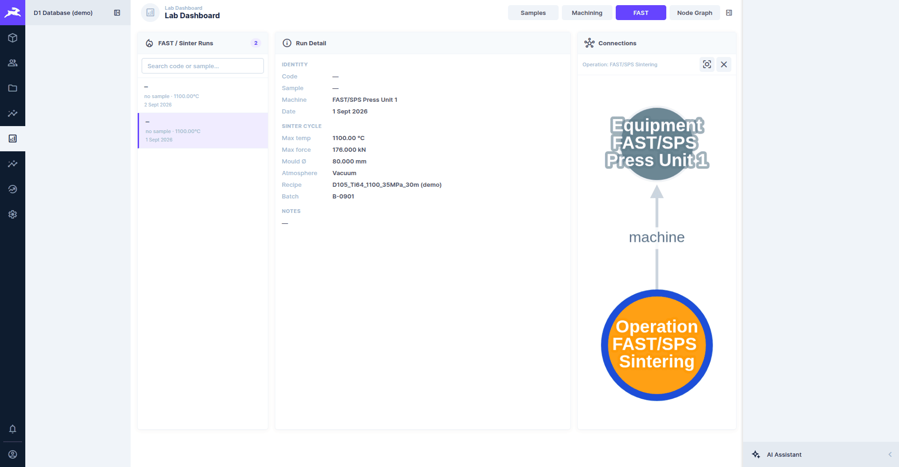
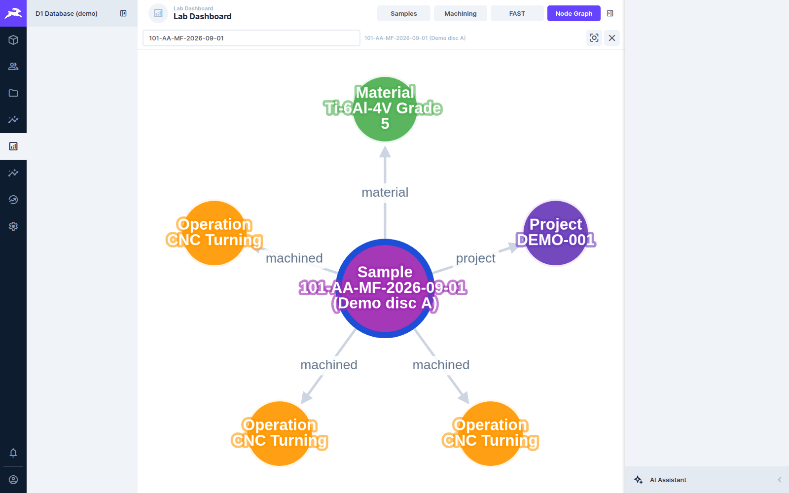
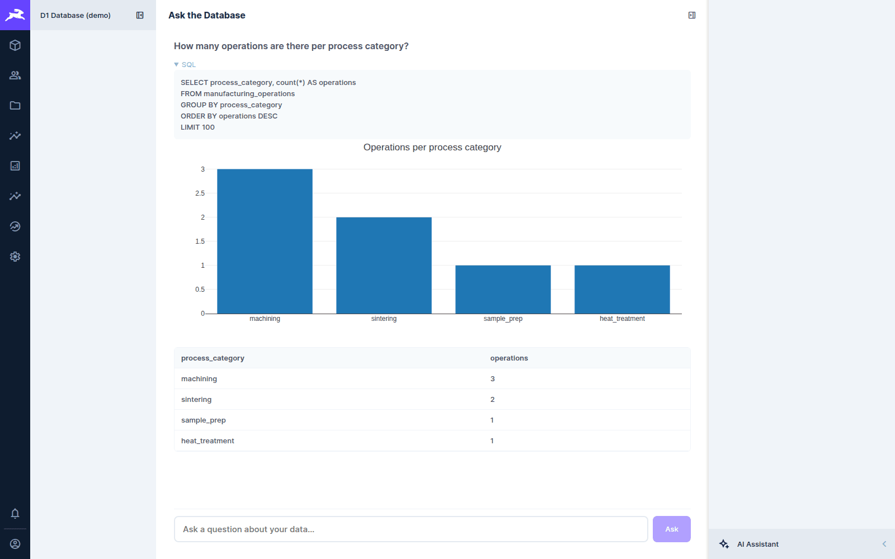
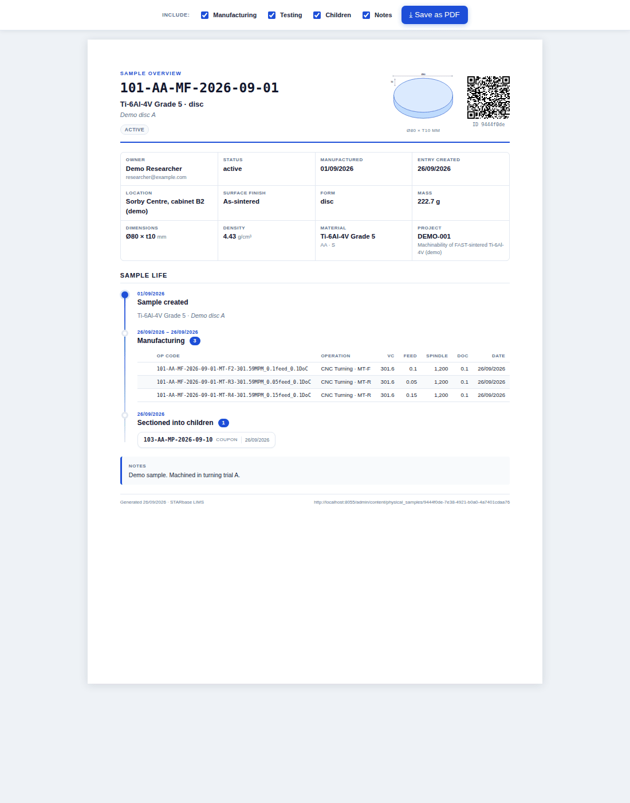
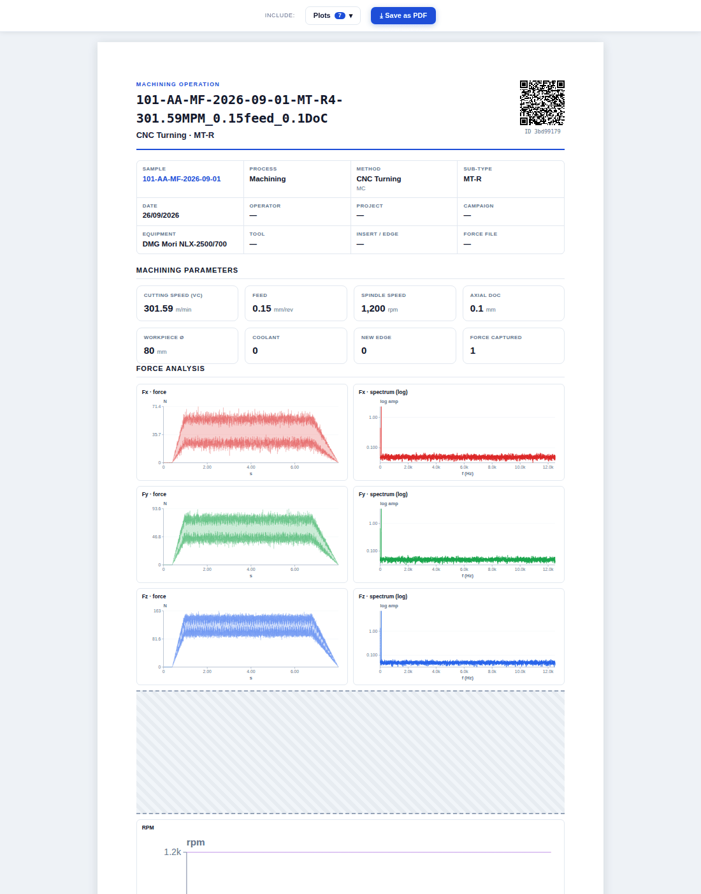
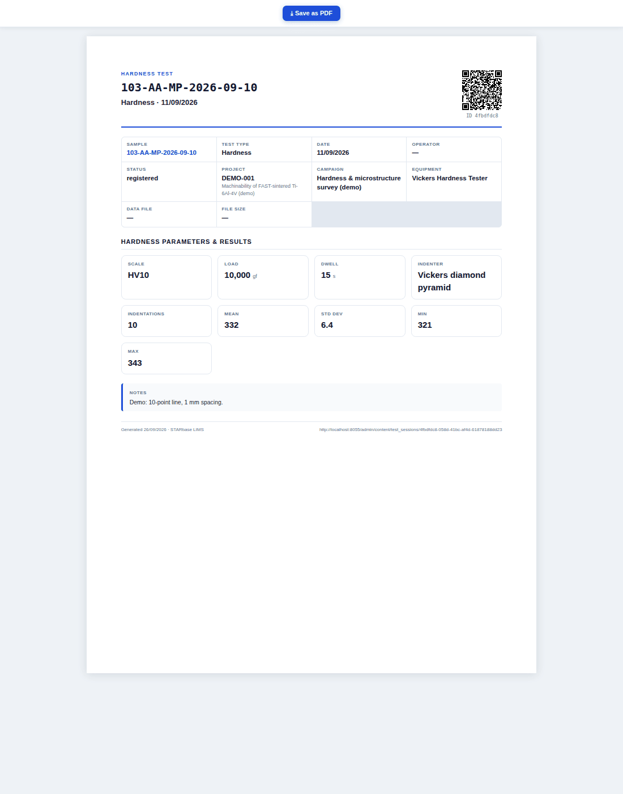

# Dashboards, Ask the Database and reports

[← D1 Database wiki](README.md)

Beyond Directus's own record lists, D1 adds its own views. [Force Analysis](force-data.md) and
[FAST Analysis](fast-data.md) have their own pages. This page covers the rest.

## Lab Dashboard

**Lab Dashboard** in the module bar is an overview in four tabs. Each tab is a chain of columns:
pick something on the left and the columns to its right fill in. The **Connections** column on the
right draws a graph of the selected record's neighbours.

### Samples

Search or filter the samples by status, then pick one to see its identity and dimensions, its
manufacturing operations (date, method, machine, edge, outcome) and its test sessions.

### Machining

Pick a machine to list its operations, then an operation to see its sample, tooling and
parameters. The connection graph links the operation to its sample, edge and machine.

### FAST

FAST sintering runs with their sinter-cycle summary (peak temperature and force, mould
diameter, atmosphere, recipe, batch). For the full traces, use [FAST Analysis](fast-data.md).

### Node Graph

A full-screen version of the connections graph. Search for a sample, operation (by its code),
machine, insert, edge or box, pick it from the results, and the graph draws its neighbours:
material and project, operations and tests, machine, tooling, parent samples. Click any node to
explore outward from it. Each exploration adds to the graph; ✕ clears it and ⌖ re-fits it.

## Ask the Database

**Ask the Database** (from Home) answers questions about the lab data in plain English:

1. Click one of the example questions on the empty page, or type your own, e.g. *"How many
   operations are there per process category?"*, and press **Ask**.
2. A **self-hosted** language model (Ollama, running on d1-server) writes a SQL query. The query
   is shown under **SQL** so you can check what was actually asked.
3. The query runs, and the answer comes back as a table, with a chart when the result suits one.
4. Follow-up questions refine the previous one (*"only for Ti-6Al-4V"*).
5. At most 200 rows are shown. When a result is longer, the page says *"Showing the first N
   rows"*: ask for something more specific (a filter or a count) to see the rest.
6. Above each answer, **Download CSV** saves the table as a spreadsheet-ready file (named after
   the question and the date), **Copy SQL** copies the query, and **Save question** pins the
   question to the **Saved** list.
7. The empty page lists your **Saved** questions and your last 20 **Recent questions**, each with
   **Run again** and **×** to remove it. They are kept in your own browser only (not on the
   server, and not shared with colleagues); only the question text is stored, never the answers.
   Clearing the site data or using a private window empties them.

There is no thumbs-up/down feedback on answers yet: it needs somewhere to store it, which is a
separate decision.

The model is **never trusted**. Its SQL goes through two independent guards before it touches
data:

- an application **SQL guard** that parses the query (with a real SQL parser) and accepts only a
  single read-only `SELECT`. It rejects anything touching credential tables or Directus's
  auth and system tables, and wraps the query in a row limit. Lab tables and the `v_*` reporting
  views are readable;
- a **read-only Postgres role**, so even a query that got past the guard could not change
  anything.

A question the guard rejects comes back with a plain explanation, the reason and the SQL, plus
the example questions, so you can rephrase it. If the page says the service could not be reached
or timed out, the language model may be starting up: try again shortly. No
data leaves the server. See [ADR-0009](../../adr/0009-text-to-sql-guarded-readonly.md) and the
[text-to-SQL runbook](../../runbooks/text-to-sql.md).

> The screenshot's answer was stubbed: the text-to-SQL service was not running on the demo
> stack. The SQL was written by hand, and the table and chart are that SQL's real result on the
> demo data.

## Printable reports

The `d1-report` endpoint renders print-ready reports (A4, one or two pages) for three kinds of
record. Open one from the **Generate PDF** button at the top of a sample, operation or test form (the
`d1-report-button` field, added by migration `20261003000117_report_buttons.sql`; restart Directus
after applying it so the form metadata is reloaded), or directly at:

| Report | URL |
|---|---|
| Sample overview | `/d1-report/sample/<sample id>` |
| Operation datasheet | `/d1-report/operation/<operation id>` |
| Test datasheet | `/d1-report/test/<session id>` |

**Save as PDF** at the top prints the report. The checkboxes beside it choose what to include.
Each report carries a QR code that links back to the record.

| Sample overview | Operation datasheet | Test datasheet |
|---|---|---|
|  |  |  |

- The **sample overview** covers identity, owner, location, dimensions, material and project,
  then the sample's life as a timeline: created, manufacturing operations, tests, and child
  samples cut from it. Toggle *Manufacturing*, *Testing*, *Children* and *Notes*.
- The **operation datasheet** has the machining parameters, and for a force capture its force and
  spectrum plots per axis, plus RPM. *Plots* chooses which plots to include.
- The **test datasheet** has the test's type-specific parameters and results, e.g. hardness scale,
  load, dwell, number of indents, mean, standard deviation, min and max.

## Insights

Directus's own **Insights** module (in the module bar) builds dashboards from panels: counts,
time series, lists. It is there for ad-hoc dashboards. D1's own views above cover the common
cases.
