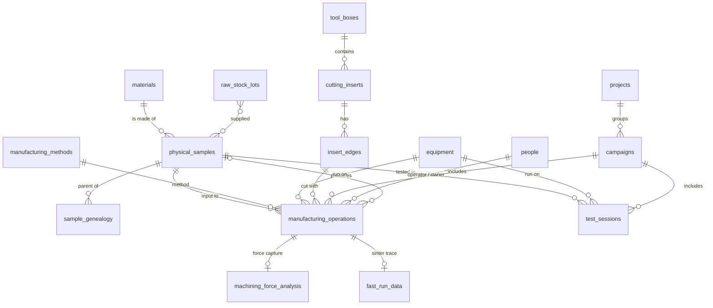

# The data model

[← D1 Database wiki](README.md)

This page is the map: what the main collections are and how they connect. The complete list of
tables and views is in the [data dictionary](../../data-dictionary.md). The authoritative
column-by-column description is in the database itself (`v_schema_dictionary`), because every
table and column carries a `COMMENT`.

## The core entities

| Collection (shown as) | What one record is |
|---|---|
| `physical_samples` (**Items**) | a physical thing: a workpiece, coupon or offcut. Also used for equipment-type and miscellaneous items (*Item Type*). |
| `materials` (**Alloys / Materials**) | an alloy in the catalogue, with its ISO 513 group and its elemental composition |
| `manufacturing_operations` (**Manufacturing Operations**) | one process step on a sample: machining pass, FAST sinter, heat treatment, sample preparation… |
| `manufacturing_methods` | the catalogue of methods: `MC` CNC Turning, `MM` CNC Milling, `MF` FAST/SPS Sintering, `MO` Forging, `MR` Rolling, `HT` Heat Treatment, `GR` Grinding, `MP` Sample Preparation |
| `test_sessions` (**Test Sessions**) | one test or measurement: hardness, tensile, SEM, XRD… |
| `projects`, `campaigns` | a research project, and a machining trial or testing campaign within it |
| `tool_boxes` → `cutting_inserts` → `insert_edges` | the three-level tooling hierarchy (**Insert Boxes**, **Cutting Inserts**, **Insert Edges**) |
| `equipment` (**Machines / Equipment**) | a machine or instrument, with the process and test categories it can do (*capabilities*) |
| `people` | anyone named on a record (operator, researcher, owner). They don't need a login. |
| `machining_force_analysis` | the processed result of one force capture (see [Force data](force-data.md)) |
| `fast_run_data`, `fast_recipes` | FAST sintering traces and recipes (see [FAST sintering data](fast-data.md)) |
| `audit_logs` | the append-only change log (see [Audit log](roles-and-permissions.md#the-audit-log)) |

## Process categories and typed parameters

A manufacturing operation's **method** decides its **process category**: `machining`,
`sintering`, `heat_treatment`, `deformation`, `additive` or `sample_prep`. The form shows only
the parameter fields for that category: cutting speed, feed and depth of cut for machining;
temperature, pressure and dwell for sintering; and so on. Test sessions work the same way, with a
**test type** (e.g. *Destructive — Hardness*) deciding the **test category** (`nde`,
`destructive` or `dynamic`) and the parameter fields shown.

The parameters are real, typed columns on the operation or test table, not a free-form JSON
blob. They can be validated, filtered and charted like any other field
([ADR-0004](../../adr/0004-jsonb-for-dynamic-method-params.md) records the original JSONB design
and why it moved on).

## Identifiers and codes

Every main entity has two identifiers:

| | Column | Purpose |
|---|---|---|
| **UUID primary key** | `sample_id`, `operation_id`, `edge_id`… | used by every relation. It never changes and is never shown. |
| **Human-readable code** | `sample_code`, `pass_code`, `edge_code`… | shown, printed on labels and searched. Unique, but never the key. |

The codes are generated in Postgres (`generate_sample_code`, `generate_pass_code`,
`generate_force_file_id`, `generate_insert_short_code`), so the same rules apply whether a record
comes from the UI, an importer or the Force App:

- **Sample code** `{sequence}-{alloy code}-{method code}-{YYYY-MM-DD}`, e.g. `101-AA-MF-2026-09-01`
  (sample 101, alloy `AA` = Ti-6Al-4V Grade 5, made by `MF` = FAST sintering, on 1 Sept 2026).
- **Operation (pass) code** `{sample code}-{subtype}{sequence}`, plus the cutting parameters for
  a machining pass: `…-MT-R4-301.59MPM_0.15feed_0.1DoC` is roughing pass 4 at Vc = 301.59 m/min,
  feed 0.15 mm/rev and 0.1 mm depth of cut. For a force capture this is also the force-file ID.
  See [experiment sheets and naming](../../experiment-sheets-and-naming.md) for where this
  convention comes from.

Because a code is derived from the data, correcting the data regenerates the code. The Force
App's *Save changes* dialog and the operation form both show the regenerated code before saving.

## Lineage and traceability

Samples form a family tree. Cutting a coupon from a disc records the disc as its parent in
`sample_genealogy`, and a FAST sinter records the sample it produced. Postgres functions walk the
tree in either direction:

| Function | Gives |
|---|---|
| `f_trace_ancestors(sample_id)` | every ancestor of a sample |
| `f_trace_descendants(sample_id)` | everything made from it |
| `f_trace_stock_origins(sample_id)` | the raw stock lots it came from |
| `f_sample_timeline(sample_id)` | its operations and tests, in date order |

The functions run as the database owner and ignore Directus permissions, so the app does not call
them directly. The Lab Dashboard's Timeline tab reads them through the `d1-trace` endpoint
(`GET /d1-trace/sample/<id>`), which re-checks every sample, operation, test and stock lot against
the signed-in user's permissions and drops, and only counts, what they cannot read.

See the [traceability runbook](../../runbooks/traceability.md). The sample report
([Reports](dashboards-and-reports.md#printable-reports)) shows the same lineage on paper.

## Views for reporting and querying

Flat, joined `v_*` views sit over the tables for reporting and for the text-to-SQL assistant:
`v_complete_sample_history`, `v_manufacturing_operations_full`, `v_test_sessions_full`,
`v_tooling_hierarchy`, `v_project_rollup`, and others. They are listed in the
[data dictionary](../../data-dictionary.md#schema-overview).
