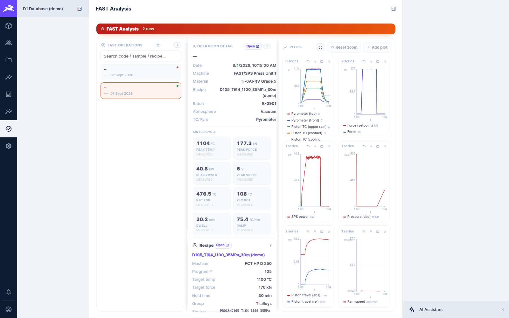

# FAST sintering data

[← D1 Database wiki](README.md)

**FAST** (field-assisted sintering, also called SPS) runs on the FCT HP D 25 and HP D 250
presses. Each run is a manufacturing operation with the **MF – FAST/SPS Sintering** method (see
[Operations](operations-and-tests.md#the-parameter-fields)). Its time-series trace (temperatures,
force, pressure, power, piston travel…) is stored as a normalised CSV and described by a
`fast_run_data` row.

## FAST Analysis (the dashboard)

**FAST Analysis** in the module bar lists every FAST operation. Pick one to see its detail and
plots:



- **FAST operations:** each run with its code, sample and date. The dot shows whether a trace is
  attached.
- **Operation detail:** machine, material, recipe, batch, atmosphere, TC/pyrometer control, and
  the **sinter cycle** summary: peak temperature, force, power and voltage, PTC top/bottom
  temperatures, dwell and heating ramp. **Open ↗** opens the operation record.
- **Recipe:** the recipe the run used (program #, target temperature and force, hold time, group).
  **Open ↗** opens it.
- **Plots:** a grid of trace tiles. Each tile's ⋮ menu (or a right-click) picks which series it
  shows. **+ Add plot** adds a tile. The rectangle tool zooms every tile together, and **Reset
  zoom** undoes it.

## Attaching a trace

A FAST run's trace comes from the press's CSV export. The two presses export in different shapes.
The **FAST orchestrator** (`scripts/fast_orchestrator.py`) normalises both into one canonical
CSV, uploads it to Directus under the operation's code, and fills in `fast_run_data`: the series
catalogue, row count, duration, start time and summary.

From an operation in FAST Analysis you can:

- **upload** a raw CSV. It is staged in Directus, and the orchestrator fetches, normalises and
  replaces it;
- **import from the archive**: pick a CSV path from the indexed archive share. The orchestrator
  reads it directly on the host.

The import status (`pending` → `done` / `error`, with the error message) shows in the panel. The
orchestrator must be running on the host:

```powershell
py scripts/fast_orchestrator.py --daemon      # poll for pending imports forever
py scripts/fast_orchestrator.py --run         # or process the pending ones once
```

## Recipes

**Manufacturing Methods → Fast Recipes** (`fast_recipes`) holds the FAST 25 / FAST 250 recipe
definitions: machine, program number, name and group, target temperature and force, hold time, and the full parameter set parsed from the recipe file.
An operation links its recipe, and the dashboard shows it alongside the run.

## Bulk imports

Historic FAST runs were rebuilt from the machines' own records by the scripts under
[Data import and backfills](../../../scripts/README.md#data-import-and-backfills)
(`import_fast25.py`, `import_fast250.py`, `import_fast_logs.py` and their helpers). Check a
script's header before re-running it against production.

Background on the FAST data itself: [FAST 25 overview](../../FAST25_OVERVIEW.md) and the FAST 25 /
FAST 250 data-architecture and file-reading guides in `docs/`.
