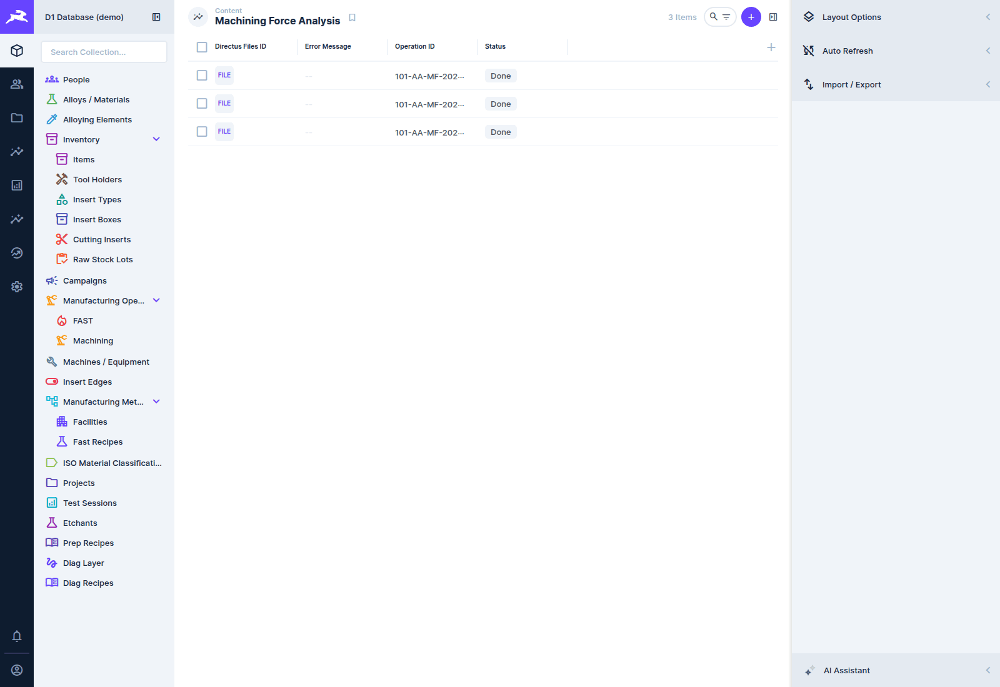
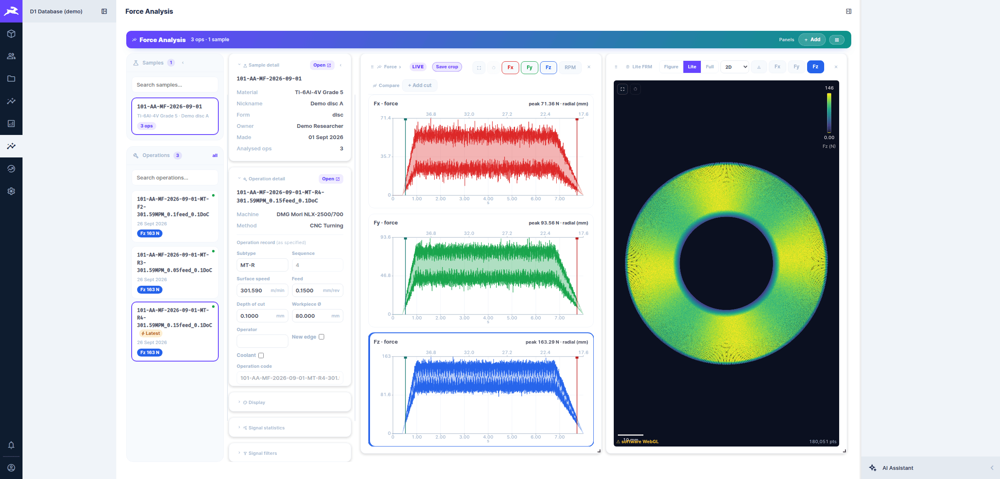
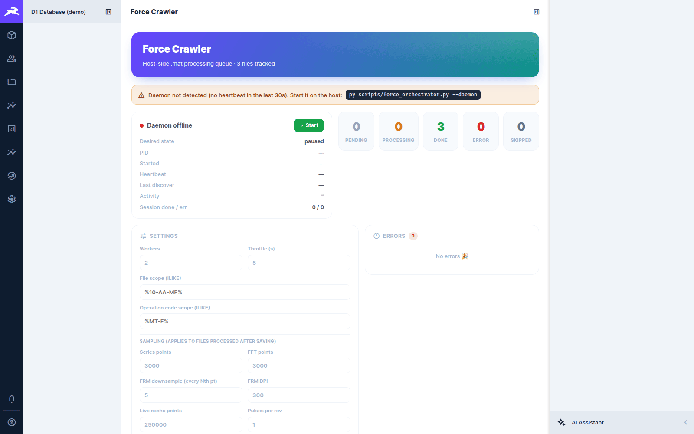

# Force data

[← D1 Database wiki](README.md)

Machining forces are captured by the dynamometer on the lathe as MATLAB `.mat` files: hundreds
of megabytes to tens of gigabytes per cut. The database stores the **results** of processing
each file in `machining_force_analysis`, one row per force file linked to its machining
operation. The raw file stays where it is: on the archive share, or in Directus file storage.

## Two ways in

| Route | How a cut arrives | What gets filled in |
|---|---|---|
| **The Force App** (new recordings) | Saving a cut creates the operation, uploads `capture.mat` and `live_cache.bin` to Directus, and writes the analysis row as finished (`status = done`) with peaks, the series envelope and any crop override. See the [Force App wiki](../force-app/recording.md#what-saving-writes). | series, peaks, live cache. **No** stored FFT, FRM figure, metrics or octree. |
| **The archive** (historic and archived cuts) | `scripts/index_archive.py` indexes the read-only archive share into the File Library (the file's `metadata.archive_path`), and the files are linked to their operations. The **force orchestrator** discovers each linked `.mat`, queues it (`pending`), runs `scripts/matlab/process_force.m` over it read-only, and writes the results. | everything: metrics, series, FFT, FRM figures per axis, live cache, then octrees and diagnostics on request |

So a cut recorded with the Force App gets full host processing (stored FFT, *Figure*, *Full*
octree, diagnostics) only once its capture is in the archive and indexed. Until then, the
dashboard views computed from the live cache (force charts, Power / Spectro / Waterfall, Lite
FRM, statistics, filters) are what it has.

## The analysis record

`machining_force_analysis` has one row per force file. The main groups of columns:

| Group | Columns |
|---|---|
| queue state | `status` (`pending` → `processing` → `done` / `error` / `skipped`), `error_message`, `processed_at`, `matlab_version` |
| cut parameters (from the file) | `sample_rate`, `feed`, `cut_diameter`, `surface_speed`, `depth_of_cut`, `max_rpm`, `pulses_per_rev`, diameters |
| results | `peak_fx/fy/fz`, `mean_rpm`, `cut_start_idx` / `cut_end_idx` (the detected crop), `series` (min/max envelope), `fft` |
| figures and caches | `frm_fx/fy/fz` (FRM PNGs), `live_cache_file` |
| on-demand host jobs | `render_*` (full-res image), `octree_*` and `grid_octree_*` (point-cloud octrees), `diag_*` (diagnostics) |
| edits | `crop_start/end_idx_override`, `filter_chain` / `filter_baked`, `doctor_dismissed` |



You rarely edit these rows by hand. The dashboard below reads and writes them.

## Force Analysis (the dashboard)

**Force Analysis** in the module bar is the same dashboard as the Force App's **Plot** page. The
shared code lives in `packages/force-plotting`. Pick a sample, then a cut, to see its force
charts, spectra and FRM map, and to crop, filter, compare and correct it.



The [Force App's Plot page documentation](../force-app/plot-dashboard.md) covers every panel and
applies here unchanged. Inside Directus the dashboard uses your Directus session, so no
separate sign-in is needed.

## Force Crawler (the processing queue)

**Force Crawler** (from Home) drives the orchestrator for the archive route. The orchestrator
runs as a daemon on the Windows host, because only that machine can reach the archive share and
MATLAB:

```powershell
py scripts/force_orchestrator.py --daemon
```

The module then controls it through the `force_crawler_state` row:



- **Status:** whether the daemon is alive (heartbeat), running or paused, its PID and its last
  discovery pass. *Daemon not detected* means it is not running on the host. The banner shows
  the command to start it.
- **Counters:** how many files are pending, processing, done, errored and skipped.
- **Settings:** number of MATLAB workers, throttle between launches, a file-path scope and an
  operation-code scope (SQL `LIKE` patterns, e.g. `%10-AA-MF%`), and the sampling applied to
  newly processed files (series points, FFT points, FRM downsample and DPI, live-cache points,
  pulses per rev).
- **Errors:** the latest failures, with their messages.

Useful one-off commands (see the script's header for all of them):

```powershell
# process one sample's files now, verbosely
py scripts/force_orchestrator.py --discover --run --file-like '%10-AA-MF%' -v
# requeue failures
py scripts/force_orchestrator.py --discover --retry-errors
```

## Where the heavy files live

| What | Where |
|---|---|
| archived `.mat` files | the read-only archive share (never written to) |
| Force App uploads | Directus file storage (MinIO in production) |
| live caches, FRM PNGs | Directus file storage |
| octrees (full, gridded, diagnostics) | the octree directory served by Caddy at `/octrees` |

File layouts are specified in [force file standards](../../force-file-standards.md). The census
of the historic archive is in [`docs/force-archive-census/`](../../force-archive-census/README.md).

> **About the screenshots:** the demo cuts were recorded with the Force App's simulator, so they
> took the first route. Their stored FFT, which the dashboard and the operation report show, was
> added by hand for this wiki (computed from each cut's live cache with the filter service) to
> stand in for the orchestrator's output.
