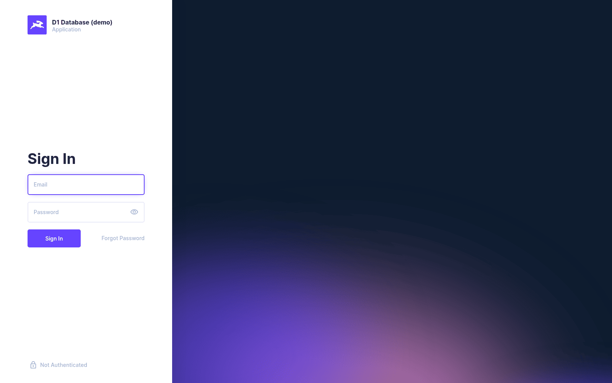
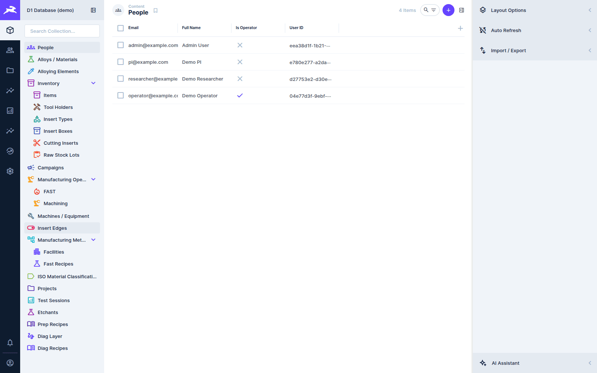
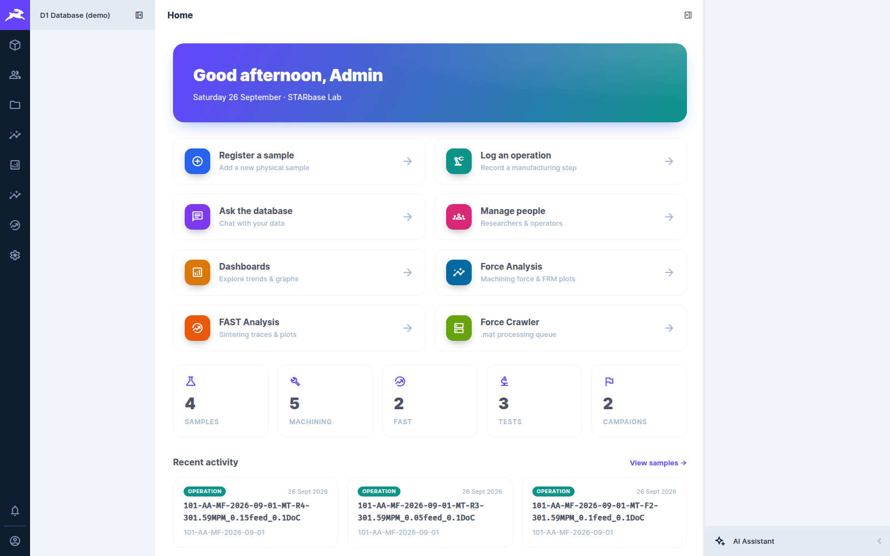

# Getting started

[← D1 Database wiki](README.md)

## Signing in

Open the Directus address you were given (on the lab network, over Tailscale) and sign in with
your email and password. The Force App uses the same account.

Accounts are created by an administrator (see [Roles](roles-and-permissions.md)). There is no
self-registration. **Forgot Password** only works if the server has email configured; otherwise
ask an administrator to reset it.

## The screen

From left to right:

1. **The module bar** (the dark rail). Each icon is a whole section:

   | Icon | Module | What it is |
   |---|---|---|
   | house | **Home** | the landing page, the formatted record pages and the guided *Register a sample* ([below](#the-home-page)) |
   | people | **User Directory** | Directus user accounts |
   | folder | **File Library** | uploaded files and indexed archive files |
   | chart | **Insights** | Directus's own dashboards |
   | grid | **Lab Dashboard** | the D1 overview of samples, machining and FAST ([Dashboards](dashboards-and-reports.md#lab-dashboard)) |
   | line chart | **Force Analysis** | the machining force dashboard ([Force data](force-data.md)) |
   | gauge | **FAST Analysis** | sintering traces ([FAST sintering data](fast-data.md)) |
   | cube | **Content** | the Data Studio: every collection (table) and its records |
   | cog | **Settings** | data model, roles, policies (administrators only) |

   **Force Crawler** and **Ask the Database** are also modules. They are reached from the Home
   page's tiles rather than the rail.

2. **The navigation panel**: in Content, the collections grouped into folders (*Inventory*,
   *Manufacturing Operations*, *Manufacturing Methods*…). Type in *Search Collection…* to find
   one.
3. **The main area**: a list of records (the *layout*) or one record's form.
4. **The sidebar** on the right: layout options, filters and export on a list; **Revisions**,
   **Comments** and **Shares** on a record. Directus 11 also puts its **AI Assistant** here.

## The Home page

**Home** is the landing page, and it is about **your** work. From top to bottom:

1. **Quick actions.** Five big buttons for what you do every day: *Register a sample*, *Log an
   operation*, *Ask the database*, *Print labels* and *Dashboards*. Below them, a **More** row
   reaches the rest: *Projects*, *People*, *Force Analysis*, *FAST Analysis* and *Force Crawler*.
2. **Needs attention.** Counts of things that want a look: force analyses in error on your
   operations, failed test sessions, operations whose force files are still queued, and (for
   administrators) samples with no owner. Click a tile and the matching records (the first ten)
   list right under it, each one a link to its page.
3. **My work.** Cards for the projects where you are PI or an investigator, the campaigns you
   own, and the samples you own or co-own (latest first). A section says so when it is empty
   rather than hiding.
4. **Lab at a glance.** The lab-wide counts of samples, machining operations, FAST runs, tests
   and campaigns. Each opens its list.
5. **Recent activity.** The newest samples, operations and tests, each tagged with its kind. A FAST
   run opens its Operation page and also offers a link to the FAST dashboard.

A section that your role cannot read shows a short notice and the rest of Home still works.

Records you click on Home, and on every page below, open as **formatted pages** rather than
Content forms: the Projects index, **Project**, **Campaign**, **Sample**, **Operation** and
**Test** pages. They are described in [Explorer pages](explorer-pages.md). Each page has an
*Open in Data Studio* button, and Content stays available for everything else: it is after the
dashboards on the rail.

## Working with records

- **Open a collection** in Content. Records are listed with the columns the layout shows. Click a
  column header to sort, use the search box, or open **Filter** in the sidebar.
- **Open a record** by clicking its row. Fields are laid out in the form, and many are D1
  custom fields that fill themselves in (see [Samples](samples.md) and
  [Operations](operations-and-tests.md)).
- **Save** with the ✓ at the top right (or Ctrl+S). The arrow next to it offers *Save and
  stay*, *Save and create new* and *Save as copy*.
- **Revisions** in the sidebar show every saved version of the record and who made it, and can
  revert to one. Every change is also written to the database's own tamper-evident
  [audit log](roles-and-permissions.md#the-audit-log).
- **Comments** are for notes to colleagues about a record.
- **Export** a list from the sidebar's *Import / Export* (CSV, JSON, XLSX).
- **Saved views** (bookmarks) sit under the collection in the navigation panel. Click one to
  open the list already filtered. They are shared by everyone, and you can change the filter on
  screen without altering the saved view. See [Saved views](#saved-views) below.

## Saved views

Ready-made filtered lists, one click away in the navigation panel:

| Collection | View | Shows |
|---|---|---|
| Manufacturing Operations | **My operations** | operations whose owner is you, newest first |
| Manufacturing Operations | **FAST runs, last 7 days** | FAST (`MF`) operations dated in the last 7 days |
| Manufacturing Operations | **Missing outcome** | operations with no outcome notes yet |
| Manufacturing Operations | **Machining**, **FAST** | all operations of that family |
| Test Sessions | **Failed** | tests whose pipeline status is `failed` |
| Test Sessions | **Needs analysis** | tests whose status is `processed`: the data is processed and analysis has not started |
| Items (samples) | **My samples** | samples whose owner is you |
| Items (samples) | **No location** | samples with no storage location recorded |

*My* views match the **Owner** picker on the record against the person linked to your login
(the person's *user id* field, the linked app login, in the *People* list). If no person is linked
to your login, they are empty: ask an administrator to link yours. A view you change in the sidebar is not saved
for anyone else. To keep your own, use the bookmark button next to the collection title.

## Codes you will see everywhere

Records are shown by their human-readable code, never by their internal ID:

| Code | Example | Built from |
|---|---|---|
| Sample code | `101-AA-MF-2026-09-01` | sequence number · alloy code · method code · date made |
| Operation (pass) code | `101-AA-MF-2026-09-01-MT-R4-301.59MPM_0.15feed_0.1DoC` | sample code · operation subtype + sequence · cutting speed, feed, depth of cut |
| Edge code | `CNMF-1-1A` | box · insert number · edge letter |
| Project code | `DEMO-001` | assigned |
| Campaign code | `DEMO-001-T1` | entered by hand (free text) |

Sample, operation and edge codes are generated automatically and can be regenerated from the data at any time. See
[The data model](data-model.md#identifiers-and-codes).
