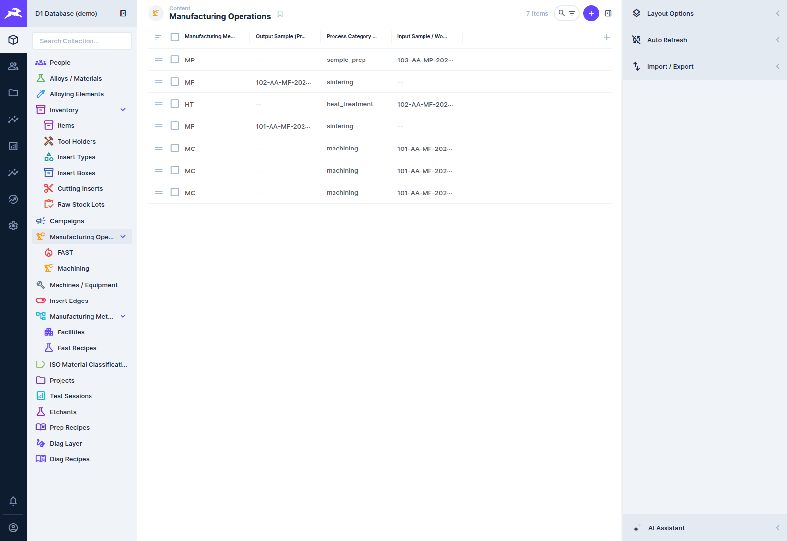
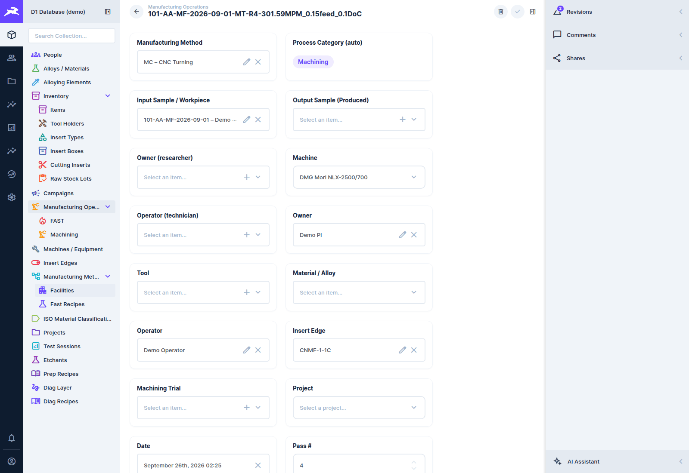
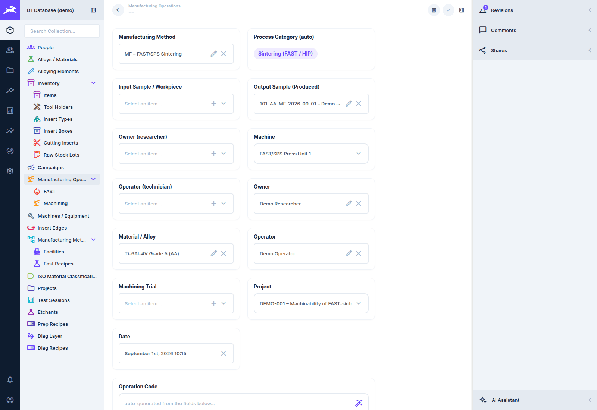
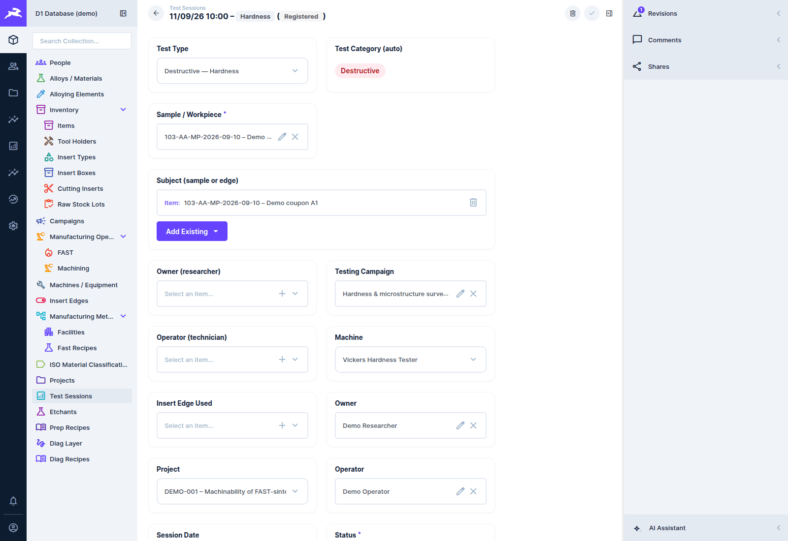
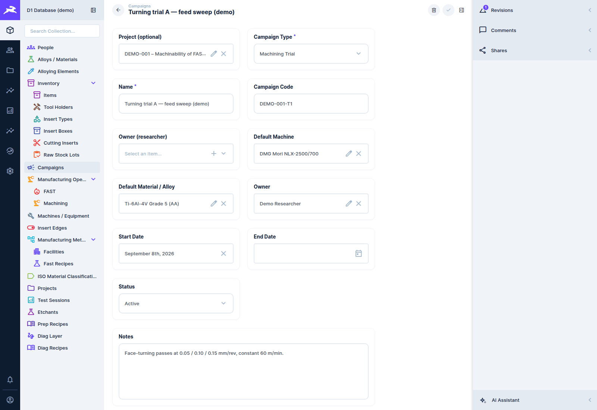
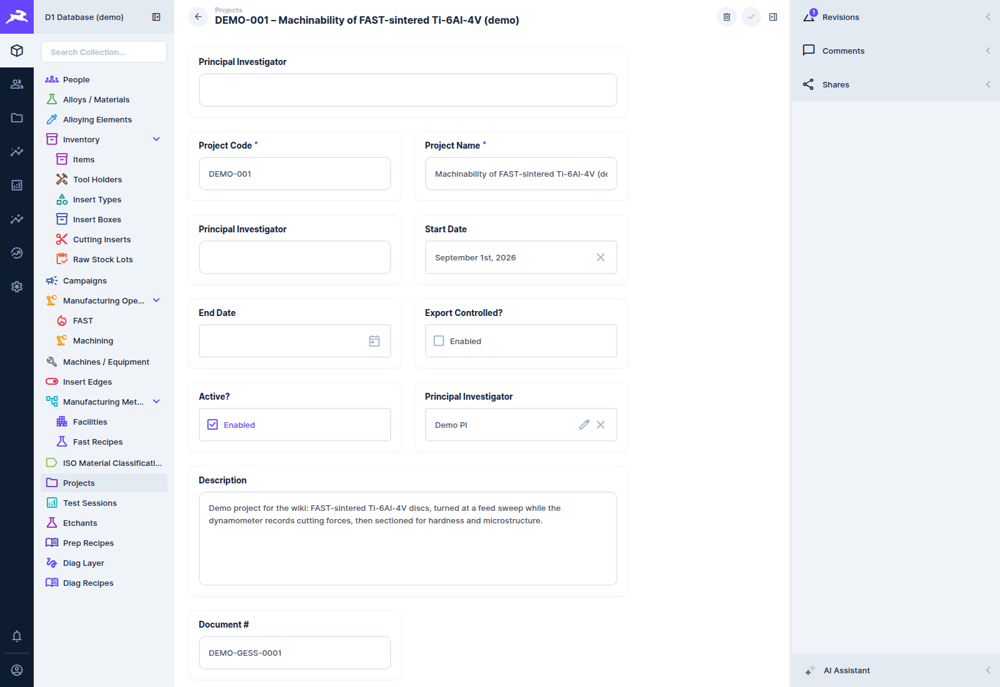

# Operations, tests, campaigns and projects

[← D1 Database wiki](README.md)

## Manufacturing operations

A **manufacturing operation** is one process step performed on a sample: a machining pass, a
FAST sinter, a heat treatment, a preparation for metallography. Operations are listed under
**Manufacturing Operations**, with shortcuts to the **FAST** and **Machining** subsets and to
**My operations**, **FAST runs, last 7 days** and **Missing outcome**
([Saved views](getting-started.md#saved-views)).



### Logging an operation

**Home → Log an operation**, or **+** on the list:

1. **Manufacturing Method** first. It sets the **Process Category (auto)** badge (Machining,
   Sintering, Heat treatment, Sample Preparation…) and shows only that category's parameter
   fields.
2. **Input Sample / Workpiece**: what the operation was done *to*. For an operation that creates
   a new sample (a sinter, a cut), also set **Output Sample (Produced)**.
3. **Machine**: the list only offers machines whose *capabilities* include this process category.
   If a facility has several, pick the facility first to narrow it.
4. People: **Owner** and **Operator** link to the *People* list, which includes people without a
   login. **Owner (researcher)** and **Operator (technician)** link to Directus user accounts.
   New operations default the researcher owner to you (editable).
5. **Machining Trial** (campaign) and **Project**: choosing a campaign fills in the project, the
   owner, the default machine and the material from it.
6. **Date**, then the category's parameters.

A machining operation, as the Force App saves it:



A FAST sintering operation, with its recipe, machine settings and QA fields:



### The parameter fields

| Category | Parameters |
|---|---|
| **Machining** | operation sub-type (facing, roughing…), spindle speed, cutting speed Vc, feed, axial (ap) and radial (ae) depth of cut, cutting length, workpiece diameter, insert edge, new edge used?, coolant used and pressure, tachometer used?, force data captured?, chips collected and reference code, experiment-sheet link |
| **Sintering (FAST/SPS)** | recipe and recipe #, batch #, mould diameter, atmosphere, TC/pyrometer control, charge mass, peak temperature, force, voltage and power, top/bottom PTC temperatures, CoSHH reference, and the linked **FAST run** trace |
| **Heat treatment** | treatment type, atmosphere, peak temperature, and the rest of the cycle |
| **Sample preparation** | the recipe and its editable steps ([Sample preparation](samples.md#sample-preparation)) |

### The operation code

**Operation Code** is generated from the fields as you fill them in: the sample code, the
sub-type and **Pass #**, and for machining, the cutting parameters:

```
101-AA-MF-2026-09-01 - MT-R 4 - 301.59MPM_0.15feed_0.1DoC
   sample code         sub-type + pass #   Vc, feed, depth of cut
```

**Pass #** (`operation_sequence`) is assigned automatically, per sample, so every operation's
code is unique. The Force App's Plot page shows the same code and regenerates it when a
parameter is corrected (see the [Force App wiki](../force-app/plot-dashboard.md#correcting-an-operations-metadata)).

## Test sessions

A **test session** is one test or measurement: under **Test Sessions**, where the **Failed** and
**Needs analysis** saved views ([Saved views](getting-started.md#saved-views)) list the sessions
that need attention.



- **Test Type** sets the **Test Category (auto)**, and with it the parameter fields:

  | Category | Test types |
  |---|---|
  | **NDE** | optical microscopy, SEM / EBSD / EDS, TEM, XRD, Alicona, CLEMX imaging, DCT, CT scan |
  | **Destructive** | tensile, hardness, Charpy impact, compression, tribology |
  | **Dynamic** | fatigue, creep, DMA |

- **Subject (sample or edge)**: what was tested. Usually a sample, but a test can target an
  insert edge (e.g. imaging edge wear).
- **Testing Campaign**, **Project**, owners, operator, **Machine** (filtered by capability) and
  **Session Date**, as for operations.
- **Status**: `registered` → `pending_processing` → `processing` → `processed` →
  `analysing` → `analysed`, or `failed`. Status moves forward as data is attached and processed.
  The heavy-data pipeline sets the later states automatically (see the
  [heavy-data runbook](../../runbooks/heavy-data-pipeline.md)).
- **Data**: linked files, the data-file URI and size, capture software and frequency. **Summary
  Statistics (auto)** and **Plot URIs (auto)** are filled in by processing plugins.

Operations, tests, campaigns and projects each open as a formatted page from Home and from every
link; see [Explorer pages](explorer-pages.md).

## Campaigns

A **campaign** groups the operations or tests of one piece of work under a project. It is either
a **machining trial** (a sequence of passes, often one experiment sheet) or a **testing
campaign** (e.g. a hardness and microstructure survey).



A campaign carries defaults (default machine, default material, project) that new operations and
tests created in it **inherit**. Whoever creates an operation or test is its owner, not the campaign's owner. Its **Campaign** panel opens with an overview:

- counts of samples, operations and test sessions, and progress bars for force analysis (machining
  operations whose force files are analysed), diagnostics builds and completed tests;
- a table of samples with how many operations and tests each has in the campaign (a sample that
  appears only through an operation is marked "not in list" and can be added);
- each operation with its **force analysis** and **diagnostics** status (done, pending,
  processing, error, not analysed; hover an error for the message);
- each test session with its date and status.

There is no planned count on a campaign, so progress is "done out of what exists", not out of a
target. Below the overview you can **add samples** and **add test sessions** (search, click to add;
test sessions already in another campaign are not offered; the x removes), and **add or remove
operations** with the search pre-filtered to the campaign's type. What you see and change follows
your role's permissions. A role that cannot read force-analysis rows sees "—" for those columns.

## Projects

A **project** is a research project (principal investigator, investigators, dates, document
number, export control). Its items panel gathers everything used in it: samples, operations and
tests linked directly, plus those linked through its campaigns (tagged with the campaign). Empty
sections are hidden. Whoever creates a campaign is its owner (the project's PI is not copied in).



`v_project_rollup` (and its cached `project_rollup` collection) holds the same roll-up for
reporting.
