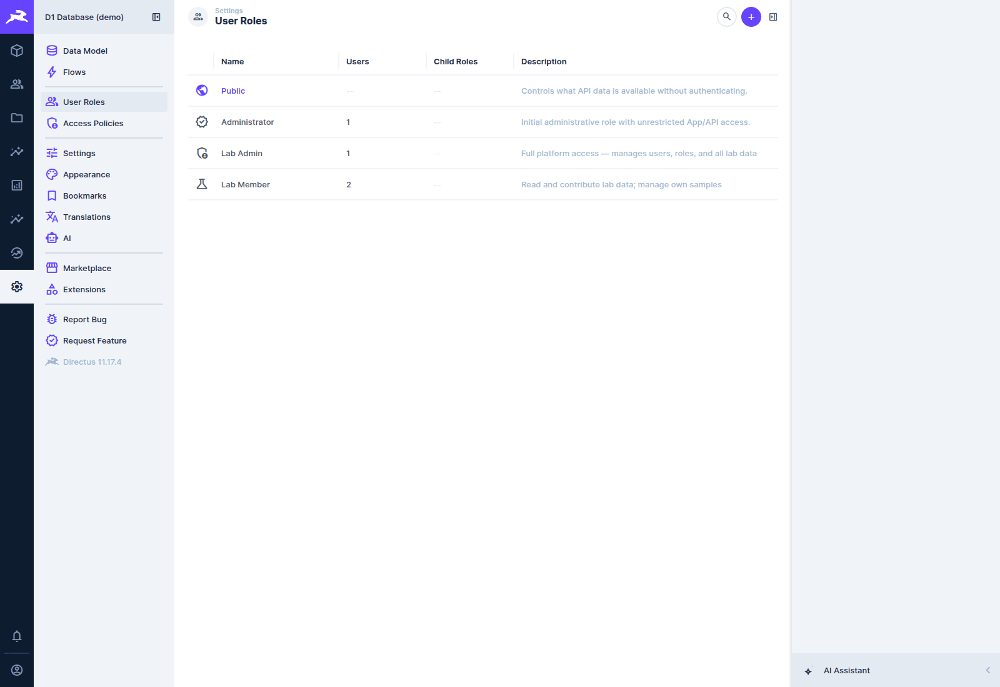
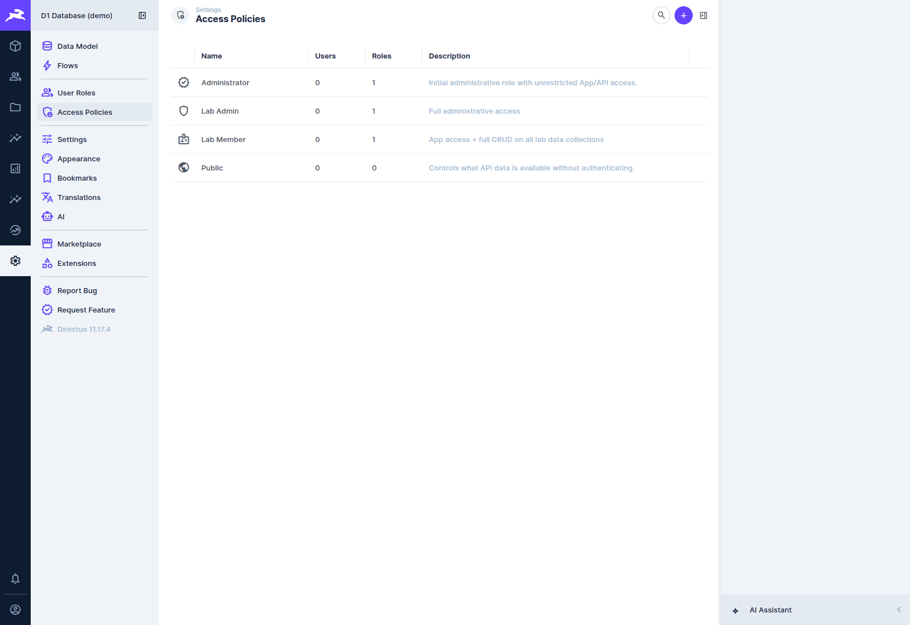
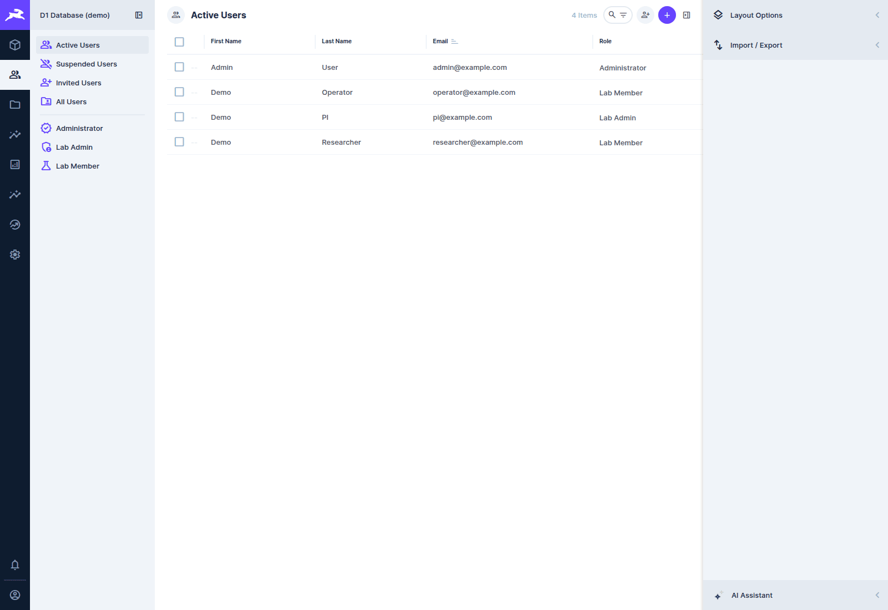
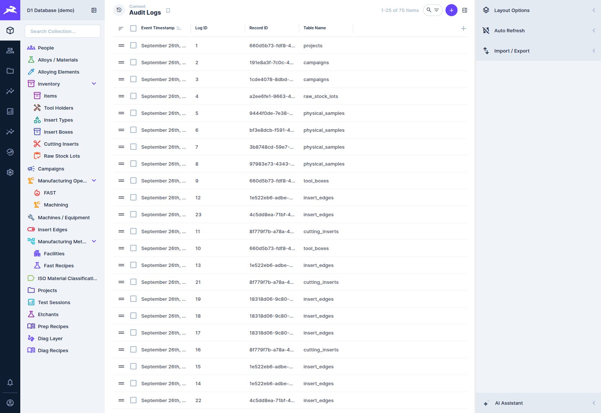

# Roles, permissions and the audit log

[← D1 Database wiki](README.md)

## How access works in Directus 11

A **user** has a **role**. A role, or a user directly, carries **policies**. A policy is a set of
permissions (create, read, update or delete, per collection, optionally per field or per row) plus
two switches: **app access** (can use the Directus web app) and **admin access** (bypasses all
permissions). Manage them in **Settings → User Roles** and **Settings → Access Policies**, and
manage people in the **User Directory**.

| User roles | Access policies |
|---|---|
|  |  |

## The roles in use

| Role | Policy | What it can do |
|---|---|---|
| **Administrator** | Administrator (admin access) | everything, including settings and the data model |
| **Lab Admin** | Lab Admin (admin access) | full administrative access. For the people who run the lab database. |
| **Lab Member** | Lab Member (app access) | uses the app; creates records, and reads and changes the samples, operations, tests, campaigns and projects **they are involved in** ([see below](#who-can-see-and-change-which-records)); uses the shared reference data (materials, equipment, tooling…); reads People but cannot relink a login; cannot read the audit log. Later migrations named `*_lab_member_*.sql` widen it collection by collection. |
| **Public** | Public | nothing (not signed in) |

The roles and policies, and the lab's real user accounts, are created by
`scripts/configure_users_and_policies.sql`. A local or demo stack should apply only the role and
policy parts of that script, not the real accounts (see the [developer guide](developer-guide.md)).

### Machine users and the Phase 3 roles

`core/roles.json` and `core/permissions.json` define an older role model from
[ADR-0005](../../adr/0005-directus-rbac-structure.md):

- **Operator:** writes samples, operations, tests and tooling;
- **Researcher:** reads everything, including the audit log;
- **Administrator**.

`core/apply.sh` creates them. Machine users such as the rig's `Rig_1_Fast_Sampling_Node` use
the Operator role with a static token. See the [API contract](../../api-contract.md).

### Lab Member and files

A Lab Member can record and save a cut from the Force App. Saving a cut uploads two files
(`POST /files`: the `.mat` and the live cache), then creates the `machining_force_analysis` row.
Force Analysis fetches each live cache with `GET /assets/<id>`. Migration
`20261005000133_lab_member_force_app_save.sql` grants exactly that:

| Collection | Lab Member actions | Why |
|---|---|---|
| `directus_files` | create, read | upload a capture. Directus answers an upload with the new file row, so create without read gives the app no file id. Read is not limited to the uploader: Force Analysis opens caches that colleagues uploaded. |
| `machining_force_analysis` | create (read and update already granted) | link the capture to its operation |

Lab Member cannot update or delete files, so a file cannot be replaced or removed from the app
(use a Lab Admin). Before that migration, saving a cut failed at the upload step and left the
operation row behind.

**The `directus_files` read grant is unfiltered.** Any Lab Member can read any file, and
`/assets/<id>` serves the bytes, even though samples and operations are now filtered per person
([ADR-0011](../../adr/0011-row-level-visibility.md) lists this as a known gap). **Phase 9
follow-up:** the export-control filter must cover file reads, or `/assets/<id>` bypasses it.

The production server may have been adjusted in the UI. If a rebuild loses a permission you rely
on, record it in a migration.

## Who can see and change which records

Since [ADR-0011](../../adr/0011-row-level-visibility.md) a **Lab Member sees only the records they
are involved in**. This is enforced by Directus permission filters on the Lab Member policy, so it
holds on the Explorer pages, the Data Studio, the API, search, counts and reports (the exceptions are
under [Known limits](#known-limits)). Lab Admins and the machine users (Operator, Researcher,
Administrator) are not filtered.

"You" below means the signed-in user. You are the **owner** of a record when its *Owner* field
(`owner_person_id`, a row of **People**) is your own person. Your person is the People row whose
*user* is your login, so every member needs one. You are a **co-owner** of a sample when you are
listed in its *Co-owners* field. A project's **PI** and **investigators** are the *Principal
Investigator* and *Secondary Investigators* fields of the project.

### What you can see

| Record | You can see it when |
|---|---|
| **Sample** | you own it, you co-own it, you are PI or investigator of its project, you own a campaign it is in, or you are PI or investigator of the project of a campaign it is in |
| **Operation, test** | you own it, you can see the sample it acts on, you are PI or investigator of its project or of its campaign's project, or you own its campaign |
| **Campaign** | you own it, you are PI or investigator of its project, or you own or co-own a sample in it |
| **Project** | you are its PI or an investigator, you own a campaign in it, you own or co-own a sample in it, or you own an operation or test in it |
| Files, links and results attached to a record (co-owner rows, genealogy, stock provenance, data files, force analyses, test subjects, campaign samples, project investigators) | you can see the record they belong to |
| **Project rollup** (the generated list of what a project used) | you are the project's PI or an investigator |
| Materials, equipment, methods, stock lots, tools, inserts, edges, recipes, people | everyone |
| **Audit log** | admins only |

### What you can change

| Record | Edit | Delete | Create |
|---|---|---|---|
| Sample | owner or co-owner | owner | anyone |
| Operation, test | its owner, or an owner or co-owner of the sample it acts on | its owner | anyone |
| Campaign | owner | owner | anyone |
| Project | PI | PI | anyone |
| Attached rows (co-owners, genealogy, stock provenance, data files, force analyses, test subjects) | whoever may edit the record they belong to | same, except force analyses (no delete) | anyone, except the rows below |
| Co-owner of a sample | whoever may edit the sample | same | only if you may edit that sample |
| Investigator of a project | the PI | the PI | only the PI |
| Sample in a campaign | the campaign's owner, or an owner or co-owner of the sample | same | only if you may edit **both** the campaign and the sample |
| Fast run data, project rollup | nobody (read only) | nobody | nobody |
| **People** | everything except the login (`user_id`) | admins only | a row with no login or your own |

Being PI or investigator of a project, or owning a campaign a sample is in, lets you **read** that
sample, not edit it. A new sample, operation, test or campaign is created with you as its owner
(the `d1-default-owner` hook), so you can always open what you just made. Changing the *Owner* of a
record hands it over: you lose edit rights if you are not also a co-owner. Only a record's owner can
change its Owner (samples, operations and tests; the `d1-access-guard` hook refuses anyone else,
including a co-owner, so nobody can give themselves delete rights). Admins can always change it.

The rows that grant access (co-owners, investigators, samples in a campaign) cannot be used to grant
yourself access: creating one, or moving it to another sample, project or campaign, is refused
unless you may edit the record it attaches to (the `d1-access-guard` hook; the error says which).
So to put a sample in someone else's campaign, add that person as a co-owner of the sample first and
let them add it. Only an admin can link a login to a People row: a member who could would inherit
that person's records.

### Adding a rig operator

There is no technician role. To let someone record on a sample, **add them as a co-owner** of it:
open the sample, *Co-owners*, add their user. They can then see and edit the sample and its
operations and tests, and record new ones from the Force App. Add them as an *investigator* of a
project instead if they should only read everything in it. A person without a login cannot own
anything: create the user first, then ask an admin to link it on their People row.

### Known limits

- **Ask-DB** still answers over all lab data (its read-only database role is not filtered).
- **A multi-sample test** is matched through its first sample only, so a co-owner of only a later
  sample does not see the test.
- **Files** (`directus_files`, `/assets/<id>`) are readable by every member.
- **Audit log:** only admins can read it, because it holds the old and new values of every change, including records a member cannot see.
- **Records with no owner** are visible only through their project, campaign or co-owners. Assign an
  owner (`scripts/transfer_sample_ownership.py`, or edit the field); the migration prints how many
  there were when it ran.
- **Creating** a record is not filtered (Directus ignores filters on create), only the three
  access-granting rows above are checked, and only on the Directus API (a SQL import is not). A
  member can point their own record at a project they cannot read and so read that project's row
  (not its samples); the audit log records who did it.

### Where the rules live

The rules are data: [`scripts/access_rules.json`](../../../scripts/access_rules.json), one list of
paths per collection and action, each ending in "this column is the signed-in user". The generator
`scripts/gen_access_rules.py` turns it into the permission rows, and:

- migration `20261007000141_lab_member_row_visibility.sql` applied them to the database;
- `scripts/configure_users_and_policies.sql` carries the same rows between `BEGIN GENERATED` and
  `END GENERATED` markers (that script deletes and re-inserts the policy's rows on every run);
- `tests/phase1_schema.sh` and `tests/scripts/test_access_rules.py`, and a pre-commit hook, fail if
  the stored rows or the script differ from the rules file.

To change a rule: edit the JSON, run `python3 scripts/gen_access_rules.py --write`, and add a
migration that applies the rows from `--values` (copy migration 141). A new collection that holds
lab data needs an entry in `rules`, not in `unfiltered`; a junction that grants visibility also needs an entry
in `guards`, and a record whose update rule is wider than its delete rule needs one in
`owner_guards` (the generator writes the hook's `rules.json` and fails when either is missing).

To re-implement them without Directus (the ADR-0002 drill), read the paths as joins: a sample row
is visible when `owner_person_id` is a person whose `user_id` is the current user, **or** a
`sample_co_owners` row for it has that `user_id`, **or** its project's `principal_investigator_person`
or one of its `project_investigators` is that user, **or** one of its campaigns is owned by that
user. Everything else in the tables above follows from the same four involvements.

`physical_samples.co_owners` used to be both an old text column and this field. The text column is
now `co_owners_legacy`, so a filter on `co_owners` can only mean the *Co-owners* field. The
`projects.samples`, `projects.operations` and `projects.sessions` fields (hidden) exist only so the
project rule can say "owns a sample, operation or test in it"; restart Directus after applying
migration 141 so it picks them up. Every path in the rules needs its Directus relation, so the
`configure_*.sql` scripts keep them and `tests/phase1_schema.sh` checks that after migrations and
after the scripts all of them resolve.

## The audit log

Every insert, update and delete on the lab tables is recorded by a **Postgres trigger** in
`audit_logs`: which table and record, the old and new values, when, and who. The trigger runs in
the database, so it catches changes from Directus, importers, orchestrators and `psql` alike
([ADR-0003](../../adr/0003-trigger-based-immutable-audit.md)).

- **Who:** Directus connects to Postgres as one database user, so on its own the trigger would
  only see that user. The `actor-identity` hook passes the signed-in Directus user to Postgres
  (the `d1.actor_identity` setting) for each API write, and the trigger records it.
- **Immutable:** the table is append-only. Postgres rules turn any `UPDATE` or `DELETE` on
  `audit_logs` into a no-op, so an entry cannot be changed or removed through SQL.

Only admins (and the machine Researcher role) can read it; a Lab Member cannot. Directus's own **Revisions** panel on each record shows
the same history for changes made through Directus.
