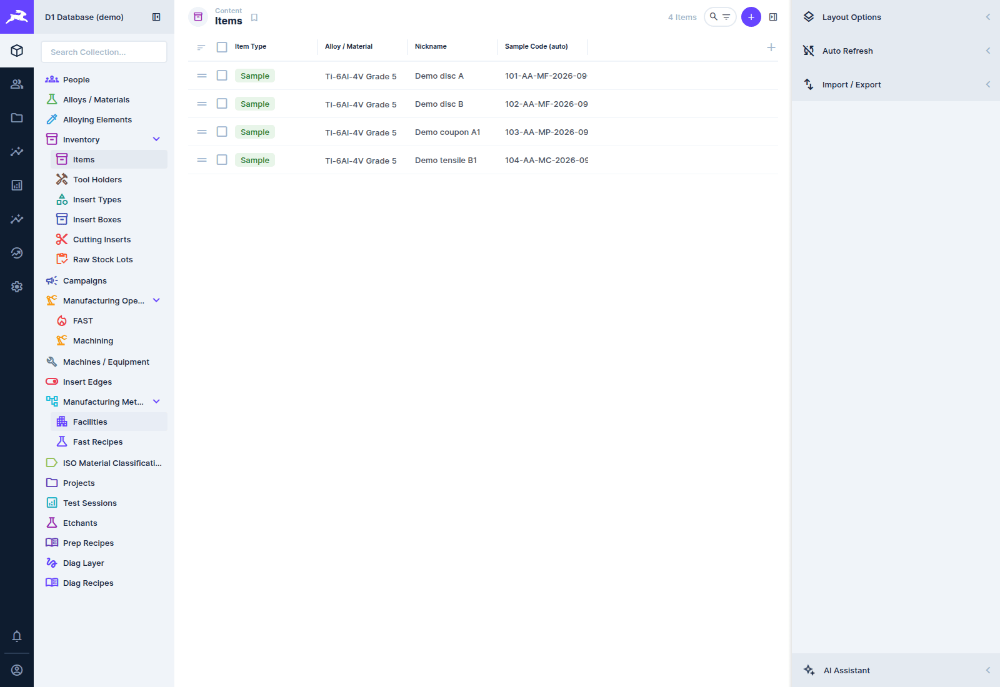
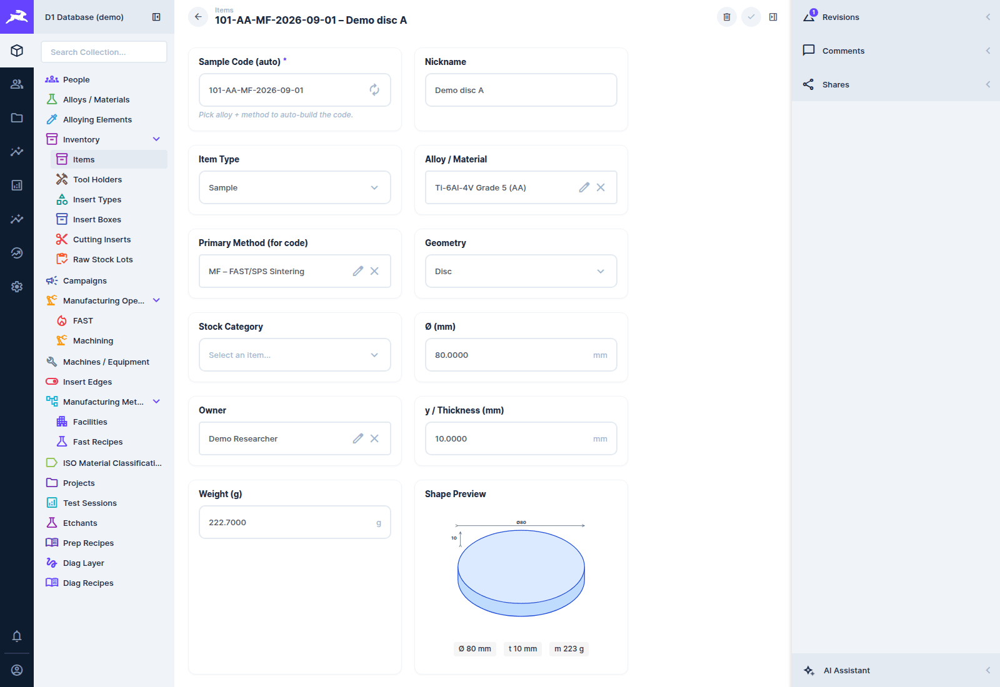
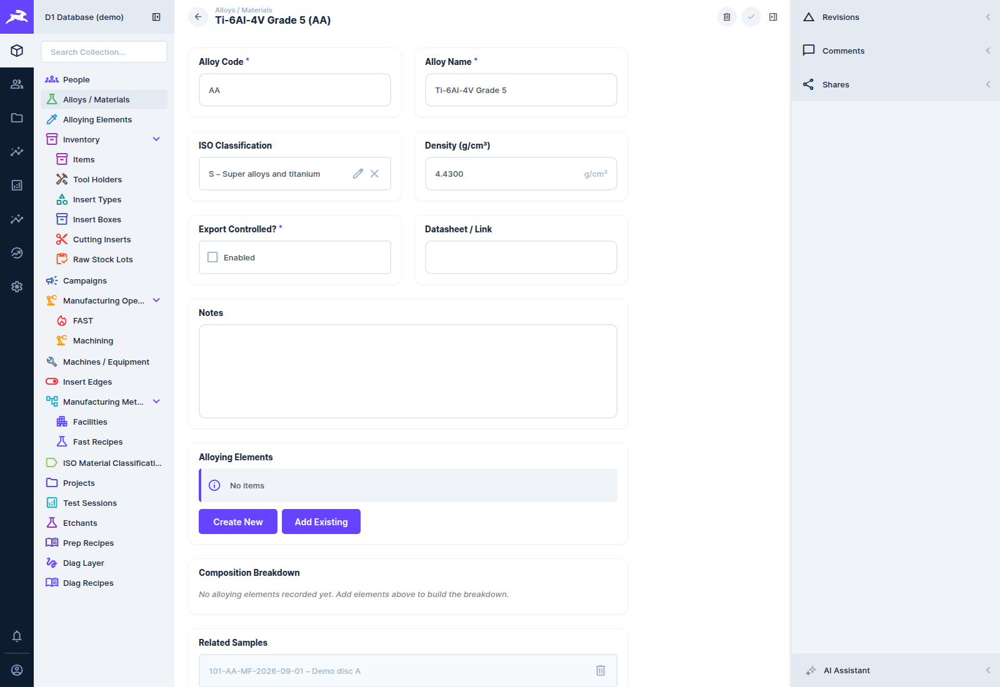
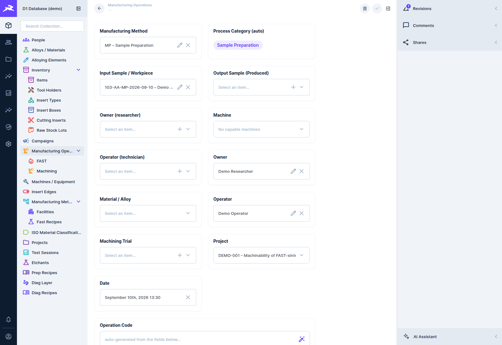

# Samples

[← D1 Database wiki](README.md)

A **sample** is a physical thing the lab holds and works on: a sintered disc, a machined
workpiece, a coupon cut for metallography, a tensile bar. Samples are the centre of the model.
Operations and tests hang off them, and their lineage shows how one became another.

In Content, samples are under **Inventory → Items** (collection `physical_samples`). Items also
covers equipment-type and miscellaneous stock (the *Item Type* field).

## Registering a sample

**Home → Register a sample**, or **+** on the Items list, opens a blank form:

| Field | Notes |
|---|---|
| **Sample Code (auto)** | built live as you fill in the form: `{sequence}-{alloy}-{method}-{date}`, e.g. `101-AA-MF-2026-09-01`. Pick the alloy and primary method first. You can edit it, and ↻ rebuilds it. |
| **Nickname** | a friendly name, e.g. *Demo disc A* |
| **Item Type** | Sample, Equipment or Miscellaneous |
| **Alloy / Material** | from the materials catalogue. Its alloy code goes into the sample code. |
| **Primary Method (for code)** | how the sample was made, e.g. `MF` FAST/SPS sintering. Its code goes into the sample code. |
| **Geometry** | Disc, Cylindrical, Rectangular, Powder / Compact or Other. It decides which dimension fields appear. |
| **Stock Category** | Bulk, Powder or Specialty |
| **Dimensions**, **Weight** | Ø, width, length, thickness, gauge dimensions (mm) and mass (g) |
| **Shape Preview** | a live sketch of the geometry with its dimensions, drawn from the fields above |
| **Status** | Active, Consumed, Destroyed or Archived |
| **Export Controlled?** | flags material subject to export control |
| **Owner**, **Co-owners** | the responsible researcher, plus anyone sharing ownership |
| **Project** | the research project it belongs to |
| **Location** | where it physically is (room, cabinet, drawer) |
| **Manufacturing Date**, **Surface Finish**, **Mounted?**, **Manufacturing Route**, **Notes** | as named |

At the bottom of the form, related records are listed and can be added in place:

- **Produced By (operations)**: the operation that made this sample, e.g. the FAST sinter.
- **Operations (as input/workpiece)**: every operation performed *on* it, e.g. machining passes.
- **Child Samples (Derived From This)**: coupons, sections and offcuts cut from it.
- **Test Sessions**: every test run on it.
- **Linked Data Files**: files from the File Library, including indexed archive files.
  **Open / Copy Linked Files** gives a one-click path to paste into Explorer.
- **Campaigns** it is part of.

## The Sample page

Click a sample on **Home** (recent activity) or in a dashboard and it opens as a formatted page,
`/admin/home/samples/<id>`, instead of the Content form:

- **The header** shows the code, nickname and status, the project and campaign as links, and the
  owner. **Edit** opens the same form as Content in a drawer (changes save without leaving the
  page, and you are warned if someone else saved the record while it was open). **Print label**
  and **Report** open in a new tab. **Data Studio** opens the Content form.
- **Overview** draws the sample at its real dimensions, shows the material with its composition
  bar, and lists the key facts. A sample without a measured mass shows an estimate from its
  dimensions and the material density.
- **Life of the sample** is a left-to-right strip: raw stock, parents, this sample, its operations
  and tests by date, and its children. Everything in it is a link. Records you are not allowed to
  read are not shown, only counted as "N not visible to you". On a narrow window the strip
  becomes a vertical list.
- **Operations** and **Tests** are tables with status badges. Machining operations have **View
  forces** and FAST runs **View FAST**.
- **Files** lists the linked data files, with buttons to copy their path on the group share.

A sample you cannot read (or that does not exist) shows *Not found or not visible to you*.

## Materials

**Alloys / Materials** is the alloy catalogue. Each has an **alloy code** (e.g. `AA` for Ti-6Al-4V
Grade 5), an ISO 513 classification (P/M/K/N/S/H), density, export-control flag and a datasheet
link. **Alloying Elements** holds its composition in wt%, drawn as a stacked **Composition
Breakdown** bar. **Related Samples** lists every sample made of it.

On an operation, *Material / Alloy* fills itself in from the input sample when left blank.

## Lineage

When a sample is cut or processed into another, record the relationship. Either add the new sample
under the parent's **Child Samples**, or set the operation's **Output Sample (Produced)**. The
database can then trace any sample's full history, backwards to the raw stock lot and forwards to
every descendant (see [Lineage and traceability](data-model.md#lineage-and-traceability)).

**Raw Stock Lots** records inbound material (supplier, lot, certificate). Linking a sample to the
lots it came from completes the chain.

## Sample preparation

Metallographic preparation is logged as an operation with the **MP – Sample Preparation** method:

- **Prep Recipes** are reusable procedures: an ordered list of steps (grinding papers, polishing
  cloths, times, loads), the materials they suit, and an owner.
- Choosing a recipe on a preparation operation **copies its steps** into that operation's own
  editable **prep steps**. You can then record what was actually done, and the recipe stays
  unchanged.
- **Etchants** is the catalogue of etchants referenced by preparation steps.

## Finding samples

- The Items list's search box matches codes and nicknames. **Filter** in the sidebar narrows by
  any field (material, project, status, owner…).
- The **My samples** and **No location** saved views (under Items in the navigation panel) list
  your own samples and the ones nobody has shelved ([Saved views](getting-started.md#saved-views)).
- The [Lab Dashboard](dashboards-and-reports.md#lab-dashboard)'s **Samples** tab shows a sample
  with its operations and tests side by side.
- [Ask the Database](dashboards-and-reports.md#ask-the-database) answers questions like *"which
  Ti-6Al-4V samples have hardness results?"*.
- The [sample report](dashboards-and-reports.md#printable-reports) prints a one- or two-page
  history of a sample.
