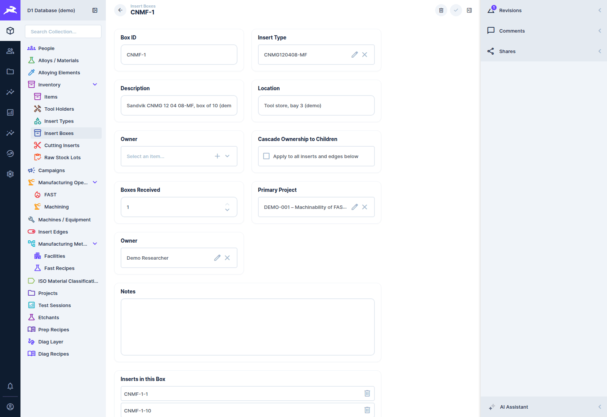
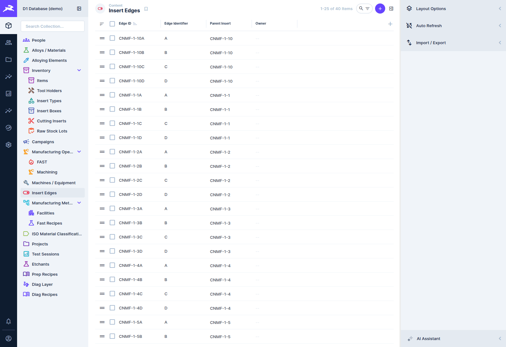
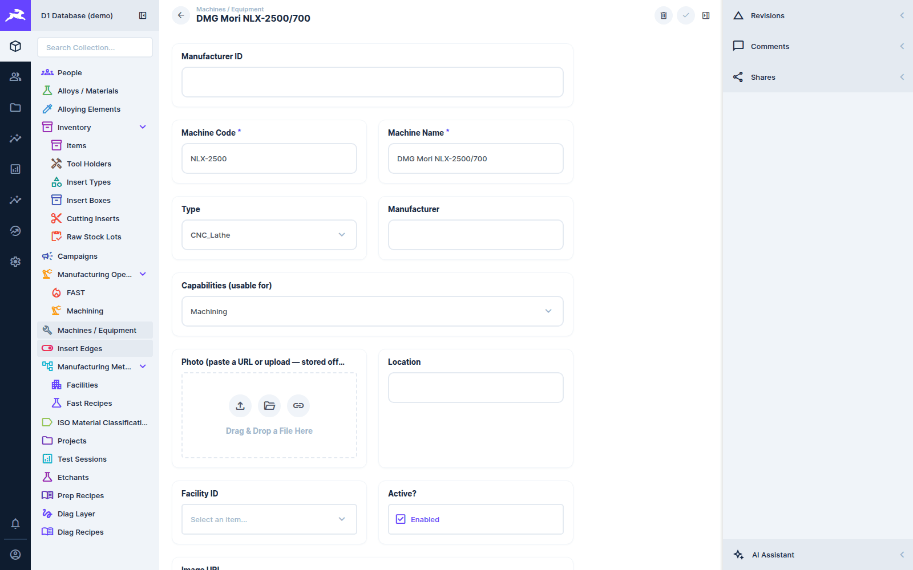

# Tooling and equipment

[← D1 Database wiki](README.md)

## The tooling hierarchy

Cutting tools are tracked down to the individual **cutting edge**, because wear and force are
properties of an edge:

```
Insert Types      catalogue: manufacturer, ISO designation, substrate, coating,
                  inserts per box, edges per insert
  └ Insert Boxes      a physical box of inserts            e.g. CNMF-1
      └ Cutting Inserts   one insert in the box             e.g. CNMF-1-1
          └ Insert Edges      one cutting edge of the insert   e.g. CNMF-1-1A … CNMF-1-1D
```

**Tool Holders** (`tools`) are recorded separately and linked on the operation.

### Receiving a box

When a delivery arrives, create one **Insert Box** record with its **Insert Type** and the
**Boxes Received** count. On save, the database expands it (`expand_tool_box_intake()`, called by
the `box-intake` hook). That one entry becomes:

- *N* box records (the first is the one you created, the rest are clones),
- as many **cutting inserts** per box as the insert type holds,
- as many **edges** per insert as the insert type has (A, B, C…),

with every code generated in the pattern `{short code}-{box #}-{insert #}{edge letter}`.





### Ownership

A box has an owner and a **Cascade Ownership to Children** toggle. Changing the owner with the
toggle on also reassigns every insert and edge in the box (the `owner-cascade` hook).

### Edges in use

An edge records whether it has been used. When you pick an edge on a machining operation,
**New Edge Used?** fills itself in: *yes* for an edge that has never been used, *no* otherwise.
You can still change it. Recording the edge on every pass is what makes the Force App's
[wear trend](../force-app/plot-dashboard.md#wear-trend-and-metadata-doctor) work.

## Machines and equipment

**Machines / Equipment** lists every machine and instrument, grouped under **Facilities** (the
labs and centres that house them).



| Field | Notes |
|---|---|
| **Machine Code** | a short code. If you leave it blank, a unique 6-character code is generated. |
| **Machine Name**, **Type**, **Manufacturer** | as named |
| **Capabilities (usable for)** | the process and test categories the machine can do: `machining`, `sintering`, `heat_treatment`, `additive`, `sample_prep`, `nde`, `destructive`… |
| **Facility**, **Location**, **Active?** | where it is, and whether it is in service |
| **Photo**, **Image URL** | a picture for the record and reports |

**Capabilities matter.** The *Machine* field on operations and tests only offers machines whose
capabilities include the record's process or test category. A machine with no capabilities never
appears there. Set them when you add a machine.

## Reference catalogues

These change rarely and are usually maintained by an administrator:

| Collection | Holds |
|---|---|
| **Manufacturing Methods** | method codes and names (`MC` CNC Turning, `MF` FAST/SPS Sintering…) |
| **Facilities** | labs and centres |
| **Manufacturers** | the manufacturer list used by equipment, tools and insert types |
| **Insert Types** | the cutting-insert catalogue |
| **ISO Material Classifications** | the ISO 513 P/M/K/N/S/H groups |
| **Alloying Elements** | the periodic-table reference for compositions |
| **Etchants** | metallographic etchants |
| **FAST Recipes** | FAST 25 / FAST 250 sintering recipes ([FAST data](fast-data.md)) |
