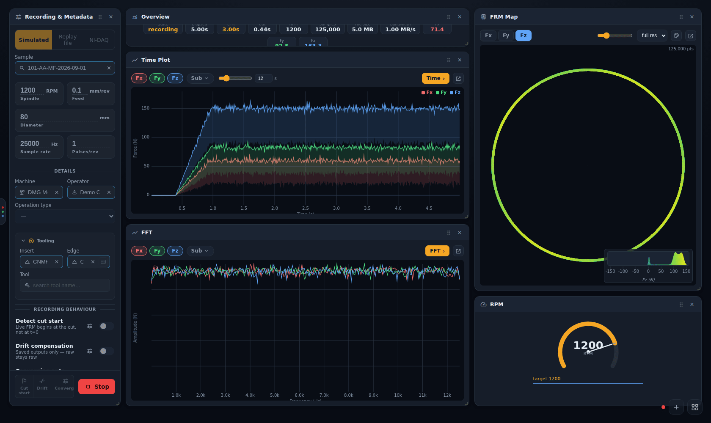
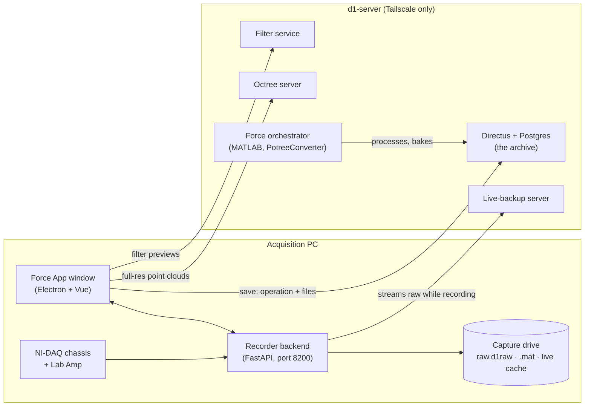

# Force App wiki

The **Force App** records, views and analyses cutting forces measured by the Kistler
dynamometer on the lathe. It runs on the acquisition PC as a Windows desktop app. When a cut
finishes, the app uploads it into the D1 database (Directus), where the [database wiki](../database/README.md)
takes over.

> Every screenshot in this wiki comes from a local test stack filled with **demo data**:
> the simulated signal source, a mock Lab Amp and made-up samples and people (`Demo PI`,
> `Demo Operator`, sample `101-AA-MF-2026-09-01`). None of it is a real measurement.

## Pages

| Page | Read it when you want to… |
|---|---|
| [Getting started](getting-started.md) | install the app, sign in and find your way around |
| [Recording a cut](recording.md) | set up, run, save or discard a recording |
| [Live panels](live-panels.md) | understand and arrange what the Record page shows while a cut runs |
| [Replaying an archived cut](replay.md) | play back a cut that is already in the database |
| [The Plot dashboard](plot-dashboard.md) | review, crop, compare, filter and correct a finished cut |
| [Diagnostics Workbench](diagnostics.md) | run deeper analysis on the full-resolution spiral |
| [Lab Amp and NI-DAQ](hardware.md) | configure the charge amplifier, the DAQ channels and virtual channels |
| [Settings](settings.md) | change a setting (each tab explained) |
| [Working offline](working-offline.md) | sign in, record and upload with no connection, and who a late upload is credited to |
| [Captures, backup and recovery](captures-and-recovery.md) | know where your data is, and get it back after a crash |
| [Troubleshooting](troubleshooting.md) | fix something that isn't working, read logs, report a bug |
| [Developer guide](developer-guide.md) | run the app from source, test it, release it |
| [Glossary](glossary.md) | look up FRM, DoC, edge, pass code, live cache… |

## How the pieces fit

- **Recorder backend.** Talks to the hardware, writes the capture to disk and streams live data to the window.
  It keeps running when you switch pages, so a recording carries on if you open Plot or Settings.
- **Directus** is the archive. Saving a cut creates a `manufacturing_operations` row plus a
  `machining_force_analysis` row with the capture files attached. See
  [Force data in the database](../database/force-data.md).
- **Filter service, octree server and orchestrator** run on d1-server. The Plot dashboard's
  filter preview, *Full* FRM view and host-side *Bake* use them. Recording does not need them.

## Related reference docs

- [`apps/force-app/README.md`](../../../apps/force-app/README.md): the component overview
- [`docs/force-app-operations.md`](../../force-app-operations.md): deploying the backup server and update feed, the hardware checklist
- [`docs/force-file-standards.md`](../../force-file-standards.md): the `.mat` capture layouts
- [ADR-0010](../../adr/0010-force-app-extraction-and-electron-packaging.md): why the app is a standalone Electron app
