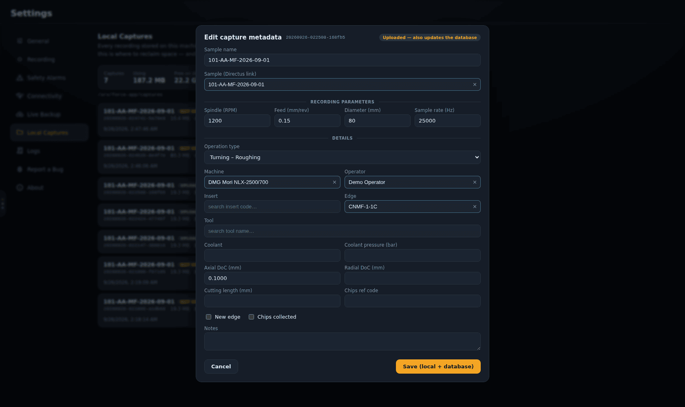
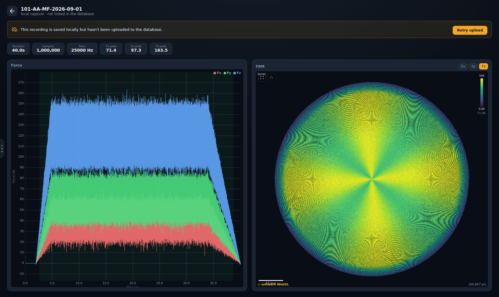
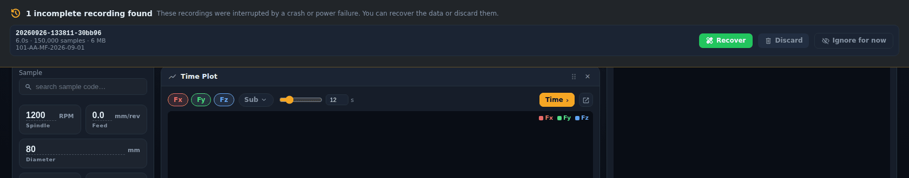

# Captures, backup and recovery

[← Force App wiki](README.md)

The app is built so that a cut, once recorded, is not lost: not to a crash, a power cut, a full
disk, a network outage or a forgotten sample.

## Where a recording lives

Each recording gets its own folder on the capture drive, named by its **capture id**
(`YYYYMMDD-HHMMSS-xxxxxx`):

| File | What it is |
|---|---|
| `raw.d1raw` | the raw acquisition stream, written continuously while recording. It is the source of truth and is never modified. |
| `manifest.json` | the recording's config and state, updated while it runs. It is how an interrupted session is recognised. |
| `summary.json` | written when the recording is finalized: duration, samples, peaks, cut window and the metadata you entered |
| `capture.mat` | the finalized MATLAB file (v1.0 layout, see [force file standards](../../force-file-standards.md)). It is skipped for captures too large to export. |
| `live_cache.bin` | a decimated cache the Plot page and replay read |

Finalizing turns `raw.d1raw` into `capture.mat` and `live_cache.bin`. This happens right after the
recording stops, **whether or not you save it to the database**. The capture drive is set in
[Settings → General](settings.md#general).

Other places the app keeps data:

| What | Where (Windows) | Override |
|---|---|---|
| storage and backup settings, NI-DAQ channel map (`nidaq_channels.json`), simulated chassis, LabAmp settings | `%LOCALAPPDATA%\force-app` | `FORCE_APP_CONFIG_DIR` |
| `backend.log` (+3 rotated) | Electron's `userData\logs` | `FORCE_APP_LOG_DIR` |
| run records waiting to sync | the app's local storage | — |

## Local captures

**Settings → Local Captures** lists every recording on the drive, with a tag for each:

| Tag | Meaning |
|---|---|
| **uploaded** | the database holds this capture's run, its files and its analysis record |
| **partial upload** | a run record exists but the upload never finished (files or analysis missing). Still the only complete copy: press **Upload** to finish it. |
| **not uploaded** | only on this PC. Upload it, or keep it until you are sure you don't need it. |
| **upload queued** | waiting in the offline queue (see below) |
| **incomplete** | never finalized: an interrupted session (see [Crash recovery](#crash-recovery)) |
| **upload state unknown** | the app could not ask the database. It is treated as possibly not uploaded, so you are warned before deleting. |

For every capture that is **not uploaded** or a **partial upload**, an **Upload** button appears, and **Upload N unsynced**
uploads them all.

The app works out the upload state by matching each capture's id against the `capture_id` that
every upload stamps into the operation's `recorded_metadata`. In v0.1.30 and earlier that check
always failed, so every capture showed *upload state unknown* and no Upload buttons appeared.

**Edit** (or clicking a capture's name) corrects the metadata recorded with a capture, for
example a sample that was forgotten at the end of a cut:

For a capture that isn't uploaded yet, only its local `summary.json` changes. For one that is
already uploaded, the same edit is also written to its database record.

**Delete** removes a capture's folder. This is the only way the app deletes a finished capture.
It warns you first if the capture isn't known to be in the database.

### Viewing a capture that isn't in the database

The save dialog's **Open in Plot** opens a capture that was not uploaded in a simple local view
(`/plot/local/<capture id>`), read straight from the recorder backend:

The banner offers **Retry upload**, and once the capture is uploaded, **Open database record**.

### The offline queue

If the database is unreachable when a run is logged, the record is kept on this PC and retried
automatically when the connection returns. It uploads under the account that recorded it (see
[Working offline](working-offline.md#who-a-recording-belongs-to)). Stuck items appear under **Pending database records**
at the top of Local Captures. An item with an error blocks the ones behind it until you **Retry**
or **Discard** it. The sidebar's cloud chip shows how many records are queued.

## Crash recovery

If the app, the backend or the PC dies mid-recording, `raw.d1raw` holds everything captured up to
that moment. The next time the Record page opens, it offers the interrupted session:

- **Recover** finalizes the raw capture into a normal `.mat` + live cache. The recording then
  shows up in Local Captures like any other and can be uploaded.
- **Discard** deletes the raw capture. If the session was also streamed to the live-backup
  server, the confirmation says so, because a copy still exists there.
- **Ignore for now** hides the banner for that session without doing either.

Recovering or discarding a large capture can take a while. The buttons stay disabled until it
finishes.

When the backend process itself crashes, the desktop shell restarts it and returns you to Record,
where this banner picks the session up.

## Live backup

For protection against losing the whole PC or its disk, turn on
[Settings → Live Backup](settings.md#live-backup). While a cut runs, the backend streams
`raw.d1raw` to the backup server on d1-server in chunks of about 4 MB.

- If the network drops, the recording carries on locally untouched. The backup pauses and catches
  up when the link returns. The percentage on the sidebar chip *falls* during an outage because
  the total keeps growing while nothing is sent; no data is being lost.
- A backup can be pulled back with **Fetch remote backups** and finalized exactly like a local
  capture. This was tested end to end: the restored raw was byte-identical and re-finalized to the
  same result.
- The server keeps backups for 12 hours by default. It is a **safety net, not an archive**; the
  archive is the database upload.
- The backup server has no authentication and is reachable only over Tailscale. Never expose it
  publicly (see [`force-app-operations.md`](../../force-app-operations.md#security-posture--read-before-exposing-anything)).
