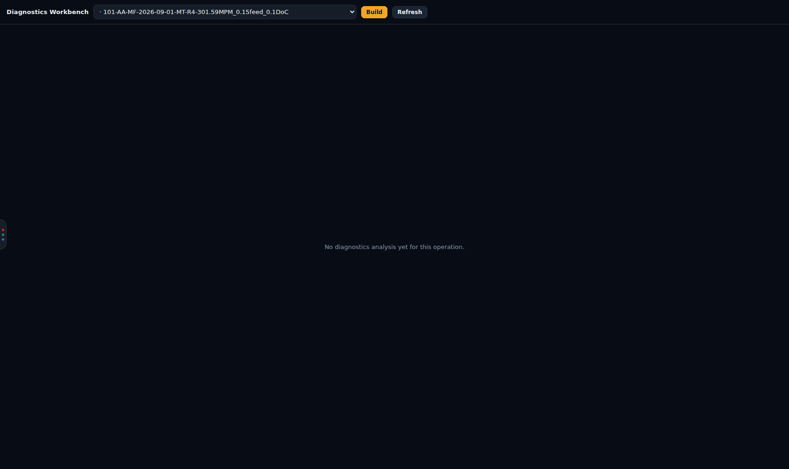

# Diagnostics Workbench

[← Force App wiki](README.md)

The **Diagnostics** section runs deeper analysis on a cut's full-resolution force spiral. It
turns "that looks like a macrozone" into mapped hot-spots and clusters with statistical backing.
It is a specialist tool and is kept out of the everyday Plot dashboard.

> **About this screenshot.** A diagnostics build runs MATLAB (`process_force.m`) and
> PotreeConverter on d1-server. The demo stack these screenshots came from has neither, so it
> shows the page's empty state: *No diagnostics analysis yet for this operation.* On a real
> install the same page shows the workbench panels described below.

## How it works

All heavy computation happens on the host. The browser only edits recipes, draws regions and
displays results. It never computes statistics itself.

1. **Pick an operation** in the drop-down at the top. It lists every successfully analysed cut,
   each tagged with its diagnostics state: `✓` built, `…` pending or processing, `✗` failed,
   `·` not built.
2. **Build.** The app marks the analysis row `diag_status = pending`. The **force orchestrator**
   daemon on d1-server claims it, re-runs MATLAB on the archived `.mat` to emit a dense point
   cloud and live cache, runs the diagnostics **recipe** (below), and publishes a diagnostics
   octree. Large cuts take minutes, and the page polls until the row is `done` or `error`.
3. **Explore** the result in the workbench panels, tune the recipe with fast previews, and
   **Bake** when you are happy. Baking re-runs the build with your recipe, so what you tuned is
   exactly what is stored.

If a build sits at *pending* forever, the orchestrator daemon is not running. See
[Troubleshooting](troubleshooting.md#diagnostics-never-finish-building).

A build re-runs MATLAB on the cut's **archived** `.mat`. A cut saved straight from the Force App
has no archive copy, so its build ends in `✗` with *no archive .mat linked to this analysis row*
until its capture has been copied into the archive and indexed.

## The recipe

A recipe is an ordered list of steps that you can toggle, retune and reorder. The default recipe:

| Step | What it does |
|---|---|
| `frame_transform` | rotates and corrects forces into the workpiece frame, using the tool setup's mount angle and H-matrix |
| `angular_resample` | resamples each revolution onto a fixed angular grid (samples per rev) |
| `tsa` | time-synchronous averaging: the repeating once-per-rev component, and the residual left over |
| `radial_detrend` | removes the slow radial trend, so what remains is local variation |
| `getis_ord` | Getis-Ord Gi* hot-spot statistic (neighbourhood `k`, significance `alpha`) |
| `hdbscan` | density-based clustering of the significant regions, with GLOSH outlier scores |
| `envelope` | band envelope analysis |

Named recipes are saved in the **recipe library** and can be applied across a whole campaign.
Hand-painted **layers** (mask, label, seed regions) are stored per cut and read at bake time, so
a recipe stays reusable.

## Panels

| Panel | Shows |
|---|---|
| **Spatial view** | the full-resolution cloud, coloured by any channel the recipe produces (residual, Gi*, significance, cluster id, GLOSH, envelope band…). You can have several side by side. |
| **Pipeline** | the recipe editor, with a live preview of any step over a framed region |
| **Signal** | the anomaly signal along the cut, per force channel in the workpiece frame (Fp / Fc / Ff chips, or *All channels* to compare them) |
| **Clusters** | a per-cluster summary table |
| **Selection inspector** | statistics for the points you have selected |

The workbench can also pop out into its own window (`/diag-panel/<analysis id>`) for a second
monitor.

## Services involved

| Service | Role |
|---|---|
| Force orchestrator (`scripts/force_orchestrator.py`) | claims builds and bakes, runs MATLAB and `scripts/diag` |
| Diag preview service (`plugins/diag-service`, `/diag`) | fast per-step previews while tuning |
| Octree server (`/octrees`) | streams the diagnostics octree to the Spatial view |

Design detail: [`docs/superpowers/specs/`](../../superpowers/README.md), the *diagnostics* specs
dated 2026-08-30 to 2026-09-04.
