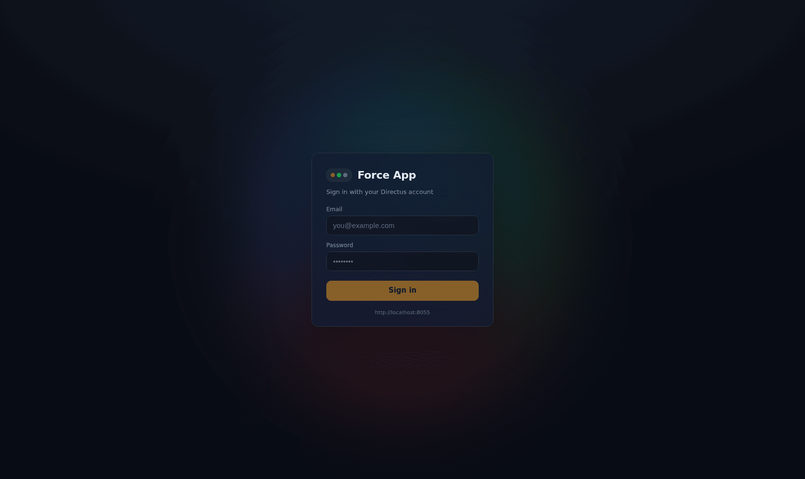
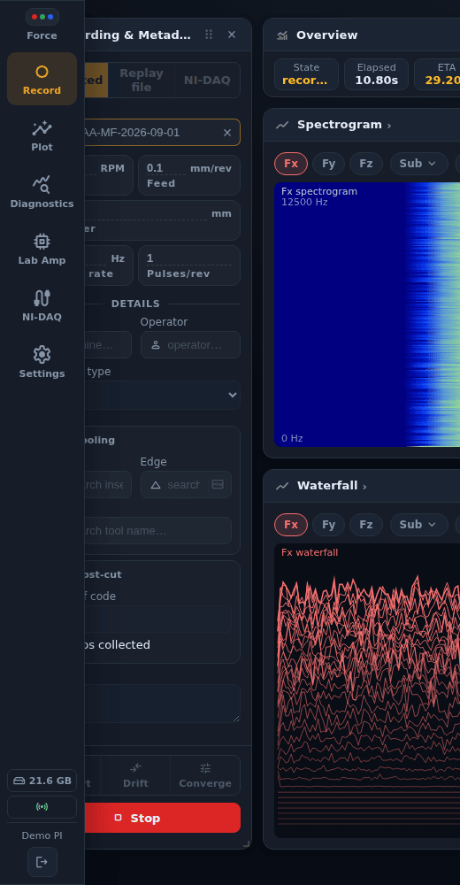
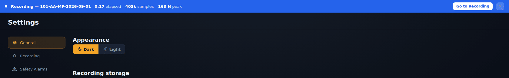

# Getting started

[← Force App wiki](README.md)

## Installing

The app is distributed as an unsigned Windows installer (`ForceApp-Setup-x.y.z.exe`, a standard NSIS installer that lets you choose the install folder), built by CI
for every `force-app-v*` tag and published to the update feed on d1-server.

1. Download the installer from the repository's GitHub Releases page, or ask whoever maintains
   the acquisition PC.
2. Run it. Windows SmartScreen warns because the installer is unsigned; that is expected for v1
   (see [ADR-0010](../../adr/0010-force-app-extraction-and-electron-packaging.md)). Choose
   **More info → Run anyway**.
3. Start **Force App** from the Start menu.

Once installed, the app updates itself. On launch it checks the feed at
`https://d1-server…/force-app-updates/` (reachable only over Tailscale) and downloads any newer
version in the background. When the download is ready it shows what is new in that version (trimmed if long; the full history is in **Settings → About**) and asks **Update now / Not now**:

- **Update now** closes the app, installs silently and reopens it within a few seconds.
- **Not now** keeps the current version. You can install later from **Settings → About**.

The app never restarts itself during a recording. The install waits until the cut has finished.
**Settings → About** also lists what changed in each version.

Only one copy runs at a time. Starting it again brings the existing window to the front.

## Signing in

Sign in with your **Directus account**, the same email and password you use for the D1 database.
The address under the button is the Directus server the app is pointed at. You can change it in
**Settings → Connectivity → Service endpoints**.

Your Directus role decides what you can do. Recording, replaying and plotting work for any
signed-in user. **Saving a cut to the database** needs permission to create
`manufacturing_operations` and `machining_force_analysis` rows and to upload files. If *Save*
fails with a permission error, ask a Directus administrator to check your role (see
[Roles and permissions](../database/roles-and-permissions.md)).

## Finding your way around

The app has six sections. The navigation is a small three-dot tab on the left edge of the window.
Point at it to slide it open, or tap it, or reach it with Tab and press Enter. Opened by a tap or
the keyboard, it stays open until you pick a section, tap elsewhere or press Escape:

| Section | What it is for |
|---|---|
| **Record** | acquire a cut from the simulator, a replayed file or the NI-DAQ hardware ([Recording a cut](recording.md)) |
| **Plot** | the finished-cut dashboard ([The Plot dashboard](plot-dashboard.md)) |
| **Diagnostics** | the recipe-driven analysis workbench ([Diagnostics Workbench](diagnostics.md)) |
| **Lab Amp** | the charge amplifier's connection, calibration and auto-range ([Lab Amp and NI-DAQ](hardware.md)) |
| **NI-DAQ** | the DAQ chassis, channel mapping and virtual channels ([Lab Amp and NI-DAQ](hardware.md)) |
| **Settings** | storage, alarms, connectivity, backup, captures, logs, bug reports ([Settings](settings.md)) |

The bottom of the expanded sidebar shows status chips (free disk space, backend connection,
live-backup progress, queued offline records), your name and the **sign out** button.

### Second monitor

Each section has an **open in new window** button (↗) next to it in the sidebar. A typical setup
keeps **Record** on the rig's main screen and **Plot** on a second monitor. The new window shares
your sign-in. Individual live plots on the Record page have the same button (see
[Live panels](live-panels.md#popping-a-panel-out)).

### While a recording is running

Recording happens in the backend, not in the page, so you can leave the Record page mid-cut. Every
other page then shows a blue banner with the elapsed time, sample count and peak force, plus a
**Go to Recording** link:

## Keyboard and menus

| | |
|---|---|
| **F11** | toggle full screen |
| **Help → Connectivity Doctor** | jump to the health check ([Troubleshooting](troubleshooting.md)) |
| **Help → View Logs** (**Ctrl+Shift+L**) | open the backend log viewer |
| **Help → Report a Bug…** (**Ctrl+Shift+B**) | open Settings → Report a Bug |
| **Help → Open Captures Folder** (**Ctrl+Shift+O**) | open the folder recordings are saved to in the file browser |
| **Help → Check for Updates…** | look for a new version and show the result in Settings → About |
| **Help → About Force App** | open Settings → About |
| **Tab** to the navigation tab, then **Enter** | open the navigation, with focus on the current section. **Escape** closes it again. |
| **↑ / ↓** and **Enter** in a search list | move through the matches in the Sample, Machine, Operator and tooling lookups (and the replay cut picker) and pick one |
| **Escape** in a dialog | cancel and close it. The save dialog after a cut is the exception: it needs **Save** or **Don't save**. |

While a dialog is open, **Tab** moves only between its own controls.

## Theme

**Settings → General → Appearance** switches between dark (the default, and what every screenshot
here uses) and light.
