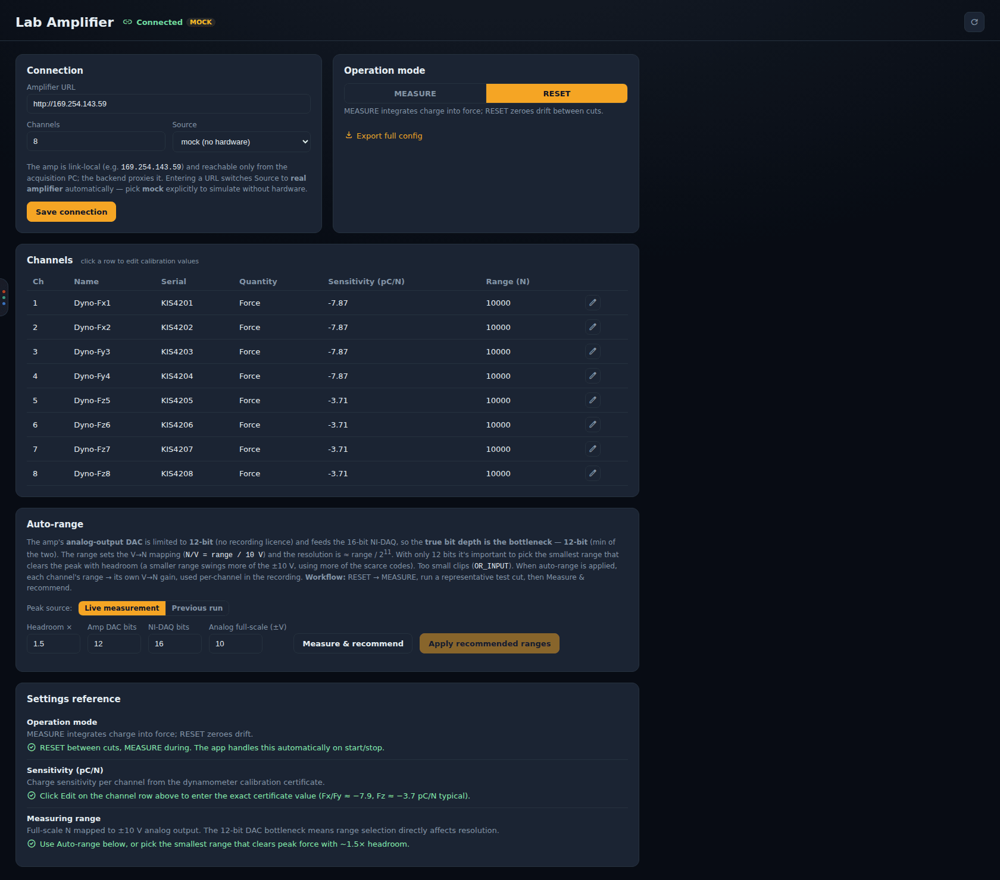
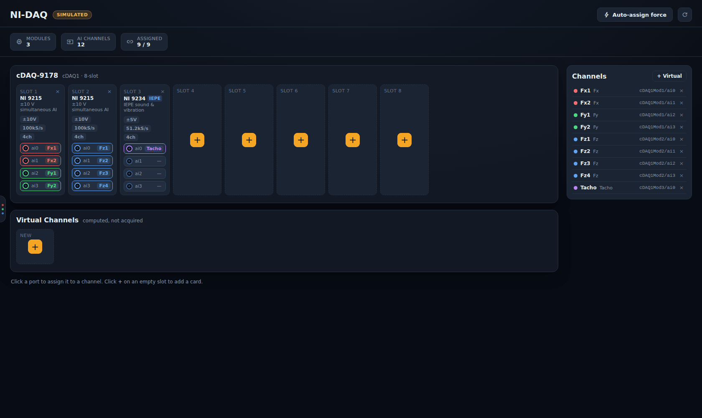
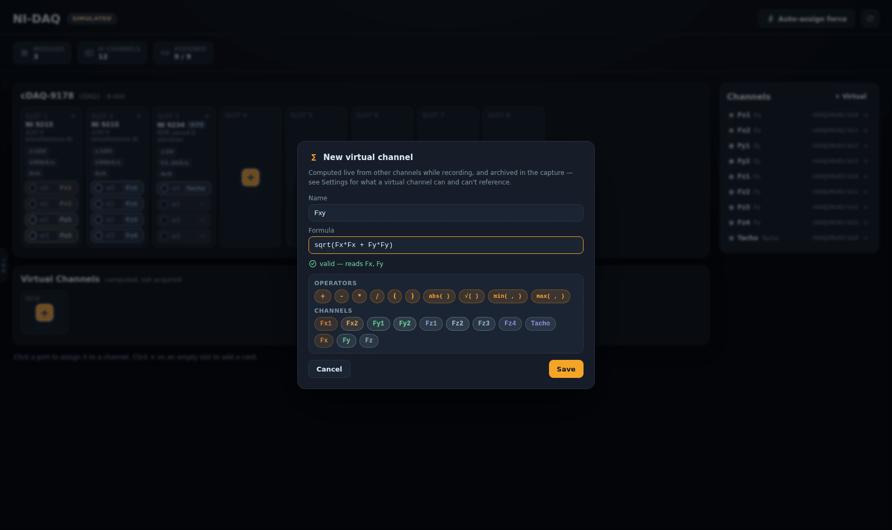

# Lab Amp and NI-DAQ

[← Force App wiki](README.md)

A real recording goes **dynamometer → Kistler Lab Amp (charge amplifier) → NI-DAQ chassis →
recorder backend**. The **Lab Amp** and **NI-DAQ** sections configure the two middle links. On a
PC without the hardware, both run simulated (**MOCK** / **SIMULATED** badges), which is how every
screenshot here was taken.

## Lab Amp

### Connection

The amp is **link-local** (e.g. `http://169.254.143.59`) and reachable only from the acquisition
PC. The recorder backend proxies all traffic to it. Enter its URL, the number of channels, and the
**Source**: *real amplifier*, or *mock* to simulate without hardware. Entering a URL switches the
source to real automatically. Press **Save connection**.

The backend's `LABAMP_MODE` environment variable (`mock` or `real`) sets the default when the
app starts.

### Operation mode

- **MEASURE** integrates charge into force.
- **RESET** zeroes the accumulated drift.

The app switches the amp itself: MEASURE while a cut runs, RESET between cuts. Left in MEASURE
between cuts, the amp keeps integrating drift for no reason. **Export full config** downloads the
amp's complete configuration.

### Channels (calibration)

One row per amp channel: name, sensor serial, quantity, **sensitivity (pC/N)** and **range (N)**.
Click a row's ✎ to edit it. Enter the exact sensitivity from the dynamometer's calibration
certificate (typically about −7.9 pC/N for Fx/Fy and about −3.7 pC/N for Fz).

### Auto-range

The amp's analog output DAC is **12-bit** (without the recording licence). It feeds a 16-bit
NI-DAQ, so **12 bits is the resolution bottleneck**. The range sets the volts-to-newtons mapping
(`N/V = range / 10 V`), and resolution is roughly range / 2¹¹.

The smallest range that still clears the peak force gives the best resolution. Too small a range
clips the signal (the amp reports `OR_INPUT`).

The workflow:

1. RESET → MEASURE, and run a representative test cut.
2. Press **Measure & recommend**. Recommendations are based on the **live measurement** or the
   **previous run** (the *Peak source* toggle), times the **Headroom** factor (1.5× by default).
3. **Apply recommended ranges.** Each channel's range then becomes its own V→N gain in the
   recording.

**Converging auto-range** (a Record-page toggle) repeats this automatically after every cut. See
[Recording a cut](recording.md#3-recording-behaviour-toggles).

## NI-DAQ

The page draws the chassis (here a **cDAQ-9178**, 8 slots) with each detected C-series module to
its real connector layout. The badge beside the page title says whether the hardware is **LIVE**
or **SIMULATED**, and the strip below it counts the modules, the AI channels and how many
channels are assigned to a port.

- **Assign a channel.** Click a port, then choose which channel it carries (Fx1…Fz4, Tacho…).
  The coloured tag on each port shows its current assignment.
- **Add a module** in an empty slot with **+**. This opens the card catalog (NI 9215, NI 9234,
  and others).
- **Auto-assign force** maps the standard dynamometer layout onto the detected modules in one go.
- The **Channels** list on the right shows every channel, its role (Fx/Fy/Fz/Tacho/Aux) and its
  physical port.

The channel configuration is saved on the capture drive (`nidaq_channels.json`) and decides what
the recorder captures. On the Record page, the **Sample rate** tile turns red when the rate is
higher than the assigned modules can do.

On a PC without NI-DAQmx the backend falls back to a simulated chassis. On the rig, check that the
page shows the **real** hardware (the badge reads **LIVE**, not **SIMULATED**); this is the first
item of the [hardware checklist](../../force-app-operations.md#hardware-checklist).

### Virtual channels

A **virtual channel** is computed from other channels during acquisition and archived with the
capture, for example the resultant force `Fxy = sqrt(Fx*Fx + Fy*Fy)`. Create one with
**+ Virtual**:

Click the operator and channel chips to build the formula, or type it. The backend validates it
live (*valid — reads Fx, Fy*). Formulas are deliberately limited, and are parsed safely rather
than executed:

- allowed: `+ - * /`, unary minus, numbers, other channels by name, and the functions offered
  (`abs`, `sqrt`, `min`, `max`);
- not allowed: `**` (power), comparisons, conditionals, attribute access, or any other function.
