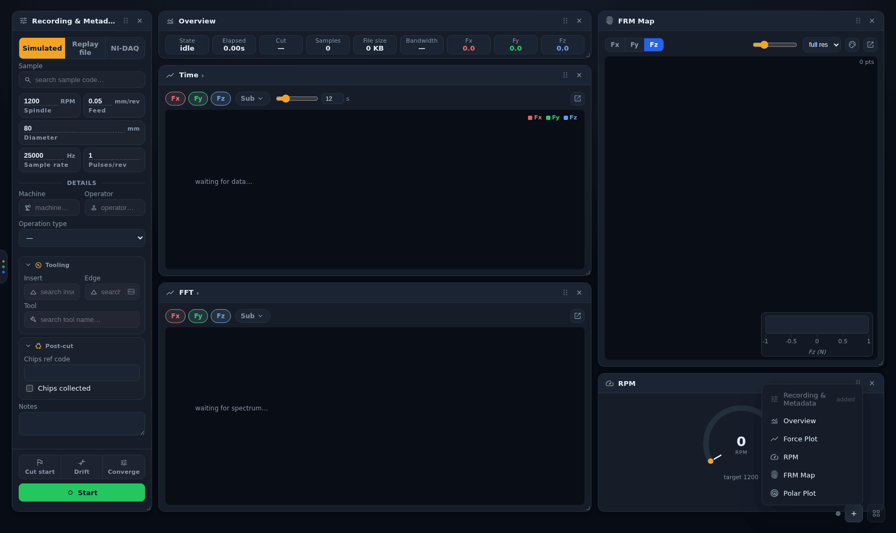
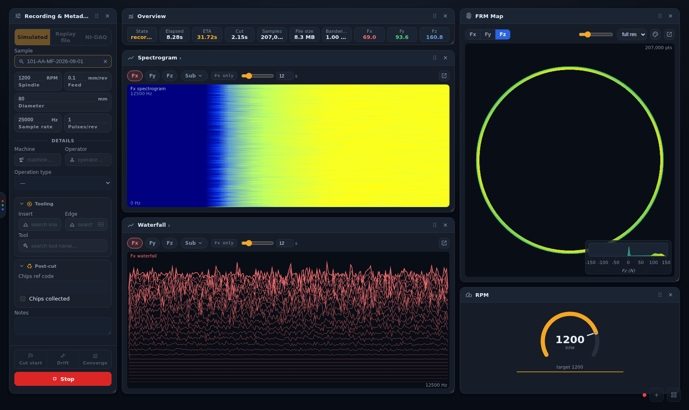

# Live panels

[← Force App wiki](README.md)

Everything to the right of the **Recording & Metadata** panel on the Record page is a live panel.
Panels update while a cut runs and show the finished trace once it stops.

## Arranging the workspace

- **Move** a panel by dragging its title bar: the grip (⋮⋮) or any empty part of it. **Resize** it
  from its bottom-right corner.
- **Close** a panel with its **×**.
- **Add** a panel with **+** at the bottom right. Each panel type can be added more than once,
  except *Recording & Metadata*. The default layout already has two Force plots, one on *Time*
  and one on *FFT*:

  

- **Reset** the layout with the grid button (▦) next to **+**. It asks first, because a reset puts
  every panel back to its default place and size and brings back the default set of panels, with
  their modes and channel choices. Recording settings and data are not affected.

The layout is saved on this PC and comes back the next time you open the app. The grid stretches
to fill the window, and past a minimum row height it scrolls instead of squashing.

## Overview

A strip of read-outs, on one line:

| Tile | Meaning |
|---|---|
| **State** | `idle`, `recording`, `finalizing`, `done` or `error` |
| **Elapsed** | time since Start |
| **ETA** | simulated runs only: time left in the planned run |
| **Cut** | when the cut started (tool contact), once detected |
| **Samples**, **File size**, **Bandwidth** | acquisition volume and the rate it is being written to disk |
| **Fx / Fy / Fz** | peak force so far on each axis (N) |

When the panel is narrow, long values are shortened with "…". Point at a tile to see its full
value. Spindle speed is in the [RPM](#rpm) panel.

## Force plot

The main plot, and the only panel with **modes**. The panel's title *is* its mode: it reads
**Time ›** or **FFT ›**. Point at the title (or reach it with Tab) and the other modes slide out
beside it; click one to switch. When the title bar has no room, they drop down as a menu instead.

| Mode | Shows |
|---|---|
| **Time** | force against time over a rolling window |
| **FFT** | the current amplitude spectrum |
| **Power** | the current power spectrum (dB) |
| **Spectrogram** | time × frequency heatmap of one channel |
| **Waterfall** | stacked spectra over time, for one channel |

**Channels.** The coloured chips pick the summed axes (**Fx**, **Fy**, **Fz**). **Sub** opens the
individual dynamometer sensors (Fx1…Fz4), for example to isolate a single sensor. Spectrogram and
Waterfall show one channel at a time, and the panel says which (`Fx only`). The slider and box
next to them set the time window (2–60 s); FFT and Power have no time axis, so they hide it.

## FRM map

The **Force-Revolution Map** plots force against spindle angle and revolution as a spiral. It is
the cut's "fingerprint". A steady cut gives an even ring, and chatter, run-out or a damaged edge
show up as patterns around it.

- **Fx / Fy / Fz** picks the axis that is coloured.
- The slider sets point size. The **full res / 1/N** box thins the live map for long, dense cuts.
- The palette button opens the colour-scale editor (colour map, limits, histogram).
- Drag to pan and scroll to zoom. The reset button returns to automatic framing.
- The histogram in the corner shows how force values are distributed against the colour scale.

With **Detect cut start** on, the map holds at the origin until the tool touches down.

## RPM

A gauge of measured spindle speed against the target, with a rolling sparkline of recent RPM.
When recording, the target is the RPM you entered. During a replay it is the replayed cut's own
spindle speed.

## Polar plot

The milling counterpart to the FRM map (added in v0.1.19). The radius is **Fz**, **|Fxy|** or
**Mz**. The angle comes from the **tacho**, or from the force vector `atan2(Fy, Fx)`. The footer
always states which angle source is used, because the two are not equally trustworthy.

## Popping a panel out

The ↗ button on the Force, FRM and Polar panels (at the right of the panel's controls) opens that
plot in its own window for a second monitor. A popped-out Force plot picks its mode from its title
in the same way. The app's advice is to open pop-outs **before** pressing Start.
