# The Plot dashboard

[← Force App wiki](README.md)

**Plot** is where finished cuts are reviewed. The same dashboard (`packages/force-plotting`) also
runs inside Directus as the *Force Analysis* module, so everything here works the same in the
browser.

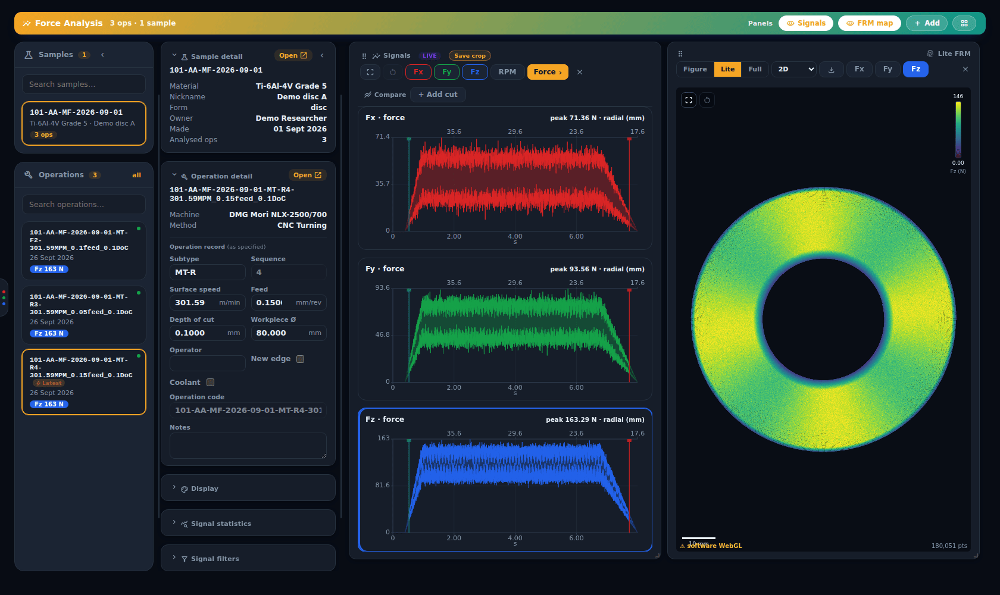

The page has four columns. From left to right:

1. **Samples** and **Operations.** Pick a sample, then one of its cuts.
2. **Sample detail** and **Operation detail**, plus the collapsible **Display**,
   **Signal statistics** and **Signal filters** cards.
3. The **Signals** panel: the per-axis charts. Its title is the current mode, *Force ›* at first.
4. The **FRM map** panel: the point cloud.

Drag the column edges to resize them. The **‹** buttons hide the first two columns for a wider
plot area. Panels 3 and 4 sit on a grid: drag them by the grip (⋮⋮), resize them from the corner,
or add more (see [Adding panels](#adding-panels)).

## Choosing a cut

- **Samples** lists every sample with analysed cuts. Type in *Search samples…* to filter.
- **Operations** lists the selected sample's cuts: pass code, date and peak Fz. The dot on each
  card shows processing state:

  | Dot | Meaning |
  |---|---|
  | green | FRM plot ready (a live cache exists) |
  | blue | processing on the host |
  | yellow | full-resolution octree only, no live cache |
  | red | processing failed |

  The most recently saved recording has a **⚡ Latest** chip. A count badge means the
  [Metadata doctor](#wear-trend-and-metadata-doctor) found problems with that cut.
- **Open ↗** on either detail card opens that sample or operation in Directus.

## Correcting an operation's metadata

The **Operation record (as specified)** block holds editable fields: subtype, cutting speed (as
surface speed m/min or RPM), feed, depth of cut, workpiece Ø (double-click to split into
outer/inner), operator, new edge, coolant and notes. **Sequence** and **Operation code** are
derived and cannot be edited: the operation code is regenerated from the subtype, sequence,
cutting parameters and sample code, just like Directus's own auto-naming.

Change what you need and press **Save changes**. Nothing is written until you confirm a summary
that lists every change as *old → new*, including the regenerated operation code:

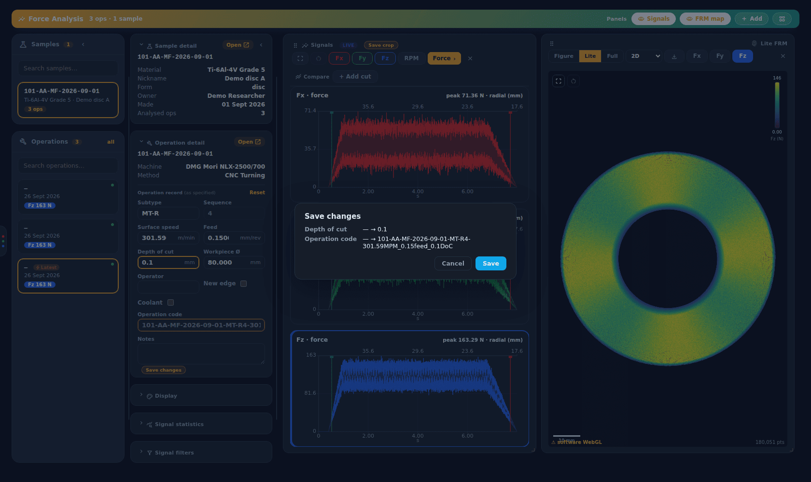

**Reset** reverts unsaved edits. A crop-window change (below) is batched into the same summary.

## Signals panel

One chart per axis (**Fx**, **Fy**, **Fz**, toggled with the coloured chips). **RPM** adds the
spindle-speed trace. The panel's title is the mode, as on the Record page: point at **Force ›**
and the other modes slide out beside it (or drop down as a menu in a narrow panel):

| Mode | Shows |
|---|---|
| **Force** | min/max force envelope over time. The shaded band marks the crop window, and the second axis along the top gives the tool's radial position (mm). |
| **FFT** | amplitude spectrum per axis (log scale) |
| **Power** | power spectrum (dB) |
| **Spectro** | time × frequency heatmap per axis |
| **Waterfall** | stacked spectra over time per axis |

| FFT | Spectrogram | Waterfall |
|---|---|---|
| 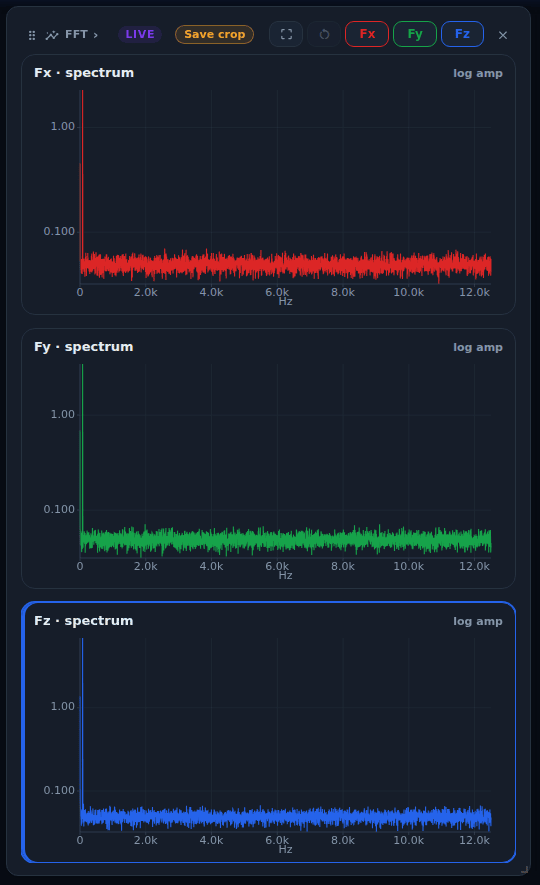 | 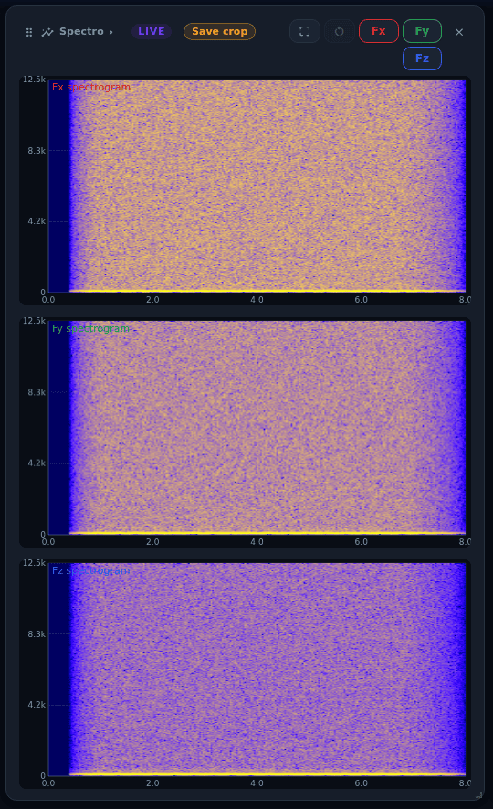 | 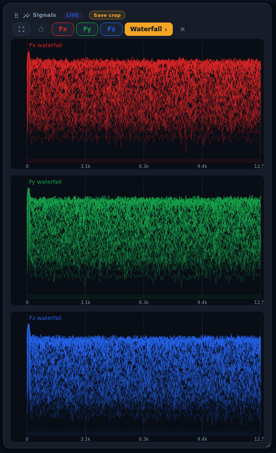 |

*Force* and *FFT* read the series and spectrum stored on the analysis row. The Force App stores
the series when it saves a cut. The spectrum is only stored by the host-side processing of
**archived** captures, so a cut saved from the Force App shows *no data* in FFT mode (see
[Troubleshooting](troubleshooting.md#plot-fft-says-no-data-or-figure--full--diagnostics-are-unavailable)).
*Power*, *Spectro* and *Waterfall* are computed on demand by the **filter service** on d1-server
from the cut's live cache, so they work for every cut that has one.

> The FFT screenshot above is of a Force App cut whose spectrum was added by hand for this wiki,
> computed from its live cache with the filter service's `/fft` endpoint to stand in for the
> host processing. Without that, the same view would show *no data*.

**Zoom.** The ⛶ button turns on rectangular zoom: drag a box on any chart. ↺ resets it. All
charts share the zoom and the hover cursor.

**Crop.** In *Force* mode, drag the edges of the shaded crop band on a chart to change the window
used for statistics and the FRM map. In *Lite* FRM mode a **Save crop** chip then appears in the
panel title. It asks *Save as official crop?* and writes the window to the operation.

To see where a point on the FRM map falls on these charts, see
[Linking the map and the signals](#linking-the-map-and-the-signals).

### Comparing cuts

In *Force* mode, **Compare → + Add cut** overlays other cuts from the current list as dashed
traces. Use it to see, for example, how force changes across passes with the same edge. **×** on a
chip removes it and **Clear** removes all:

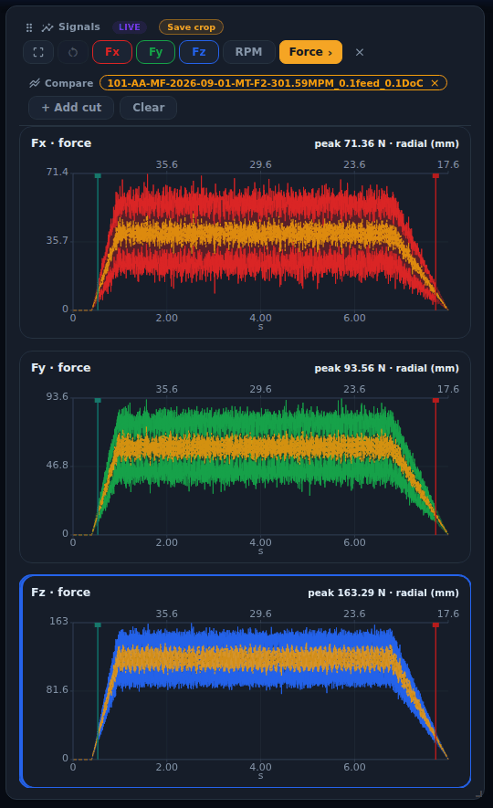

**Difference vs a reference.** Click **ref** on one chip to make it the reference, then turn on
**Difference**. A small trace appears under the Compare bar showing the selected axis (the one
highlighted for the FRM map) of the current cut minus the reference, with the mean and RMS of the
difference in newtons. What the two passes share (tool and machine signature) cancels, so what is
left points at material or wear. It uses the force envelopes already loaded for Compare, over the
stretch where both cuts' **crop windows** overlap (the cut itself, not the lead-in and lead-out, so
those do not swamp the mean and RMS), and only over the **zoomed** range when you have zoomed. The
trace and its readout say which seconds they cover. Compare draws each cut at its own recording
time and the difference uses the same time base, so there is no extra shifting. If the windows do
not overlap you get a note instead. The trace is shown in Force mode only. Removing the reference
chip turns Difference off.

### Saving a chart as an image

Right-click any Signals chart and choose **Save chart as PNG** or **Save chart as SVG**. The file
is a report-styled figure, not a screenshot: white background, a title with the operation tag, axis
and mode, axis titles with units (*Time (s)*, *Force (N)*, *Frequency (Hz)*, *Amplitude (N rms)*), ticks,
the trace for the current zoom, the shaded crop window and, if you have cuts in Compare, a legend
naming each one. The PNG is the same figure drawn at twice the size. Long traces are thinned for
the file, keeping each stretch's minimum and maximum, so peaks survive. Spectrum charts have only
these two items in their menu.

### Help and units

The **?** button in the header opens a list of the gestures that are not visible on screen
(right-click menus, crop handles, rectangular zoom, linking the map and charts, compare chips and
Difference, Copy link, exports). **Escape** or **×** closes it. The force, RPM and spectrum charts
have a y-axis title with its unit. The compact spectrogram, PSD and waterfall panels have no axis
title: each names what it draws and its unit in a label in its top-left corner (for example
*spectrogram · Hz vs s · colour dB*), and the waterfall has no numeric y-axis at all, because its
vertical offset shows recency, not a value. The statistics, wear-trend and cluster tables carry
units in their labels.

## FRM map panel

| View | What it is |
|---|---|
| **Figure** | the pre-rendered FRM image made by host processing (archived captures only). Instant. |
| **Lite** | an interactive point cloud from the live cache. It reacts to crop and feed edits and to filter previews. |
| **Full** | the full-resolution octree, streamed level-of-detail from the octree server. If none exists yet, clicking asks the host to build it (archived captures only). |
| **Gridded** | an interpolated, filled-surface grid octree, also built on the host |

**Fx / Fy / Fz** chooses the coloured axis. **2D / Z = Fx / Fy / Fz** lifts the map into 3D, with
height driven by a force series (in Lite, each point is lifted by its force, so peaks stand out
and the right-click pick and the linked marker follow the lifted points); drag to rotate, and the
slider sets the Z exaggeration:

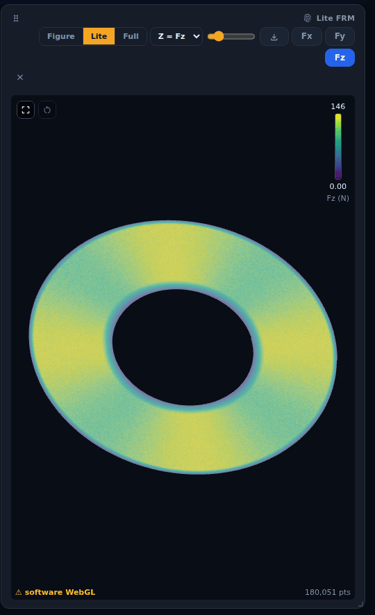

The download button saves the current view (at its current zoom) as a PNG. Badges in the title
show the fidelity of a gridded view, and whether filters are applied or baked.

Right-click a point to find it on the Signals charts: see
[Linking the map and the signals](#linking-the-map-and-the-signals).

## Linking the map and the signals

Every point on the FRM map is one sample of the recording, so it also has a moment on the force
charts. The two panels are linked through that time, in both directions. It works in **Lite**,
**Full** and **Gridded** views. The **Figure** view is a static image, so it has no points to pick.

**From the map to the charts.** Right-click a point on the map. The menu offers:

| Item | What it does |
|---|---|
| **Show position in time** | pins a marker, a vertical line labelled with the time, on every Force chart, and puts a ring on the picked point. If the charts are showing a spectrum, they switch back to *Force*. If the charts are zoomed and the marker is outside the window, the window recentres on it and keeps its width. |
| **Clear marker** | removes the marker and the ring (only shown while one is pinned) |
| **Copy point info** | copies the sample's time, position and forces as tab-separated text |
| **Set crop start here** / **Set crop end here** | moves that crop edge to the point's time. It is the same edit as dragging the crop handle, so it waits for **Save changes**. An edge that would cross the other one is greyed out. |

Items that need a point are greyed out, with a reason, when there is none under the cursor.

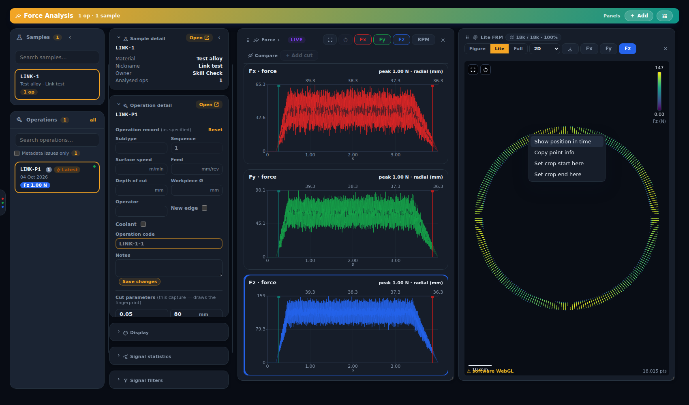

**From the charts to the map.** Hover a Force chart and a hollow ring follows the matching sample
on the map. Right-click a chart for **Show position on map**, which pins the marker and the ring
and pans the map to the point if it is out of view. The menu also has **Clear marker** and the two
**Set crop … here** items. In Lite the time must be inside the cropped window; if the cut is
showing as a Figure, the menu switches it to Lite first.

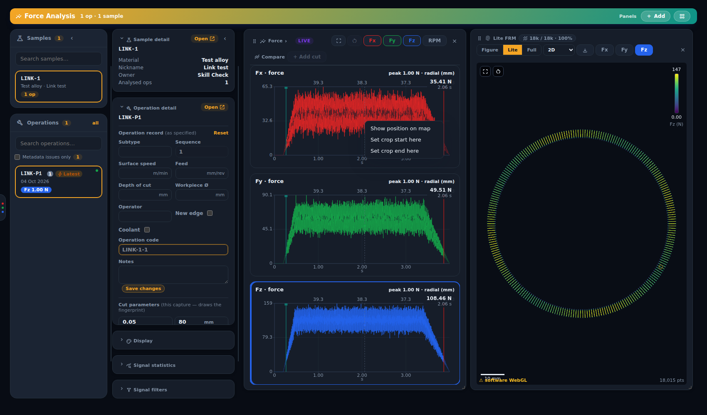

> These two screenshots are of a simulated cut on a test database, so the signal and the spiral are
> artificial. The hollow ring at the right of the map in the second one follows the chart cursor.

Things to know:

- **Full and Gridded** views have no time stored in their points. They are matched by position
  against the cut's live cache, so the cut needs one (the same cache Lite uses). Without it the
  time items are greyed out.
- **Gridded** views average samples into cells, so a right-click picks the *nearest sample to the
  spot*, not the cell. A gridded Lite view in 3D can't be picked at all; use the 2D view.
- Right-drag still pans the map. Only a right-click that doesn't move opens the menu.
- **Escape**, or switching to another operation, clears the marker. The marker is never saved.

## Display

The **Display** card controls the FRM map's appearance: point size, thinning (*show every Nth
point*), colour map and number of steps, and a **colour-scale editor**. The editor shows a
histogram of the axis's force values with draggable saturation and display limits, and **Lock
scale** keeps the limits fixed while you move between cuts.

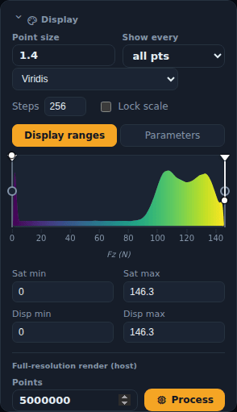

**Full-resolution render (host)** asks the host to render a high-point-count FRM image.

## Signal statistics

Computed in the browser from the live cache:

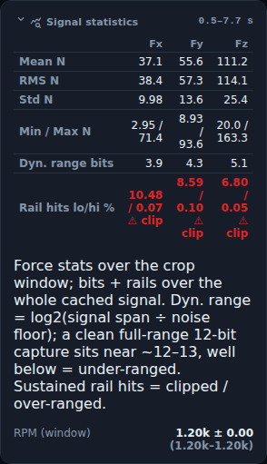

- **Mean, RMS, Std, Min/Max** of each axis over the crop window.
- **Dyn. range bits:** log₂(signal span ÷ noise floor) over the whole cached signal. A clean,
  full-range 12-bit capture sits near 12–13. Well below that means the channel was under-ranged
  on the Lab Amp.
- **Rail hits lo/hi %:** how often the signal sat at the amplifier's limits. Sustained rail hits
  (flagged **clip**) mean the channel was over-ranged and the data is clipped.
- **RPM (window):** mean ± spread of spindle speed over the crop window.
- **Download CSV / Copy:** next to the window range, saves (or copies) the table as CSV, one row
  per axis, with units in the column names (`mean_N`, `rms_N`, `rpm_mean`…). The file is named
  `signal_stats_<pass code>.csv`.

### Cutting metrics

Below Signal statistics, for the same crop window (compute the statistics first). Hover any value
for its formula; a "—" carries the reason (missing feed, depth, diameter, zero RPM) as its tooltip.

- **Resultant |F|:** mean and peak of √(Fx² + Fy² + Fz²).
- **Fc / Ff / Fp:** cutting (tangential), feed and passive force, mean and peak, taken from the
  axes chosen in **Axis mapping**. The card shows the mapping in use. The standard is
  **Fc = Fx, Ff = Fy, Fp = Fz**, but the mapping depends on the workholding and the machining
  operation, so change it if your set-up differs. The choice is remembered in this browser **per
  operation type** (MT-F, MT-O, ...). The mounting is not recorded, so the CSV `axis_map` column
  states the mapping used.
- **Cutting speed vc** = π·D·n/1000 m/min, with n the measured mean RPM. For **facing, grooving
  and parting** (`MT-F`, `MT-G`, `MT-P`) D is the diameter at the middle of the window, because the
  disc shrinks as the tool spirals in: it starts from the Diameter control at the crop start (the
  saved crop, if there is one) and shrinks by the feed in the Geometry box, the same numbers the
  radial axis of the plots uses. Every other turning type (OD, roughing, boring, threading,
  drilling) uses the Diameter control unchanged.
- **Cutting power Pc** = Fc·vc/60 W. **Specific cutting energy kc** = Fc/(ap·f) N/mm².
- Feed and depth come from the operation record (else the capture). Milling operations and
  operations with an unknown type show only the resultant.
- The metrics are also columns in the statistics CSV (`Fc_mean_N`, `Pc_W`, `kc_N_per_mm2`,
  `axis_map`…). Design: [spec](../../superpowers/specs/2026-10-06-cutting-metrics-design.md).

> The demo cut in these screenshots shows *clip* on every axis. That is an artefact of the
> simulated signal, not something a real recording would normally show.

## Signal filters

Filters clean up a signal without touching the stored raw data:

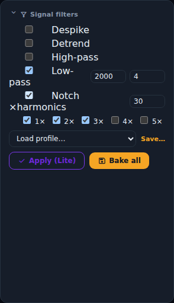

| Filter | Settings |
|---|---|
| **Despike** | window (odd) and σ threshold |
| **Detrend** | high-pass (with cutoff) or DC removal |
| **High-pass**, **Low-pass** | cutoff (Hz) and order |
| **Notch × harmonics** | Q, plus which spindle-frequency harmonics (1×–5×) to notch |

In **Lite** view, the FRM panel previews **raw** and **filtered** side by side, and in *FFT* mode
the filtered spectrum is drawn dashed over the active axis:

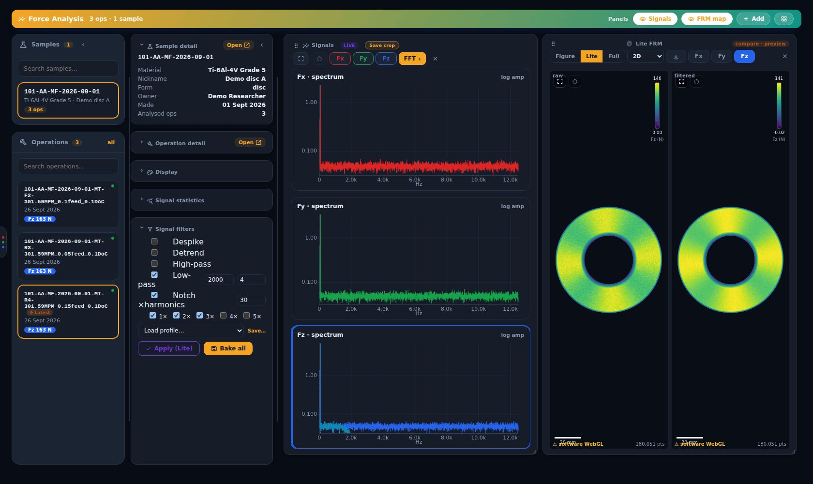

Spectrum charts are in **N rms**: a steady sine of amplitude A reads A/√2. The dashed filtered
overlay uses the same scale as the solid spectrum, so the two are directly comparable (before this
change the overlay was a density in N/√Hz and sat on a different scale).

- **Load profile… / Save…** stores and reuses named filter chains.
- **Apply (Lite)** makes the chain this cut's default. *Lite* recomputes it live, but *Full* and
  the *Figure* stay raw.
- **Bake all** reprocesses the cut on the host so every output (Lite, Full, Figure) is filtered.
  It is heavier, needs the force orchestrator, and is **admin-only**.
- **Clear** removes an applied chain.

## Sharing a view

The address bar always describes the view you are looking at, so you can copy it into a message
and the recipient lands on the same thing. **Copy link** in the header copies the full URL. The
link carries the cut (`operation`), the Signals mode (`m`) and axis (`ax`), the zoom window (`z`),
the Compare set (`cmp`, with `ref` and `diff` for the difference view; a link carries the first
five compared cuts, and always the reference if it is further down the list), the FRM view (`fm`) and
Z series (`zs`), an unsaved crop preview (`crop`) and a locked colour-scale range (`cs`). Anything
a link names that the cut cannot show (for example Lite on a cut with no live cache) is ignored
and the default is used. The address updates a moment after each change without adding browser
history entries; the Compare set only includes cuts from your own list, so a recipient who cannot
see one of them simply does not get it. It works the same in the Directus *Force Analysis* module.

## Adding panels

**+ Add** in the header adds a panel: another **Signals** or **FRM map** panel, a **Wear trend**
or the **Metadata doctor**. Each panel's **×** closes it. ▦ returns to the default layout, one
Signals and one FRM map panel side by side, and removes any others. Unlike the Record page, the
Plot page resets without asking first.

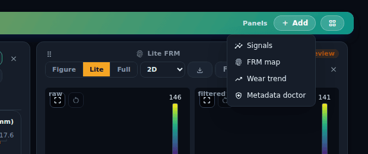

### Wear trend and Metadata doctor

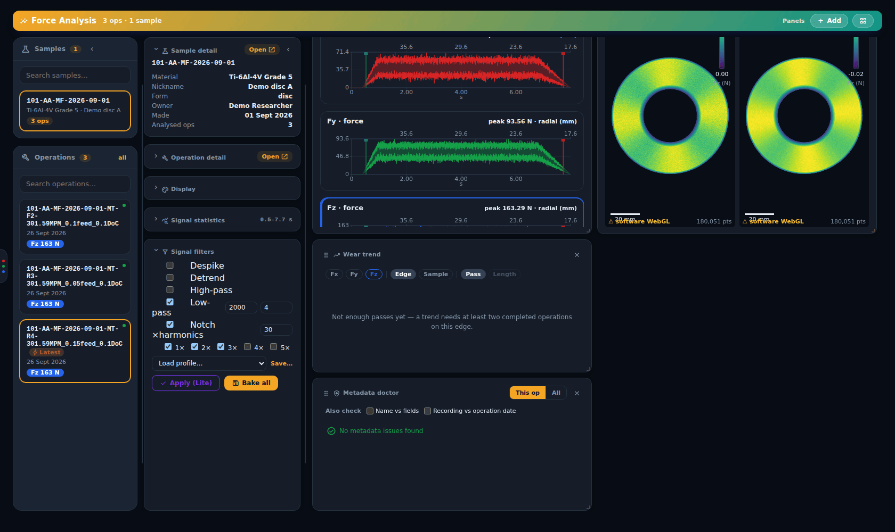

- **Wear trend** plots a force statistic across successive cuts on the same **edge** (or sample),
  against pass number or cumulative cutting length. It needs at least two completed operations
  on the edge. Record the insert and edge on every cut to get a useful trend. **Download CSV**
  or **Copy** exports every pass in the trend (pass code, pass number or cumulative cutting
  length, peak Fx/Fy/Fz in N) as `wear_trend_<edge or sample>.csv`.
- **Metadata doctor** checks the selected operation (**This op**), or every operation (**All**),
  for places where the two records of a cut disagree: the metadata the `.mat` file itself carries
  and the D1 operation record. Each finding offers a fix where one exists:

  | Finding | Fix offered |
  |---|---|
  | the operation is not linked to a sample | link it |
  | a cutting parameter differs between the `.mat` and the database | adopt the `.mat` value |
  | the stored operation code no longer matches its fields | regenerate the code |
  | the crop window doesn't cover the cut (usually a wrong feed or diameter) | opens the crop editor |

  The optional checks (*Name vs fields*, *Recording vs operation date*) are ticked on in the
  panel's header.

## Local captures

`/plot/local/<capture id>` shows a capture that is on this PC but not in the database, straight
from the recorder backend. The save dialog's **Open in Plot** goes there when you did not upload.
See [Captures, backup and recovery](captures-and-recovery.md#viewing-a-capture-that-isnt-in-the-database).
