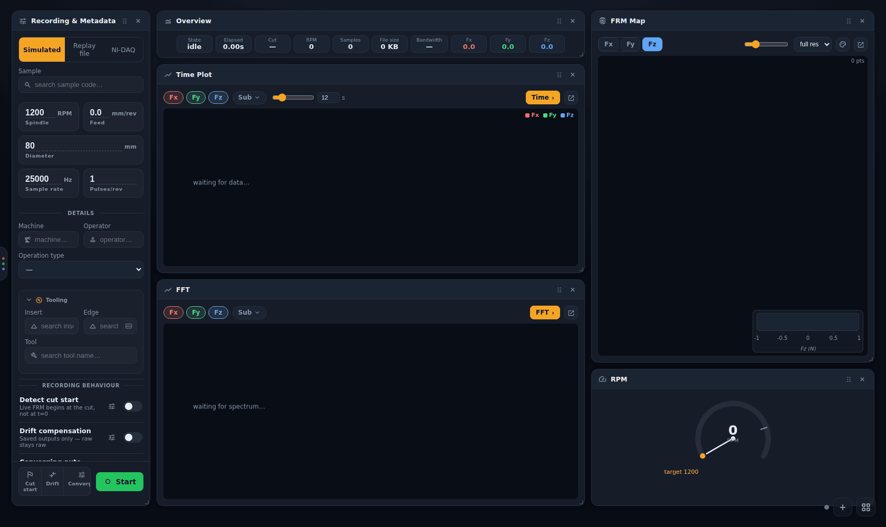
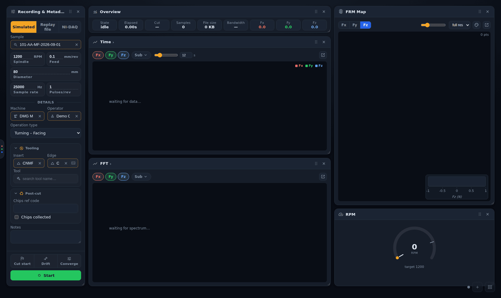
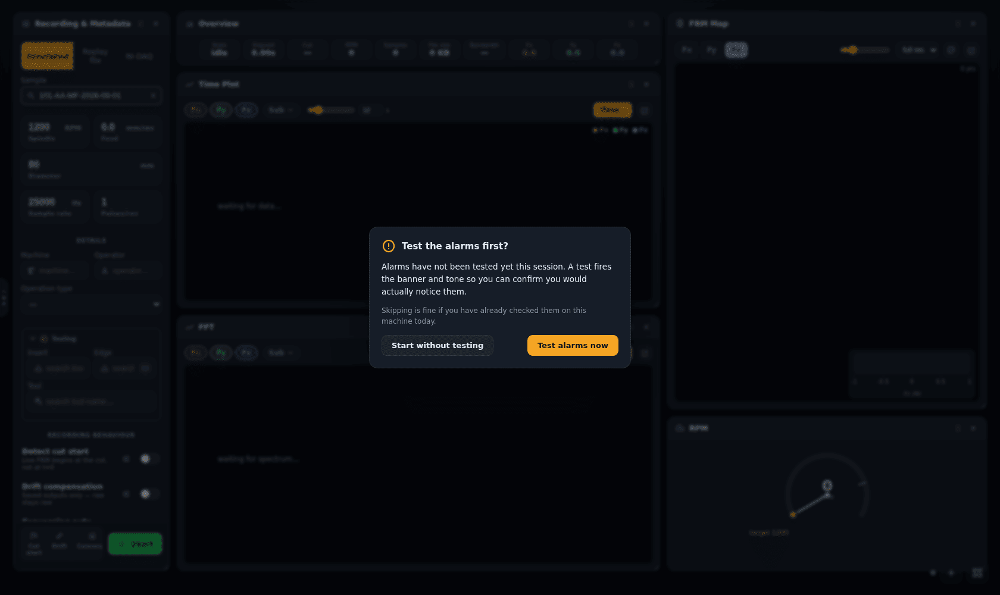
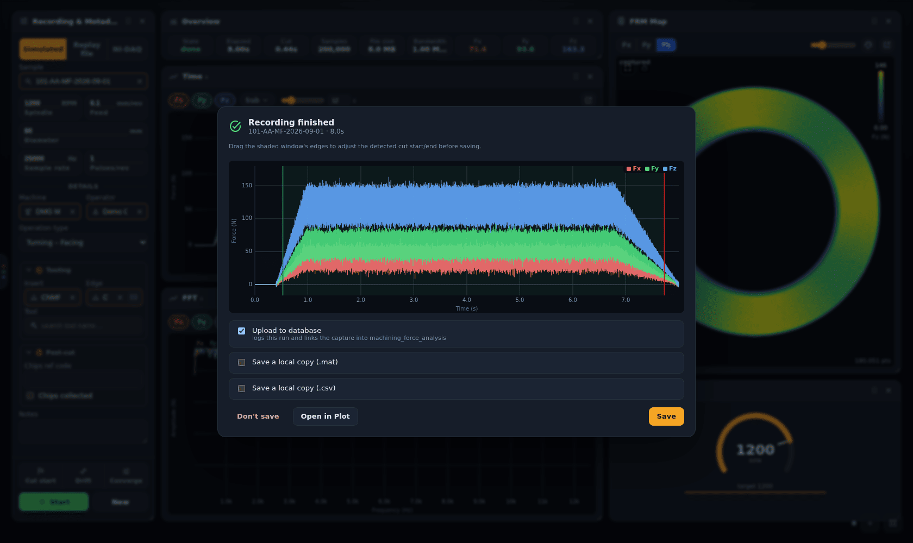
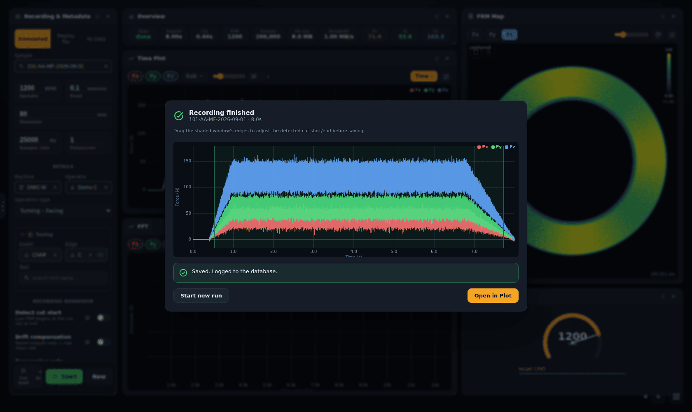
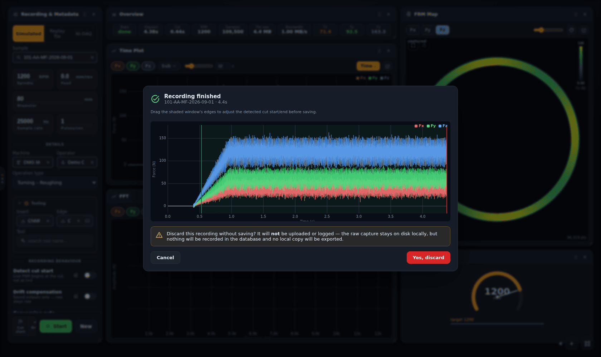

# Recording a cut

[← Force App wiki](README.md)

The **Record** page is where cuts are acquired. The left-hand **Recording & Metadata** panel
sets up the cut. The panels to its right show it live (see [Live panels](live-panels.md)).

## 1. Choose a source

The three-way switch at the top of the panel picks where the signal comes from:

| Source | What it does | Writes a capture? |
|---|---|---|
| **Simulated** | generates a synthetic cut: a ramp-in, steady cutting at the configured mean forces with noise, then a ramp-out. For training, demos and testing without the rig. | yes |
| **Replay file** | plays back a cut that is already in the database. See [Replaying an archived cut](replay.md). | **no**, playback only |
| **NI-DAQ** | acquires from the real NI-DAQ chassis via the Lab Amp. Needs the NI-DAQmx runtime and the hardware. | yes |

On first launch the app picks **NI-DAQ** automatically if it finds real hardware, and
**Simulated** otherwise. After that it remembers your last choice.

## 2. Fill in the cut parameters

| Field | Notes |
|---|---|
| **Sample** | search by sample code and pick from the list. **Required for saving to the database:** the database row is linked to it. |
| **Spindle (RPM)**, **Feed (mm/rev)** | the programmed cutting parameters |
| **Diameter (mm)** | the workpiece diameter. **Double-click** to split it into *Outer Ø* and *Inner Ø* for tube or annular stock (double-click again to merge). |
| **Sample rate (Hz)** | acquisition rate per channel. On NI-DAQ it turns red if it exceeds what the assigned hardware can do. |
| **Pulses/rev** | tacho pulses per spindle revolution (1 for the standard once-per-rev tacho) |
| **Machine**, **Operator** | searchable lists from the database. Machines are filtered by the operation type's category. |
| **Operation type** | e.g. *Turning – Facing*, *Turning – Roughing*. It decides the database *method* the run is logged under. |
| **Tooling → Insert / Edge / Tool** | the insert and the individual cutting edge. The edge is what wear trends are tracked by (see [Wear trend](plot-dashboard.md#wear-trend-and-metadata-doctor)). |

Depth of cut, coolant, cutting length, operation sequence, chips reference and notes are in the
folded sections further down the panel. You can also fill them in or correct them after the cut
on the [Plot dashboard](plot-dashboard.md#correcting-an-operations-metadata).

### The setup is remembered

The app remembers the setup between launches, so you do not re-pick the same sample, machine and
operator every morning: the spindle, feed, diameter, sample rate and pulses/rev values, the
**Sample**, **Machine**, **Operator** and **Operation type** picks, and the depth, coolant and
cutting-length fields. Insert, edge and tool are not remembered across launches (they change
cut to cut), and neither are the per-cut fields: notes, pass code, operation sequence, chips
reference, chips collected and the new-edge mark. The setup is kept in this computer's app
storage, per user profile, and is not sent anywhere.

**Clear setup**, at the bottom of the panel, puts every field back to blank or its default and
forgets the remembered copy. Choosing **Replay file** clears Sample, Machine and Operation type
for the replay search as before, but does not erase the remembered setup: it is back when you
return to Simulated or NI-DAQ, and the next launch.

## 3. Recording behaviour toggles

Three toggles sit at the bottom of the panel, just above **Start**, so they are checked right
before each cut. They are the same switches as in [Settings → Recording](settings.md#recording),
which explains them in full and holds the cut-detection threshold:

| Toggle | Effect |
|---|---|
| **Cut start** (detect cut start) | the live FRM map holds at the origin until the tool touches down, so air-cut revolutions don't crowd the fingerprint |
| **Drift** (drift compensation) | applies a linear drift correction (the same one the MATLAB app used) to the **saved outputs** (`.mat` and live cache). The raw capture is never modified, so turning this on or off later loses nothing. |
| **Converge** (converging auto-range) | NI-DAQ only. After each cut, recommends new per-channel Lab Amp ranges from that cut's peaks and applies them to the next cut, so a badly ranged channel converges on the amp's full resolution. On Simulated/Replay it previews the recommendation only, and says so under the toggles. |

## 4. Start

Press **Start**. The first time in each session the app offers to test the safety alarms:

**Test alarms now** fires the alarm banner and tone so you can confirm you would notice them.
**Start without testing** is fine if you have already checked them on this machine today. The
thresholds are set in [Settings → Safety Alarms](settings.md#safety-alarms).

While recording, the parameter fields lock and **Start** becomes **Stop**:

A recording stops when you press **Stop**. It also stops by itself when a simulated run reaches
its planned length, or when the capture drive runs out of space.

## 5. Save or discard

When the recording stops, the **Recording finished** dialog opens. It first works through
*Stopping acquisition → Writing capture files (.mat, live cache) → Loading recorded trace*, with a
timer on each stage, and then shows the whole cut:

- **Adjust the cut window.** The shaded region is the automatically detected cut (tool in contact).
  Drag its edges to correct it. The dialog then shows the adjusted and auto-detected times, with a
  **Reset** button.
- **Upload to database** (ticked by default when online) creates the operation record and
  attaches the capture files (see [what gets written](#what-saving-writes)). It is disabled when
  no Sample is picked, and when the PC is offline.
- **Save a local copy (.mat / .csv)** additionally downloads a copy of the capture as
  `<capture id>.mat` / `.csv`. The `.mat` option is unavailable for captures too large to export.
- **Open in Plot** jumps straight to the finished cut. The capture files are already on disk, so
  this is always safe.
- **Save** does what is ticked. On success the dialog says *Saved. Logged to the database.* and
  offers **Start new run** or **Open in Plot**:

**Don't save** asks for confirmation first:

Discarding only skips the database record and the local export. The raw capture stays on the
capture drive and is listed in [Settings → Local Captures](captures-and-recovery.md#local-captures),
where you can upload it later or delete it.

If finalizing fails, the dialog says so and nothing is uploaded. The raw capture can still be
recovered (see [Crash recovery](captures-and-recovery.md#crash-recovery)).

### What saving writes

Saving a cut makes, in order:

1. a **`manufacturing_operations`** row: the sample, machine, operator, method (from the
   operation type), cutting parameters, tooling and a `recorded_metadata` block holding the
   capture id, peaks and source;
2. two uploaded **files**: `capture.mat` (full resolution, when small enough) and
   `live_cache.bin` (the decimated cache the Plot page reads);
3. a **`machining_force_analysis`** row linking the operation to those files. It also stores a
   min/max *series envelope* for the charts, the peaks, and the crop window if you moved it.

The analysis row is saved as already finished (`status = done`). Everything the Plot page
computes from the live cache works straight away. The host-side processing on d1-server (the
stored FFT, the FRM *Figure*, the full-resolution octree and diagnostics) only runs on captures
indexed from the archive share, so it does not run on a cut saved this way. See
[Force data in the database](../database/force-data.md#two-ways-in).

> **Partial failures.** Step 1 happens before the uploads. If the file upload is refused (for
> example because your role cannot create files), the operation row already exists and is left
> without an analysis. Delete it in Directus, or ask an admin to fix the permission and save
> again from Local Captures.

## Starting the next cut

After saving, press **New** (or **Start new run** in the dialog) to clear the plots. The sample,
machine, operator and tooling stay filled in. The per-cut values reset: if the **operation
sequence** is a whole number it goes up by one (so the Cut ID `{sample}-{TYPE}{seq}` does not
repeat), and **chips reference**, **chips collected** and the **new edge** mark are cleared. A
typed pass code and the notes are left as they are, so change them if they no longer apply.

**Discarding** a cut does not step the sequence or clear those fields: the retake is the same cut.

## Leaving the page mid-cut

Recording runs in the backend, not the page. You can switch to Plot or Settings while a cut runs.
A banner on every other page shows its progress (see [Getting started](getting-started.md#while-a-recording-is-running)).

You do not have to be on the Record page when the cut ends. The page checks with the recorder
whenever you come back to it, and if the cut finished (or is still being saved) while you were
away, the save dialog opens then. The capture is finalized on disk either way and is listed in
[Settings → Local Captures](captures-and-recovery.md#local-captures), which is where an
un-uploaded capture gets uploaded later.

One case is not offered again: if you **reload or restart the app** and the cut has already finished,
the page starts with no memory of it and does not open the dialog. A cut that is still being saved
at that point is offered. Either way, find the finished cut in Local Captures.
