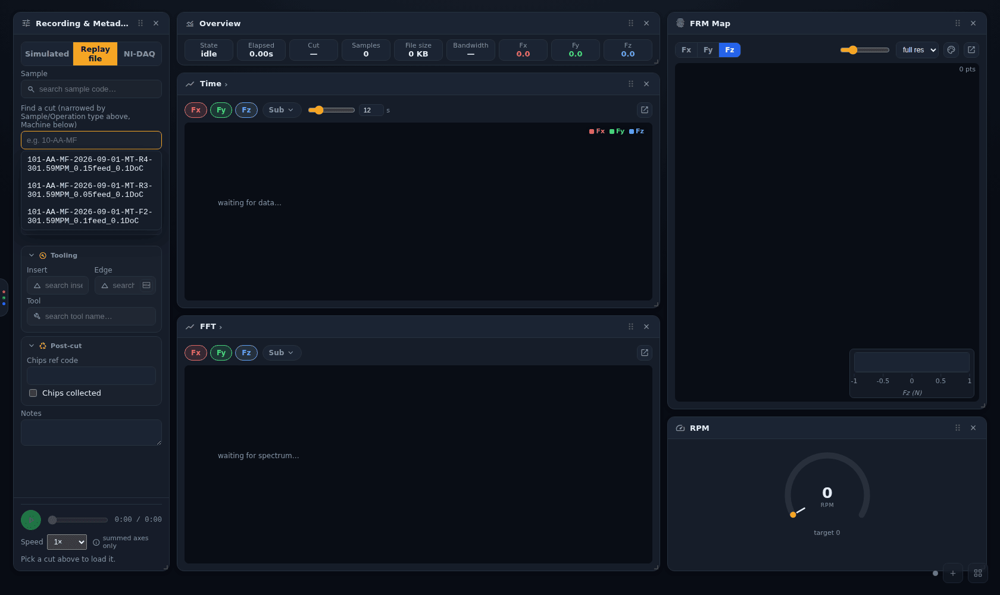
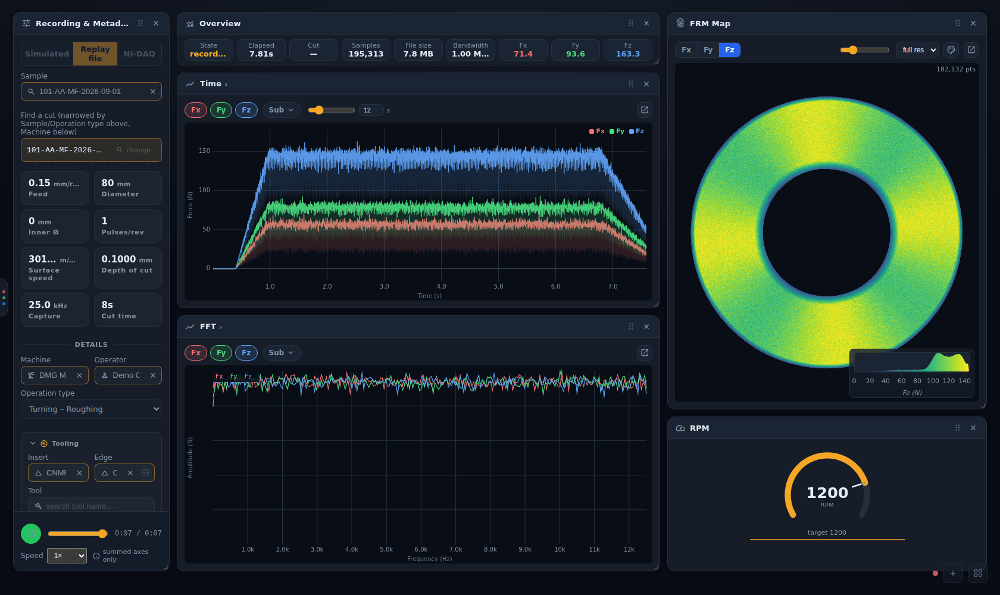

# Replaying an archived cut

[← Force App wiki](README.md)

**Replay file** plays a cut that is already in the database back through the Record page's live
panels, as if it were being recorded again. Use it to review a cut at the rig, to show the live
views without cutting metal, or to compare what a panel showed against the archived result.

Replay is **playback only**. It writes no capture, creates no database record and does not
change the recording form, so nothing about the next real recording is affected.

## Picking a cut

1. On the Record page, switch the source to **Replay file**.
2. Optionally narrow the list first: pick a **Sample** and/or **Operation type** above, or a
   **Machine** below. The search only offers cuts that match all of them.
3. Click **Find a cut** and type part of the operation code (e.g. `101-AA-MF`). Pick a cut from
   the list, with the mouse or with ↑ / ↓ and Enter:

The cut's archived parameters load into read-only tiles: feed, diameters, pulses/rev, surface
speed, depth of cut, the capture rate of the cached signal, and the cut time. The sample, machine,
operator, operation type and tooling fill in from the archived record. **change** next to the
picked cut starts a new search. It clears the sample, machine and operation-type filters so the
full recent list comes back.

## Playing

The transport bar at the bottom of the panel has **play/pause**, a **scrub bar** and the time.
**Speed** runs from 0.25× to 20×. Every live panel follows the playhead. Scrubbing backwards
rebuilds the plots at that point, and spectrogram and waterfall history never runs ahead of the
playhead.

## What a replay can and can't show

The archived live cache stores the **summed** Fx/Fy/Fz only (the **summed axes only** note by the
transport says the same):

- per-sensor sub-channels (Fx1…Fz4) are shown as an even split of the summed axis, not real
  per-sensor data;
- there is no tacho channel. RPM comes from the file's own rpm series, and the RPM gauge's target
  is the replayed cut's own speed;
- the cache is decimated, so the capture rate shown can be lower than the original sample rate.

For the full-resolution original, use the [Plot dashboard](plot-dashboard.md) or download the
operation's `.mat` from Directus.
