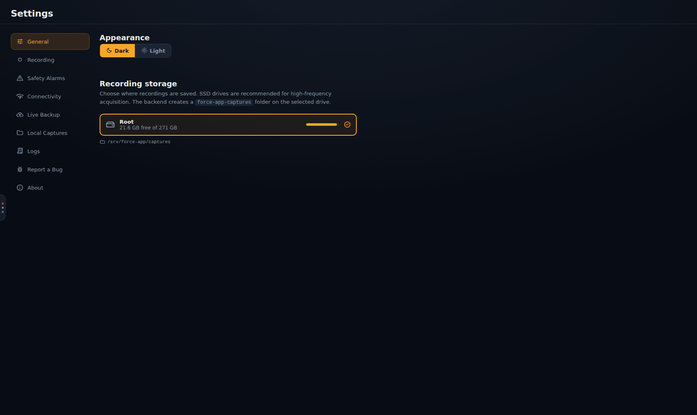
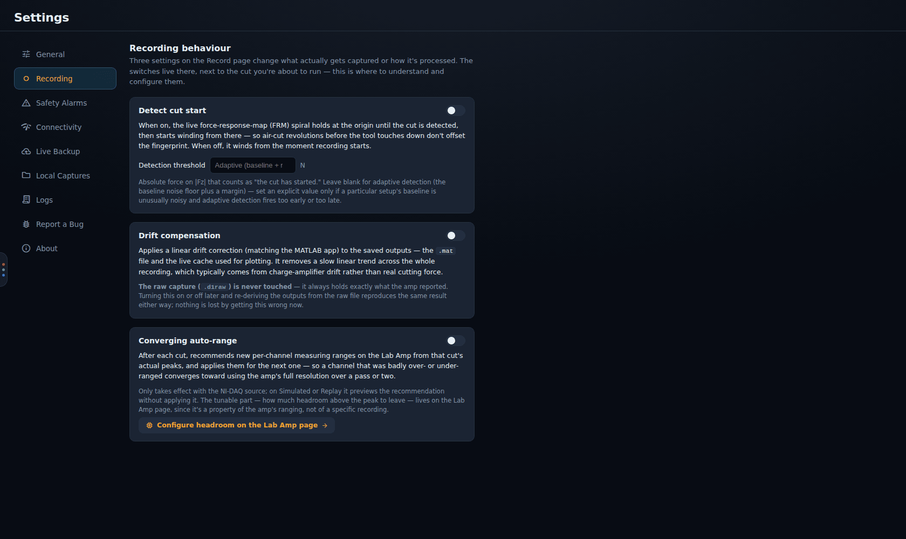
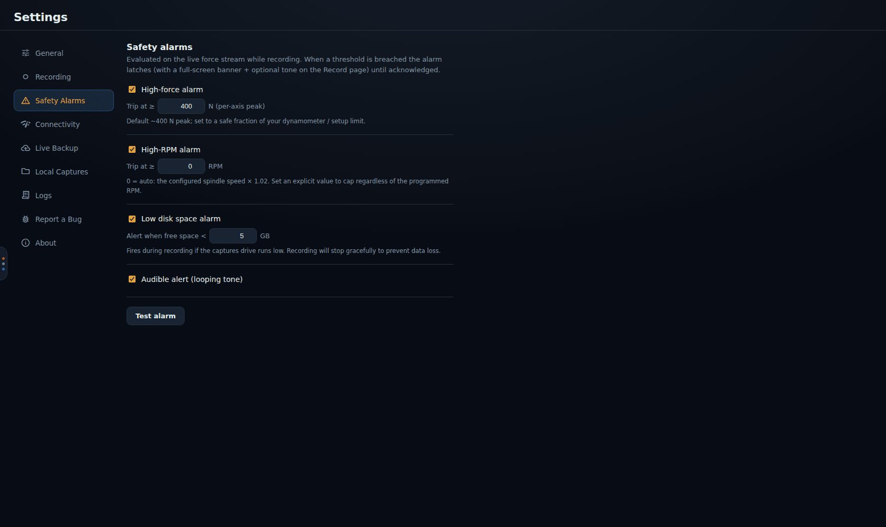
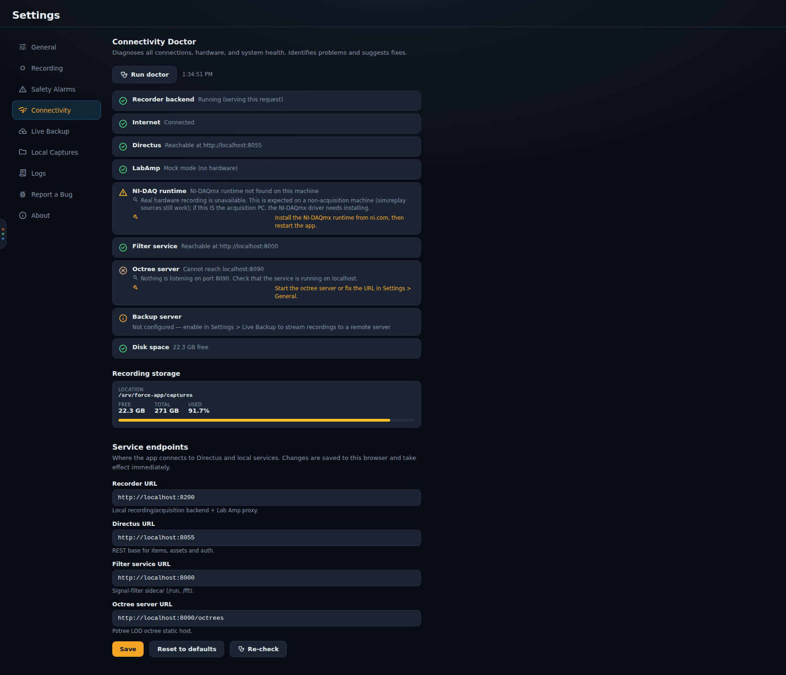
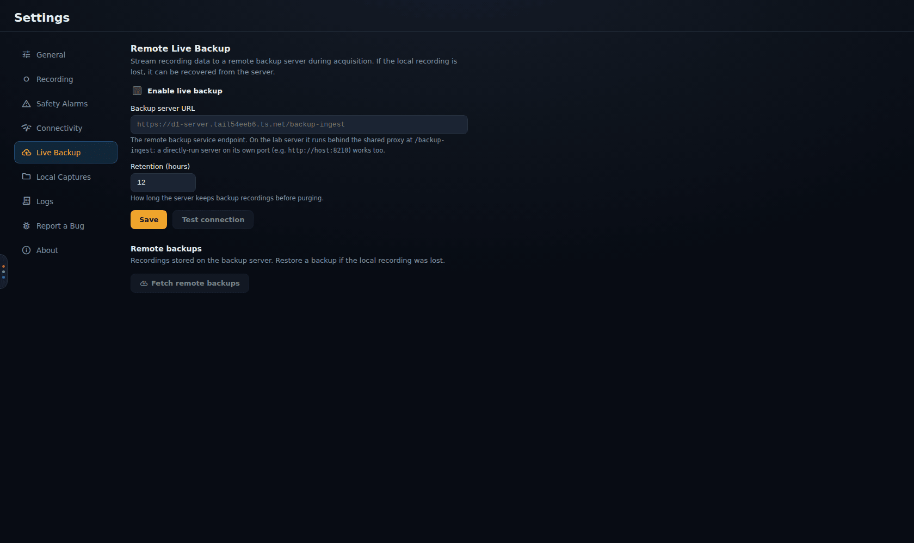
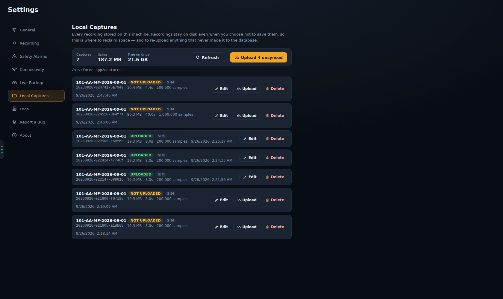
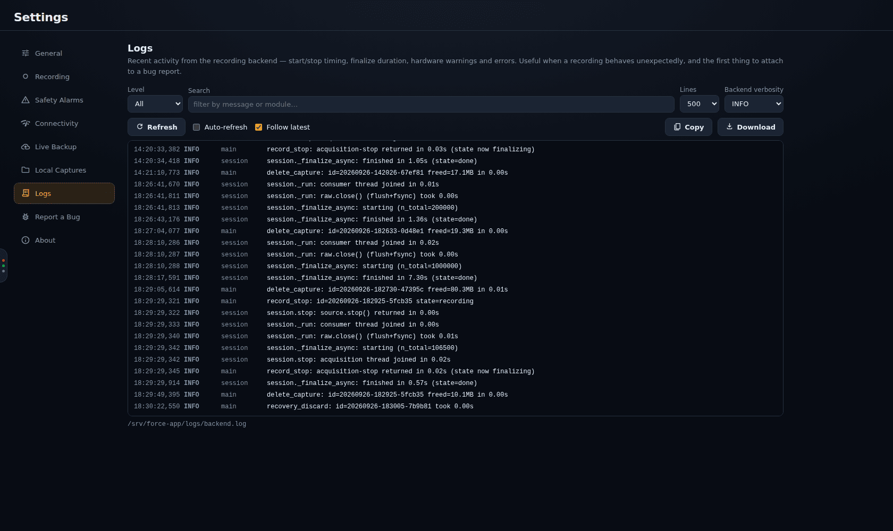
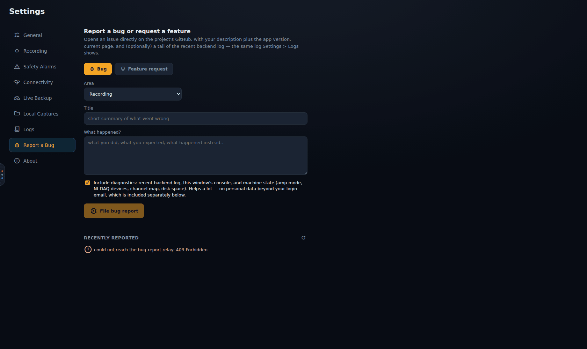
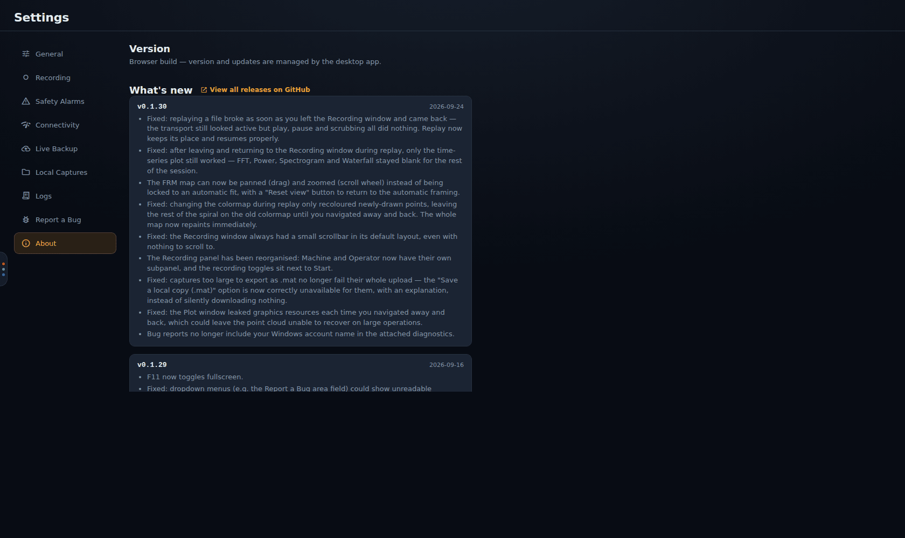

# Settings

[← Force App wiki](README.md)

**Settings** has nine tabs. You can link straight to one with `/settings?tab=<id>`, for example
`/settings?tab=logs`.

- [General](#general)
- [Recording](#recording)
- [Safety Alarms](#safety-alarms)
- [Connectivity](#connectivity)
- [Live Backup](#live-backup)
- [Local Captures](#local-captures)
- [Logs](#logs)
- [Report a Bug](#report-a-bug)
- [About](#about)

## General

- **Appearance:** dark or light theme.
- **Recording storage:** the drive recordings are written to. The backend creates a
  `force-app-captures` folder on the drive you pick. Use a fast local SSD: high-rate acquisition
  writes continuously, and a slow or network drive risks dropped data. The bar shows how full
  the drive is.

## Recording

The long form of the three toggles next to **Start** on the Record page:

- **Detect cut start.** The live FRM spiral holds at the origin until the cut is detected.
  **Detection threshold** (N) is the absolute |Fz| that counts as "the cut has started". Leave it
  blank for adaptive detection (the baseline noise floor plus a margin). Set a value only if a
  particular setup's baseline is unusually noisy and adaptive detection fires too early or late.
- **Drift compensation.** A linear drift correction, matching the MATLAB app, applied to the saved
  `.mat` and live cache. It removes the slow linear trend that charge amplifiers typically add
  across a recording. The raw capture (`.d1raw`) is never touched, so switching this on or off
  later and re-deriving the outputs loses nothing.
- **Converging auto-range.** After each cut, recommends new per-channel Lab Amp ranges from that
  cut's peaks and applies them to the next one. It only takes effect on NI-DAQ recordings. The
  headroom setting lives on the [Lab Amp page](hardware.md#auto-range).

## Safety Alarms

Alarms watch the live force stream while recording. When a threshold is breached, a full-screen
banner (and optionally a tone) latches on the Record page until someone acknowledges it.

| Alarm | Default | Notes |
|---|---|---|
| **High-force alarm** | 400 N per-axis peak | set it to a safe fraction of your dynamometer or setup limit |
| **High-RPM alarm** | 0 = automatic | automatic trips at the configured spindle speed × 1.02 |
| **Low disk space alarm** | 5 GB free | recording also stops cleanly when the drive is actually full, so no data is lost |
| **Early warning** | on, 80 % of the force limit | an amber banner on the Record page when a force axis reaches that share of the limit. No tone, nothing latches; **Dismiss** hides it for the cut. Change the percentage (1-99) beside it |
| **Stop the recording when the force alarm trips** | off | stops the cut the same way the **Stop** button does, then the save dialog opens. Only the high-force alarm does this, not RPM, tacho or disk |
| **Audible alert** | on | a looping tone alongside the banner |
| **Set the tone volume** | off | unticked, the app raises the system volume to maximum when an alarm sounds. Ticked, you choose the tone's level (5-100 %) and the system volume is left alone |

The alarm banner is announced to screen readers as an alert; the early-warning and disk banners as
status messages. Alarms and warnings apply to Record mode only, never to Replay.

**Test alarm** fires the banner and tone so you can check they would be noticed. The Record page
also offers this test at the first Start of each session.

## Connectivity

**Connectivity Doctor** checks everything the app depends on and suggests a fix for each
problem. It runs when the tab opens; press **Run doctor** to repeat it. The checks are: recorder
backend, internet, Directus, Lab Amp, NI-DAQ runtime, filter service, octree server, backup
server and disk space. Where the app can fix a problem itself, the finding has a **Fix now**
button. Where a command fixes it, **Copy** puts the command on the clipboard. In the screenshot,
*NI-DAQ runtime* warns because the demo PC has no NI-DAQmx driver, and *Octree server* fails
because none was running. Both are expected off the rig.

In the installed app, when the recorder backend is down the doctor offers **Restart recorder**.
It stops and restarts the backend, then runs the check again. It will not restart while a recording
is in progress or still being saved. In a browser or a development build the doctor shows the
command to start the backend by hand instead.

**Service endpoints** are the URLs the app uses:

| Endpoint | Default | Used for |
|---|---|---|
| Recorder URL | `http://localhost:8200` | the local backend (and the Lab Amp proxy) |
| Directus URL | set at build time | sign-in, items, files |
| Filter service URL | `/filter` | filter previews and spectra on the Plot page |
| Octree server URL | `/octrees` | *Full* and *Gridded* FRM views, diagnostics |

**Save** stores your changes in this browser profile, where they take effect at once, and runs
the doctor again to check the new addresses. **Reset to defaults** undoes them. A deployment can
also ship a `config.json` next to the app to set them. The order of precedence is build defaults,
then `config.json`, then these overrides.

## Live Backup

With **Enable live backup** ticked, the backend streams the raw recording to the backup server on
d1-server while the cut runs. If the PC dies mid-cut, the recording can be restored from there.

- **Backup server URL:** the `/backup-ingest` endpoint behind the shared proxy (the default
  points at d1-server's tailnet address).
- **Retention (hours):** how long the server keeps backups before purging them (12 by default).
- **Test connection** checks the server before you rely on it. **Save** applies the settings.
- **Remote backups → Fetch remote backups** lists what the server holds, so you can restore one
  whose local copy was lost.

The sidebar's cloud chip shows streaming progress during a recording. See
[Captures, backup and recovery](captures-and-recovery.md#live-backup) for how the pieces fit.

## Local Captures

Every recording on this PC's capture drive, with its size, duration, sample count and date. This
tab is **the only place a finished capture can be deleted**, so recordings otherwise pile up.
See [Captures, backup and recovery](captures-and-recovery.md#local-captures) for the upload-state
tags, editing metadata and uploading.

## Logs

The recorder backend's log: recording start and stop timing, finalize duration, hardware warnings
and errors. You can filter by **Level** and **Search**, choose how many **Lines** to show, and
turn on **Auto-refresh** and **Follow latest**. **Copy** and **Download** export what is shown.
**Backend verbosity** changes how much the backend logs from now on. The file's path is shown
under the log (`backend.log`, rotated to three backups).

## Report a Bug

Files an issue straight into the project's GitHub. Choose **Bug** or **Feature request** and an
**Area**, then write a title and describe what happened. **Include diagnostics** (on by default)
attaches the recent backend log, this window's console and the machine state: amp mode, NI-DAQ
devices, channel map and disk space. No personal data beyond your login email is included, and
your Windows account name is stripped. **Recently reported** lists what you have filed.

Reports go through the **bug-report relay** on d1-server. The red message in the screenshot
(*could not reach the bug-report relay: 403*) is what you see when the relay is unreachable, as
it was on the demo stack.

## About

The installed version, **Check for updates** / **Update now** (desktop app only), and **What's
new**: the changelog bundled with each build, newest first, with a link to all releases on
GitHub.
